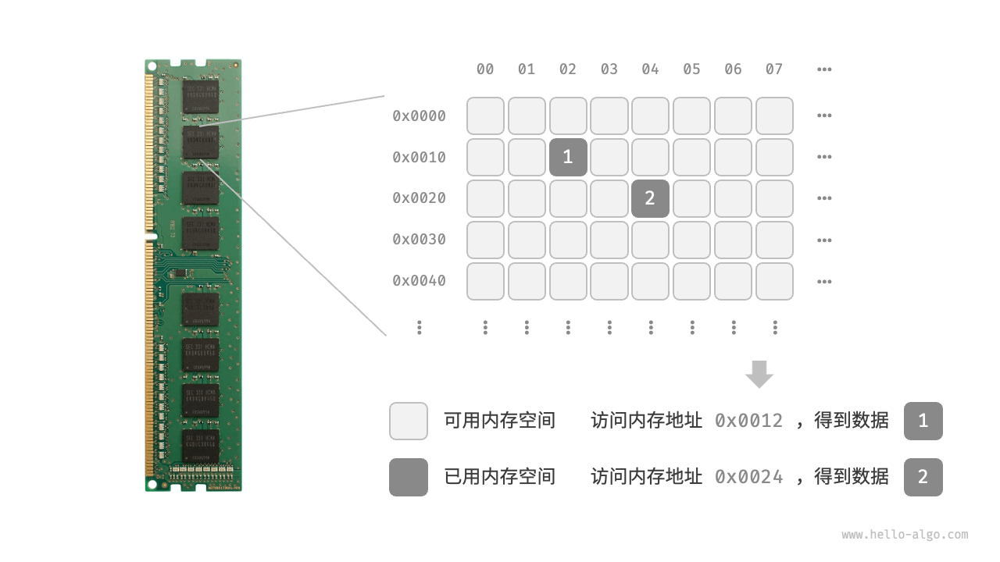
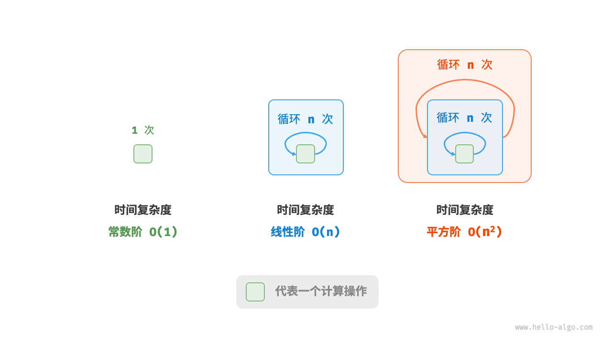
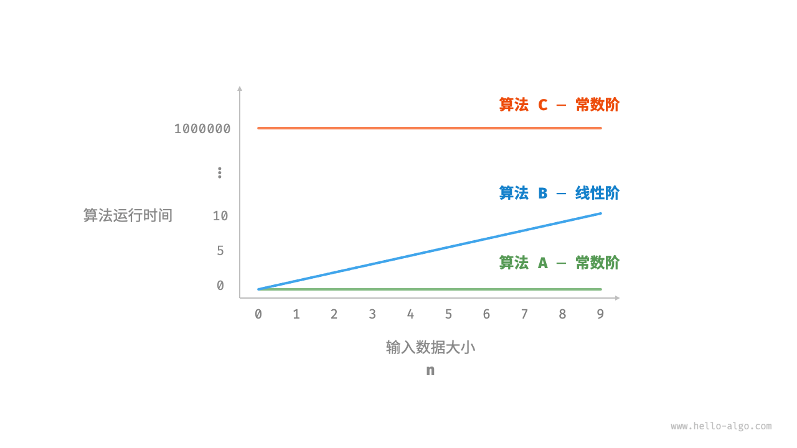
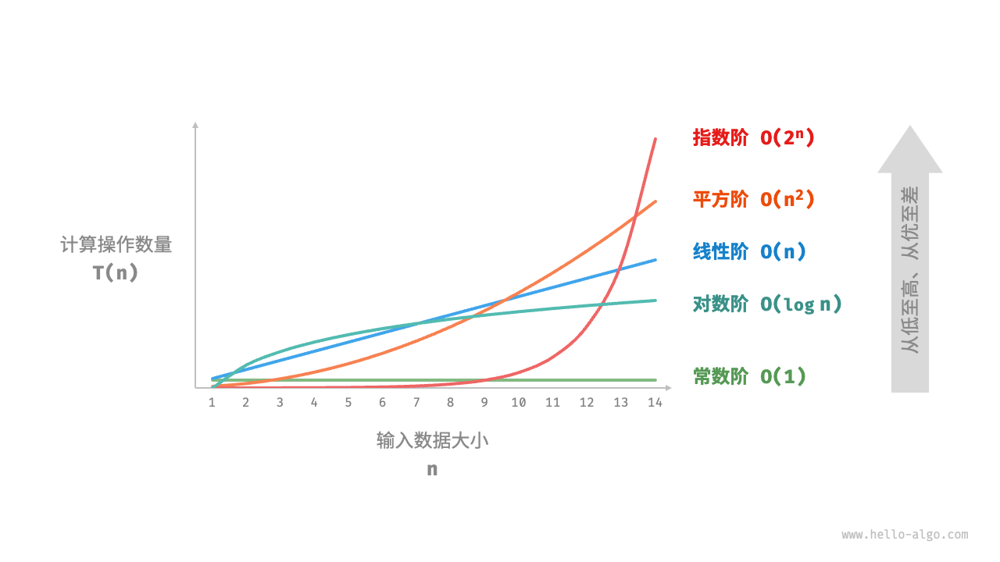
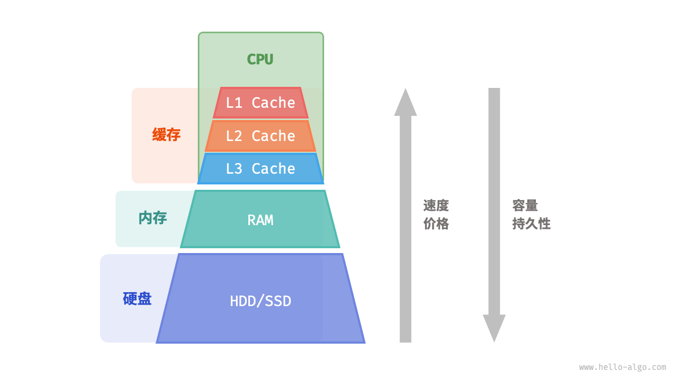

# 前置知识

> 本页**所有非***内容都是学习数据结构所必须的知识，请读者一定注意。

##  指针与结构体

指针也就是内存地址，指针变量是用来存放内存地址的**变量**。

[指针 - 《阮一峰《C 语言教程》》 - 书栈网 · BookStack](https://www.bookstack.cn/read/wangdoc-clang-tutorial/docs-pointer.md)

[C 指针 | 菜鸟教程 (runoob.com)](https://www.runoob.com/cprogramming/c-pointers.html)

**结构**是 C 编程中另一种用户自定义的可用的数据类型，它允许存储**不同类型**的数据项。

[struct 结构 - 《阮一峰《C 语言教程》》 - 书栈网 · BookStack](https://www.bookstack.cn/read/wangdoc-clang-tutorial/docs-struct.md)

[C 结构体 | 菜鸟教程 (runoob.com)](https://www.runoob.com/cprogramming/c-structures.html)

!> 不多赘述，但是指针和结构体是数据结构的基础，是**一定要掌握的内容**，若实在是想不起来，可以参考以下视频（你知道的，我的大学其实是在B站上的）

[南京大学-C程序设计基础-W9 指针1_哔哩哔哩_bilibili](https://www.bilibili.com/video/BV17K41187Dp/?spm_id_from=333.788&vd_source=3310f07bcb7152dc48cc5e65834e98b5)

> 需要到达什么水平？
>
> A: 完全独立（不借助参考）
>
> 1. 声明和使用（整数等）指针 掌握使用`*`和 `&`等符号访问、修改指针变量，
> 2. 声明和使用 结构体、**结构体变量**， 掌握 `->`和`.`符号访问结构体变量、函数
> 3. 掌握 指针作为函数参数的函数以及函数的 声明、定义、使用

检测一下：

```c
#include <iostream>

int main()
{
    int* a;
    int b = 50;
    a = &b;
    std::cout << a << " " << &a << " " << *a << " " << b << " " << &b <<std::endl;
}
```

求打印内容。

答（不同计算机和编译器的地址可能不同）：

```c
0xb9fd5ff9b4 0xb9fd5ff9b8 50 50 0xb9fd5ff9b4
```

## [数据结构中使用的关键字和函数](./011.md)

> 参考”实验“的内容，建议在第一次实验课前阅读

# 绪论

## 基本数据类型

当谈及计算机中的数据时，我们会想到文本、图片、视频、语音、3D 模型等各种形式。尽管这些数据的组织形式各异，但它们都由各种**基本数据类型构成**。

**基本数据类型是 CPU 可以直接进行运算的类型**，在算法中直接被使用，主要包括以下几种。

- 整数类型 `byte`、`short`、`int`、`long` 。
- 浮点数类型 `float`、`double` ，用于表示小数。
- 字符类型 `char` ，用于表示各种语言的字母、标点符号甚至表情符号等。
- 布尔类型 `bool` ，用于表示“是”与“否”判断。

**基本数据类型以二进制的形式存储在计算机中**。一个二进制位即为 1 比特。在绝大多数现代操作系统中，1 字节（byte）由 8 比特（bit）组成。

基本数据类型的取值范围取决于其占用的空间大小。下面以 Java 为例。

- 整数类型 `byte` 占用 1 字节 = 8 比特 ，可以表示 28 个数字。
- 整数类型 `int` 占用 4 字节 = 32 比特 ，可以表示 232 个数字。

下表列举了 Java 中各种基本数据类型的占用空间、取值范围和默认值。此表格无须死记硬背，大致理解即可，需要时可以通过查表来回忆。

表 ：基本数据类型的占用空间和取值范围

| 类型   | 符号     | 占用空间 | 最小值       | 最大值      | 默认值 |
| :----- | :------- | :------- | :----------- | :---------- | :----- |
| 整数   | `byte`   | 1 字节   | −27 (−128)   | 27−1 (127)  | 0      |
|        | `short`  | 2 字节   | −215         | 215−1       | 0      |
|        | `int`    | 4 字节   | −231         | 231−1       | 0      |
|        | `long`   | 8 字节   | −263         | 263−1       | 0      |
| 浮点数 | `float`  | 4 字节   | 1.175×10−38  | 3.403×1038  | 0.0f   |
|        | `double` | 8 字节   | 2.225×10−308 | 1.798×10308 | 0.0    |
| 字符   | `char`   | 2 字节   | 0            | 216−1       | 0      |
| 布尔   | `bool`   | 1 字节   | false        | true        |        |

## 数据结构的逻辑结构：线性与非线性

> 从这里开始，我们正式进入了数据结构的学习，如果读者初学时觉得以下内容难以理解，可以在学过线性表、栈、队、广义表、树等章节后再次观看，**常看常新！**

常见的数据结构包括数组、链表、栈、队列、哈希表、树、堆、图，它们可以从**“逻辑结构”**和**“物理结构”**两个维度进行分类。

**逻辑结构揭示了数据元素之间的逻辑关系**。

- 在数组和链表中，数据按照一定顺序排列，体现了数据之间的线性关系；
- 而在树中，数据从顶部向下按层次排列，表现出“祖先”与“后代”之间的派生关系；
- 图则由节点和边构成，反映了复杂的网络关系。

如图所示，逻辑结构可分为“线性”和“非线性”两大类。

- 线性结构比较直观，指数据在逻辑关系上呈线性排列；
- 非线性结构则相反，呈非线性排列。

具体上有：

- **线性数据结构**：数组、链表、栈、队列、哈希表，元素之间是一对一的顺序关系。
- **非线性数据结构**：树、堆、图、哈希表。

非线性数据结构可以进一步划分为树形结构和网状结构。

- **树形结构**：树、堆、哈希表，元素之间是**一对多**的关系。
- **网状结构**：图，元素之间是**多对多**的关系。


## 数据结构的物理结构：连续与分散

**当算法程序运行时，正在处理的数据主要存储在内存中**。

如图展示了一个计算机内存条，其中每个黑色方块都包含一块内存空间。我们可以将内存想象成一个巨大的 Excel 表格，其中每个单元格都可以存储一定大小的数据。



**系统通过内存地址来访问目标位置的数据**。如图所示，计算机根据特定规则为表格中的每个单元格分配编号，确保每个内存空间都有唯一的内存地址。有了这些地址，程序便可以访问内存中的数据。

如下图所示**物理结构反映了数据在计算机内存中的存储方式**，可分为连续空间存储（数组）和分散空间存储（链表）。物理结构从底层决定了数据的访问、更新、增删等操作方法，两种物理结构在时间效率和空间效率方面呈现出互补的特点。


值得说明的是，**所有数据结构都是基于数组、链表或二者的组合实现的**。例如，栈和队列既可以使用数组实现，也可以使用链表实现；而哈希表的实现可能同时包含数组和链表。

## 算法

当我们听到“算法”这个词时，很自然地会想到数学。然而实际上，许多算法并不涉及复杂数学，而是更多地依赖基本逻辑，这些逻辑在我们的日常生活中处处可见。

在正式探讨算法之前，有一个有趣的事实值得分享：**你已经在不知不觉中学会了许多算法，并习惯将它们应用到日常生活中了**。下面我将举个具体的例子来证实这一点。

**例：查字典**。在字典里，每个汉字都对应一个拼音，而字典是按照拼音字母顺序排列的。假设我们需要查找一个拼音首字母为 𝑟 的字，通常会按二分查找来实现。

1. 翻开字典约一半的页数，查看该页的首字母是什么，假设首字母为 𝑚 。
2. 由于在拼音字母表中 𝑟 位于 𝑚 之后，所以排除字典前半部分，查找范围缩小到后半部分。
3. 不断重复步骤 `1.` 和 步骤 `2.` ，直至找到拼音首字母为 𝑟 的页码为止。

查字典这个小学生必备技能，实际上就是著名的“二分查找”算法。从数据结构的角度，我们可以把字典视为一个已排序的“数组”；从算法的角度，我们可以将上述查字典的一系列操作看作“二分查找”。

如图下所示，数据结构与算法高度相关、紧密结合，具体表现在以下三个方面。	

- 数据结构是算法的基石。数据结构为算法提供了结构化存储的数据，以及操作数据的方法。
- 算法是数据结构发挥作用的舞台。数据结构本身仅存储数据信息，结合算法才能解决特定问题。
- 算法通常可以基于不同的数据结构实现，但执行效率可能相差很大，选择合适的数据结构是关键。


## 抽象数据类型

> 想象一下，当你在大学一年级的时候敲c语言的作业时，你发现，在不同的作业中，你总是要不停的敲同一段代码：**创建一个数组，并对其进行冒泡排序**，不停的敲同一段代码的任务使你感到枯燥。
>
> 在一次作业中，突然你灵机一动，把这段代码写成一个函数，偷偷用word保存下来（~~摊牌了，我其实是天才~~），之后每次需要的时候，你便掏出你的word，直接 **ctrl c v** 解决战斗，那么恭喜你，你已经初步学会了什么是抽象数据类型，以及什么是数据结构

抽象数据类型（Abstract Data Type），简称ADT，如果你阅读课本，它的定义是：一个数据模型以及定义在该模型上的一组操作。你可能很困惑，这到底是什么？

其实很简单，当前人们在敲代码的时候，发现很多重复的代码被不停的使用，为了提高效率，工程师们想了一个办法，把常用的算法集合起来，使用户可以不用知道其具体实现，但是可以直接调用。ADT就是这么个想法，比如对于一个数组，我可能总是要对其进行排序（比如从小到大排序），于是高级语言们想了个办法：把**数组和对数组的一系列操作的函数**封装起来，成为一个新的**结构体**（比如C++的标准模板库STL），这样有很多好处：

- **代码复用**：提供了大量的通用数据结构和算法，可以减少重复编写代码的工作。
- **性能优化**：其中的算法和数据结构都经过了优化，以提供最佳的性能。
- **泛型编程**：使用模板，支持泛型编程，使得算法和数据结构可以适用于任何数据类型。
- **易于维护**：其的设计使得代码更加模块化，易于阅读和维护。

这就是ADT的简单理解，ADT方便了大家你我他，但是可惜的是，C语言并没有这样的库。因此，本课程需要大家尝试写出类似的数据类型（实验课）。

> 上述理解忽略了“**抽象**”这一关键词，主要关注点在**“数据类型**”上，关于抽象数据类型的严格定义，读者可阅读以下链接：[【浙江大学数据结构 陈越】 【精准空降到 02:31】](https://www.bilibili.com/video/BV1H4411N7oD/?p=4&share_source=copy_web&vd_source=f6ff1f6b32d145cf17622a2f18e41586&t=151)
>
> #### ADT的特点
>
> - **抽象性**：ADT只关注数据和操作的逻辑特性，而不涉及具体实现。
> - **封装性**：ADT将数据和操作封装在一起，用户只能通过定义的操作接口访问数据。
> - **可替换性**：由于实现细节对用户隐藏，不同的实现可以互相替换而不影响使用者的代码。

## 迭代与递归

### 迭代

迭代（iteration）是一种重复执行某个任务的控制结构。在迭代中，程序会在满足一定的条件下重复执行某段代码，直到这个条件不再满足。

```c
/* for 循环 */
int forLoop(int n) {
    int res = 0;
    // 循环求和 1, 2, ..., n-1, n
    for (int i = 1; i <= n; i++) {
        res += i;
    }
    return res;
}
```


### 递归

> 递归是**树**的前置知识

递归（recursion）是一种算法策略，通过函数调用自身来解决问题。它主要包含两个阶段。

1. **递**：程序不断深入地调用自身，通常传入更小或更简化的参数，直到达到“终止条件”。
2. **归**：触发“终止条件”后，程序从最深层的递归函数开始逐层返回，汇聚每一层的结果。

而从实现的角度看，递归代码主要包含三个要素。

1. **终止条件**：用于决定什么时候由“递”转“归”。
2. **递归调用**：对应“递”，函数调用自身，通常输入更小或更简化的参数。
3. **返回结果**：对应“归”，将当前递归层级的结果返回至上一层。

观察以下代码，我们只需调用函数 `recur(n)` ，就可以完成 $1+2+⋯+𝑛$​ 的计算：

```c
/* 递归 */
int recur(int n) {
    // 终止条件
    if (n == 1)
        return 1;
    // 递：递归调用
    int res = recur(n - 1);
    // 归：返回结果
    return n + res;
}
```


## 复杂度

> 在学习过线性表后，读者可重新观看本部分

在算法设计中，我们先后追求以下两个层面的目标。

1. **找到问题解法**：算法需要在规定的输入范围内可靠地求得问题的正确解。
2. **寻求最优解法**：同一个问题可能存在多种解法，我们希望找到尽可能高效的算法。

也就是说，在能够解决问题的前提下，算法效率已成为衡量算法优劣的主要评价指标，它包括以下两个维度。

- **时间效率**：算法运行时间的长短。
- **空间效率**：算法占用内存空间的大小。

简而言之，**我们的目标是设计“既快又省”的数据结构与算法**。而有效地评估算法效率至关重要，因为只有这样，我们才能将各种算法进行对比，进而指导算法设计与优化过程。

### 时间复杂度



时间复杂度分析统计的不是算法运行时间，**而是算法运行时间随着数据量变大时的增长趋势**。

算法中重复操作执行的次数是问题规模 $n$ 的一个函数$f(n)$，那么算法的时间复杂度记作 $O(f(n))$

> 这里需要用到一些数学证明，在此省略，详细内容读者可阅读：[2.3  时间复杂度 - Hello 算法 (hello-algo.com)](https://www.hello-algo.com/chapter_computational_complexity/time_complexity/#23)

我们直接看例子：

假设输入数据大小为 𝑛 ，给定三个算法 `A`、`B` 和 `C` ：



- 算法 `A` 运行时间不随着 𝑛 增大而增长。我们称此算法的时间复杂度为“常数阶”。
- 算法 `B` 运行时间随着 𝑛 增大呈线性增长。此算法的时间复杂度被称为“线性阶”。
- 算法 `C` 中的操作需要循环 $1000000$ 次，虽然运行时间很长，但它与输入数据大小 $𝑛$ 无关。因此 `C` 的时间复杂度和 `A` 相同，仍为“常数阶”。

表:不同操作数量对应的时间复杂度

| 操作数量 $𝑇(𝑛)$    | 时间复杂度 $𝑂(𝑓(𝑛))$ |
| :----------------- | :------------------- |
| $100000$           | $𝑂(1)$               |
| $3𝑛+2$             | $𝑂(𝑛)$               |
| $2𝑛^2+3𝑛+2$        | $𝑂(𝑛^2)$             |
| $𝑛^3+10000𝑛^2$     | $𝑂(𝑛^3)$             |
| $2^𝑛+10000𝑛^10000$ | $𝑂(2^𝑛)$             |

因此常见的时间复杂度类型：
$$
O(1) < O(log_n) < O(n) < O(nlog_n) < O(n^2) < O(2^n) < O(n!)
$$


### 空间复杂度

**类似于时间复杂度**，也就是说，一个算法所需存储空间的量度，同样记作 $O(f(n))$。

与时间复杂度不同的是，我们通常只关注**最差空间复杂度**。这是因为内存空间是一项硬性要求，我们必须确保在所有输入数据下都有足够的内存空间预留。

观察以下代码，最差空间复杂度中的“最差”有两层含义。

1. **以最差输入数据为准**：当 $𝑛<10$ 时，空间复杂度为 $𝑂(1)$ ；但当 $𝑛>10$ 时，初始化的数组 `nums` 占用 $𝑂(𝑛)$ 空间，因此最差空间复杂度为 $𝑂(𝑛)$ 。
2. **以算法运行中的峰值内存为准**：例如，程序在执行最后一行之前，占用 $𝑂(1)$ 空间；当初始化数组 `nums` 时，程序占用 $𝑂(𝑛)$ 空间，因此最差空间复杂度为 $𝑂(𝑛)$


## * 字符

#### ASCII 字符集

ASCII 码是最早出现的字符集，其全称为 American Standard Code for Information Interchange（美国标准信息交换代码）。它使用 7 位二进制数（一个字节的低 7 位）表示一个字符，最多能够表示 128 个不同的字符。如图 3-6 所示，ASCII 码包括英文字母的大小写、数字 0 ~ 9、一些标点符号，以及一些控制字符（如换行符和制表符）。


图 ASCII 码

然而，**ASCII 码仅能够表示英文**。随着计算机的全球化，诞生了一种能够表示更多语言的 EASCII 字符集。它在 ASCII 的 7 位基础上扩展到 8 位，能够表示 256 个不同的字符。

在世界范围内，陆续出现了一批适用于不同地区的 EASCII 字符集。这些字符集的前 128 个字符统一为 ASCII 码，后 128 个字符定义不同，以适应不同语言的需求。

#### GBK 字符集

后来人们发现，**EASCII 码仍然无法满足许多语言的字符数量要求**。比如汉字有近十万个，光日常使用的就有几千个。中国国家标准总局于 1980 年发布了 GB2312 字符集，其收录了 6763 个汉字，基本满足了汉字的计算机处理需要。

然而，GB2312 无法处理部分罕见字和繁体字。GBK 字符集是在 GB2312 的基础上扩展得到的，它共收录了 21886 个汉字。在 GBK 的编码方案中，ASCII 字符使用一个字节表示，汉字使用两个字节表示。

#### Unicode 字符集

随着计算机技术的蓬勃发展，字符集与编码标准百花齐放，而这带来了许多问题。一方面，这些字符集一般只定义了特定语言的字符，无法在多语言环境下正常工作。另一方面，同一种语言存在多种字符集标准，如果两台计算机使用的是不同的编码标准，则在信息传递时就会出现乱码。

那个时代的研究人员就在想：**如果推出一个足够完整的字符集，将世界范围内的所有语言和符号都收录其中，不就可以解决跨语言环境和乱码问题了吗**？在这种想法的驱动下，一个大而全的字符集 Unicode 应运而生。

Unicode 的中文名称为“统一码”，理论上能容纳 100 多万个字符。它致力于将全球范围内的字符纳入统一的字符集之中，提供一种通用的字符集来处理和显示各种语言文字，减少因为编码标准不同而产生的乱码问题。

自 1991 年发布以来，Unicode 不断扩充新的语言与字符。截至 2022 年 9 月，Unicode 已经包含 149186 个字符，包括各种语言的字符、符号甚至表情符号等。在庞大的 Unicode 字符集中，常用的字符占用 2 字节，有些生僻的字符占用 3 字节甚至 4 字节。

#### UTF-8 编码

目前，UTF-8 已成为国际上使用最广泛的 Unicode 编码方法。**它是一种可变长度的编码**，使用 1 到 4 字节来表示一个字符，根据字符的复杂性而变。ASCII 字符只需 1 字节，拉丁字母和希腊字母需要 2 字节，常用的中文字符需要 3 字节，其他的一些生僻字符需要 4 字节。

除了 UTF-8 之外，常见的编码方式还包括以下两种。

- **UTF-16 编码**：使用 2 或 4 字节来表示一个字符。所有的 ASCII 字符和常用的非英文字符，都用 2 字节表示；少数字符需要用到 4 字节表示。对于 2 字节的字符，UTF-16 编码与 Unicode 码点相等。
- **UTF-32 编码**：每个字符都使用 4 字节。这意味着 UTF-32 比 UTF-8 和 UTF-16 更占用空间，特别是对于 ASCII 字符占比较高的文本。

从存储空间占用的角度看，使用 UTF-8 表示英文字符非常高效，因为它仅需 1 字节；使用 UTF-16 编码某些非英文字符（例如中文）会更加高效，因为它仅需 2 字节，而 UTF-8 可能需要 3 字节。

从兼容性的角度看，UTF-8 的通用性最佳，许多工具和库优先支持 UTF-8 。

## * 计算机存储设备

计算机中包括三种类型的存储设备：**硬盘（hard disk）、内存（random-access memory, RAM）、缓存（cache memory）**。下表展示了它们在计算机系统中的不同角色和性能特点。

 计算机的存储设备

|        | 硬盘                                     | 内存                                   | 缓存                                              |
| :----- | :--------------------------------------- | :------------------------------------- | :------------------------------------------------ |
| 用途   | 长期存储数据，包括操作系统、程序、文件等 | 临时存储当前运行的程序和正在处理的数据 | 存储经常访问的数据和指令，减少 CPU 访问内存的次数 |
| 易失性 | 断电后数据不会丢失                       | 断电后数据会丢失                       | 断电后数据会丢失                                  |
| 容量   | 较大，TB 级别                            | 较小，GB 级别                          | 非常小，MB 级别                                   |
| 速度   | 较慢，几百到几千 MB/s                    | 较快，几十 GB/s                        | 非常快，几十到几百 GB/s                           |
| 价格   | 较便宜，几毛到几元 / GB                  | 较贵，几十到几百元 / GB                | 非常贵，随 CPU 打包计价                           |

我们可以将计算机存储系统想象为图所示的金字塔结构。越靠近金字塔顶端的存储设备的速度越快、容量越小、成本越高。这种多层级的设计并非偶然，而是计算机科学家和工程师们经过深思熟虑的结果。

- **硬盘难以被内存取代**。首先，内存中的数据在断电后会丢失，因此它不适合长期存储数据；其次，内存的成本是硬盘的几十倍，这使得它难以在消费者市场普及。
- **缓存的大容量和高速度难以兼得**。随着 L1、L2、L3 缓存的容量逐步增大，其物理尺寸会变大，与 CPU 核心之间的物理距离会变远，从而导致数据传输时间增加，元素访问延迟变高。在当前技术下，多层级的缓存结构是容量、速度和成本之间的最佳平衡点。



计算机的存储层次结构体现了速度、容量和成本三者之间的精妙平衡。实际上，这种权衡普遍存在于所有工业领域，它要求我们在不同的优势和限制之间找到最佳平衡点。

总的来说，**硬盘用于长期存储大量数据，内存用于临时存储程序运行中正在处理的数据，而缓存则用于存储经常访问的数据和指令**，以提高程序运行效率。三者共同协作，确保计算机系统高效运行。

如图所示，在程序运行时，数据会从硬盘中被读取到内存中，供 CPU 计算使用。缓存可以看作 CPU 的一部分，**它通过智能地从内存加载数据**，给 CPU 提供高速的数据读取，从而显著提升程序的执行效率，减少对较慢的内存的依赖。


#### 数据结构的内存效率

在内存空间利用方面，数组和链表各自具有优势和局限性。

一方面，**内存是有限的，且同一块内存不能被多个程序共享**，因此我们希望数据结构能够尽可能高效地利用空间。数组的元素紧密排列，不需要额外的空间来存储链表节点间的引用（指针），因此空间效率更高。然而，数组需要一次性分配足够的连续内存空间，这可能导致内存浪费，数组扩容也需要额外的时间和空间成本。相比之下，链表以“节点”为单位进行动态内存分配和回收，提供了更大的灵活性。

另一方面，在程序运行时，**随着反复申请与释放内存，空闲内存的碎片化程度会越来越高**，从而导致内存的利用效率降低。数组由于其连续的存储方式，相对不容易导致内存碎片化。相反，链表的元素是分散存储的，在频繁的插入与删除操作中，更容易导致内存碎片化。
