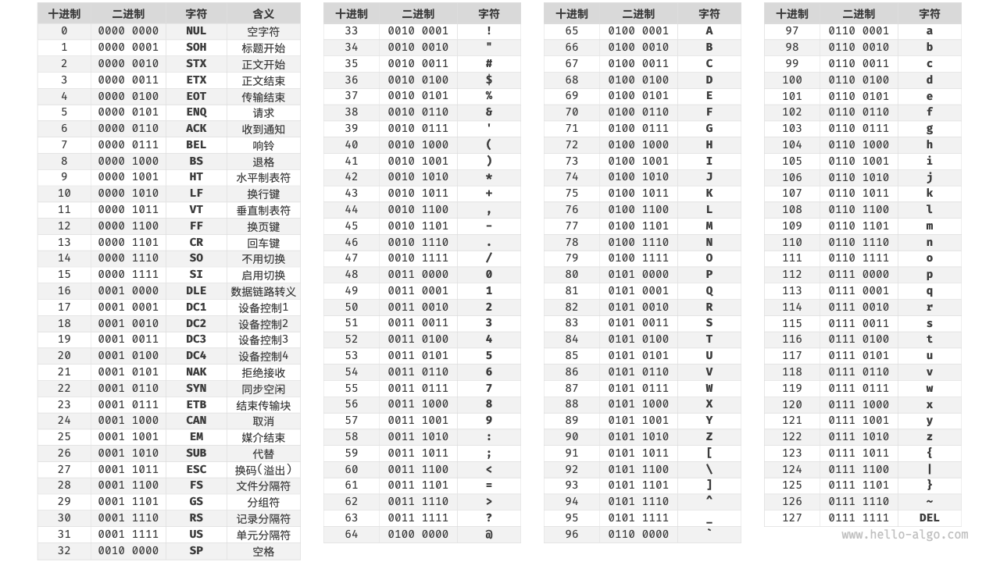

# 前置知识

> 本页**所有非***内容都是学习数据结构所必须的知识，请读者一定注意。

##  指针与结构体

指针也就是内存地址，指针变量是用来存放内存地址的**变量**。

[指针 - 《阮一峰《C 语言教程》》 - 书栈网 · BookStack](https://www.bookstack.cn/read/wangdoc-clang-tutorial/docs-pointer.md)

[C 指针 | 菜鸟教程 (runoob.com)](https://www.runoob.com/cprogramming/c-pointers.html)

**结构**是 C 编程中另一种用户自定义的可用的数据类型，它允许您存储不同类型的数据项。

[struct 结构 - 《阮一峰《C 语言教程》》 - 书栈网 · BookStack](https://www.bookstack.cn/read/wangdoc-clang-tutorial/docs-struct.md)

[C 结构体 | 菜鸟教程 (runoob.com)](https://www.runoob.com/cprogramming/c-structures.html)

!> 不多赘述，但是指针和结构体是数据结构的基础，是**一定要掌握的内容**，若实在是想不起来，可以参考以下视频

[南京大学-C程序设计基础-W9指针1_哔哩哔哩_bilibili](https://www.bilibili.com/video/BV17K41187Dp/?spm_id_from=333.788&vd_source=3310f07bcb7152dc48cc5e65834e98b5)

> 需要到达什么水平？
>
> A: 完全独立（不借助参考）
>
> 1. 声明和使用（整数等）指针 掌握使用`*`和 `&`等符号访问、修改指针变量，
> 2. 声明和使用 结构体、结构体变量， 掌握 `->`和`.`符号访问结构体变量、函数
> 3. 掌握 指针作为函数参数的函数以及函数的 声明、定义、使用

检测一下：

```c++
#include <iostream>

int main()
{
    int* a;
    int b = 50;
    a = &b;
    std::cout << a << " " << &a << " " << *a << " " << b << " " << &b <<std::endl;
}
```

求打印内容。

## [数据结构中使用的关键字和函数](../01_DS/011.md?id=实验)

## * 字符

### ASCII 字符集

ASCII 码是最早出现的字符集，其全称为 American Standard Code for Information Interchange（美国标准信息交换代码）。它使用 7 位二进制数（一个字节的低 7 位）表示一个字符，最多能够表示 128 个不同的字符。如图 3-6 所示，ASCII 码包括英文字母的大小写、数字 0 ~ 9、一些标点符号，以及一些控制字符（如换行符和制表符）。



图 ASCII 码

然而，**ASCII 码仅能够表示英文**。随着计算机的全球化，诞生了一种能够表示更多语言的 EASCII 字符集。它在 ASCII 的 7 位基础上扩展到 8 位，能够表示 256 个不同的字符。

在世界范围内，陆续出现了一批适用于不同地区的 EASCII 字符集。这些字符集的前 128 个字符统一为 ASCII 码，后 128 个字符定义不同，以适应不同语言的需求。

### GBK 字符集

后来人们发现，**EASCII 码仍然无法满足许多语言的字符数量要求**。比如汉字有近十万个，光日常使用的就有几千个。中国国家标准总局于 1980 年发布了 GB2312 字符集，其收录了 6763 个汉字，基本满足了汉字的计算机处理需要。

然而，GB2312 无法处理部分罕见字和繁体字。GBK 字符集是在 GB2312 的基础上扩展得到的，它共收录了 21886 个汉字。在 GBK 的编码方案中，ASCII 字符使用一个字节表示，汉字使用两个字节表示。

### Unicode 字符集

随着计算机技术的蓬勃发展，字符集与编码标准百花齐放，而这带来了许多问题。一方面，这些字符集一般只定义了特定语言的字符，无法在多语言环境下正常工作。另一方面，同一种语言存在多种字符集标准，如果两台计算机使用的是不同的编码标准，则在信息传递时就会出现乱码。

那个时代的研究人员就在想：**如果推出一个足够完整的字符集，将世界范围内的所有语言和符号都收录其中，不就可以解决跨语言环境和乱码问题了吗**？在这种想法的驱动下，一个大而全的字符集 Unicode 应运而生。

Unicode 的中文名称为“统一码”，理论上能容纳 100 多万个字符。它致力于将全球范围内的字符纳入统一的字符集之中，提供一种通用的字符集来处理和显示各种语言文字，减少因为编码标准不同而产生的乱码问题。

自 1991 年发布以来，Unicode 不断扩充新的语言与字符。截至 2022 年 9 月，Unicode 已经包含 149186 个字符，包括各种语言的字符、符号甚至表情符号等。在庞大的 Unicode 字符集中，常用的字符占用 2 字节，有些生僻的字符占用 3 字节甚至 4 字节。

### UTF-8 编码

目前，UTF-8 已成为国际上使用最广泛的 Unicode 编码方法。**它是一种可变长度的编码**，使用 1 到 4 字节来表示一个字符，根据字符的复杂性而变。ASCII 字符只需 1 字节，拉丁字母和希腊字母需要 2 字节，常用的中文字符需要 3 字节，其他的一些生僻字符需要 4 字节。

除了 UTF-8 之外，常见的编码方式还包括以下两种。

- **UTF-16 编码**：使用 2 或 4 字节来表示一个字符。所有的 ASCII 字符和常用的非英文字符，都用 2 字节表示；少数字符需要用到 4 字节表示。对于 2 字节的字符，UTF-16 编码与 Unicode 码点相等。
- **UTF-32 编码**：每个字符都使用 4 字节。这意味着 UTF-32 比 UTF-8 和 UTF-16 更占用空间，特别是对于 ASCII 字符占比较高的文本。

从存储空间占用的角度看，使用 UTF-8 表示英文字符非常高效，因为它仅需 1 字节；使用 UTF-16 编码某些非英文字符（例如中文）会更加高效，因为它仅需 2 字节，而 UTF-8 可能需要 3 字节。

从兼容性的角度看，UTF-8 的通用性最佳，许多工具和库优先支持 UTF-8 。

## * 算法

当我们听到“算法”这个词时，很自然地会想到数学。然而实际上，许多算法并不涉及复杂数学，而是更多地依赖基本逻辑，这些逻辑在我们的日常生活中处处可见。

在正式探讨算法之前，有一个有趣的事实值得分享：**你已经在不知不觉中学会了许多算法，并习惯将它们应用到日常生活中了**。下面我将举几个具体的例子来证实这一点。

**例：查字典**。在字典里，每个汉字都对应一个拼音，而字典是按照拼音字母顺序排列的。假设我们需要查找一个拼音首字母为 𝑟 的字，通常会按照图 1-1 所示的方式实现。

1. 翻开字典约一半的页数，查看该页的首字母是什么，假设首字母为 𝑚 。
2. 由于在拼音字母表中 𝑟 位于 𝑚 之后，所以排除字典前半部分，查找范围缩小到后半部分。
3. 不断重复步骤 `1.` 和 步骤 `2.` ，直至找到拼音首字母为 𝑟 的页码为止。

查字典这个小学生必备技能，实际上就是著名的“二分查找”算法。从数据结构的角度，我们可以把字典视为一个已排序的“数组”；从算法的角度，我们可以将上述查字典的一系列操作看作“二分查找”。

## * 计算机存储设备

计算机中包括三种类型的存储设备：**硬盘（hard disk）、内存（random-access memory, RAM）、缓存（cache memory）**。下表展示了它们在计算机系统中的不同角色和性能特点。

 计算机的存储设备

|        | 硬盘                                     | 内存                                   | 缓存                                              |
| :----- | :--------------------------------------- | :------------------------------------- | :------------------------------------------------ |
| 用途   | 长期存储数据，包括操作系统、程序、文件等 | 临时存储当前运行的程序和正在处理的数据 | 存储经常访问的数据和指令，减少 CPU 访问内存的次数 |
| 易失性 | 断电后数据不会丢失                       | 断电后数据会丢失                       | 断电后数据会丢失                                  |
| 容量   | 较大，TB 级别                            | 较小，GB 级别                          | 非常小，MB 级别                                   |
| 速度   | 较慢，几百到几千 MB/s                    | 较快，几十 GB/s                        | 非常快，几十到几百 GB/s                           |
| 价格   | 较便宜，几毛到几元 / GB                  | 较贵，几十到几百元 / GB                | 非常贵，随 CPU 打包计价                           |

我们可以将计算机存储系统想象为图所示的金字塔结构。越靠近金字塔顶端的存储设备的速度越快、容量越小、成本越高。这种多层级的设计并非偶然，而是计算机科学家和工程师们经过深思熟虑的结果。

- **硬盘难以被内存取代**。首先，内存中的数据在断电后会丢失，因此它不适合长期存储数据；其次，内存的成本是硬盘的几十倍，这使得它难以在消费者市场普及。
- **缓存的大容量和高速度难以兼得**。随着 L1、L2、L3 缓存的容量逐步增大，其物理尺寸会变大，与 CPU 核心之间的物理距离会变远，从而导致数据传输时间增加，元素访问延迟变高。在当前技术下，多层级的缓存结构是容量、速度和成本之间的最佳平衡点。


计算机的存储层次结构体现了速度、容量和成本三者之间的精妙平衡。实际上，这种权衡普遍存在于所有工业领域，它要求我们在不同的优势和限制之间找到最佳平衡点。

总的来说，**硬盘用于长期存储大量数据，内存用于临时存储程序运行中正在处理的数据，而缓存则用于存储经常访问的数据和指令**，以提高程序运行效率。三者共同协作，确保计算机系统高效运行。

如图所示，在程序运行时，数据会从硬盘中被读取到内存中，供 CPU 计算使用。缓存可以看作 CPU 的一部分，**它通过智能地从内存加载数据**，给 CPU 提供高速的数据读取，从而显著提升程序的执行效率，减少对较慢的内存的依赖。


#### 数据结构的内存效率

在内存空间利用方面，数组和链表各自具有优势和局限性。

一方面，**内存是有限的，且同一块内存不能被多个程序共享**，因此我们希望数据结构能够尽可能高效地利用空间。数组的元素紧密排列，不需要额外的空间来存储链表节点间的引用（指针），因此空间效率更高。然而，数组需要一次性分配足够的连续内存空间，这可能导致内存浪费，数组扩容也需要额外的时间和空间成本。相比之下，链表以“节点”为单位进行动态内存分配和回收，提供了更大的灵活性。

另一方面，在程序运行时，**随着反复申请与释放内存，空闲内存的碎片化程度会越来越高**，从而导致内存的利用效率降低。数组由于其连续的存储方式，相对不容易导致内存碎片化。相反，链表的元素是分散存储的，在频繁的插入与删除操作中，更容易导致内存碎片化。
