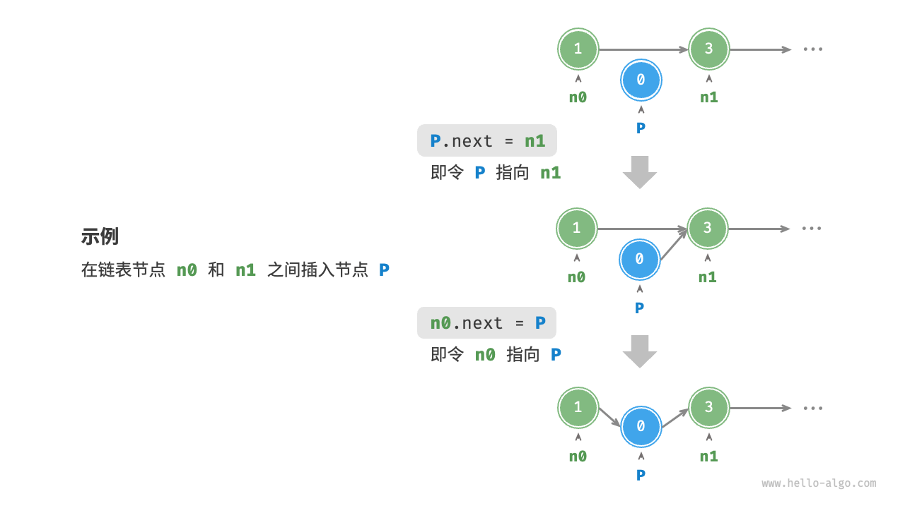
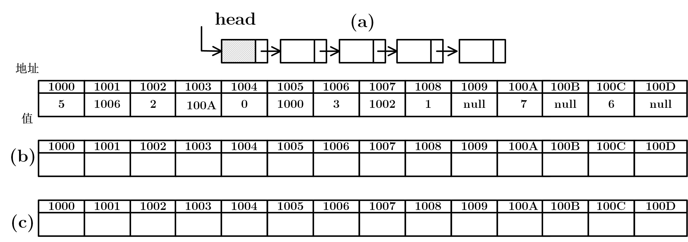

# 线性表(linear list)

### 定义

线性表是$n(n≥0)$​个相同类型的数据元素构成的**有限序列**。 

> 有限序列：
>
> 1. 有且只有一个“第一个”元素
> 2. 有且只有一个“最后一个”元素
> 3. 元素都有唯一的**前驱**和**后继**，（除了首尾元素）
>
> c语言中的数组，就是一个典型的线性表

#### 数学表示

- $(a_1，a_2，…，a_n)$ （形似数列）

- 其中，$n$为线性表的长度，当 $n=0$时，表示线性表是一个空表，即表中不包含任何元素。

- 对任意一对相邻元素$<a_i,a_{i+1}>(1≤i<n)$，$a_i$ 称为$a_{i+1}$ 的**前驱 ．**$a_{i+1}$称为$a_i$​ 的**后继**


#### 逻辑视图


### 基本操作

> 我们知道，一个**数据类型**，不只要有相应的数据元素，还需要对该元素的操作

线性表的基本操作通常包括：

- **初始化**：创建一个空表。
- **销毁**：释放线性表所占用的内存空间。
- **插入**：在指定位置插入一个元素。
- **删除**：删除指定位置的元素。
- **查找**：查找给定值的元素并返回其位置。
- **遍历**：遍历表中的每一个元素，进行操作。

#### 注意事项

- 线性表除第一个和最后一个元素之外，每一格数据元素只有**一个前驱和一个后继**
- 元素含义无所谓，可以指任何东西，但**元素类型必须相同**

# 顺序表

#### 定义

顺序表：按照顺序存储结构存储的线性表。

顺序存储结构：用一组地址连续的存储单元依次存储**数据结构**(在这里是线性表)里各个元素，这种存储结构称为线性表的顺序存储结构。

> 拓展：数据的存储结构
>
> 1. 顺序存储 ： 物理位置上相邻
> 2. 链式存储 ： 不要求物理位置上相邻
> 3. 索引存储
> 4. 散列存储

## 表示

在c语言中，我们一般用**数组**来表示顺序表

*数组（array）*是一种**典型的**线性数据结构，是一种**典型的顺序表。**

```c
/* 初始化数组 */
int arr[5] = { 0 }; // { 0, 0, 0, 0, 0 }
int nums[5] = { 1, 3, 2, 5, 4 };
```

#### 逻辑图示


在计算机中，数组的分配形式是连贯的：


#### <font color = red> 重点1 ： 数组中访问第$i$个元素的时间复杂度</font>

#### 注意事项

访问顺序表中任意元素的时间都相等，具有这一特点的存储结构称为**随机存取结构**。

> 注意 ：这里是"存取"结构，和上文的“存储”结构并不相同，读者可忽略相关专有名词，只需注意数组访问各个元素的时间复杂度是 $O(1)$​ 即可。
>
> **顺序存储方法 $\Leftrightarrow$ 可以随机存取**

**也就是说，在顺序表中，我们访问第 $i$ 个元素时，不需要遍历前 $i - 1$个元素，而是可以直接访问第 $i$个元素，**

比如在数组$<1，2，3，4，5，7，8，9>$中，若我们要访问 $a_4$（也就是 $5$ 这个元素）我们可以根据据数组首地址 $a_0$（也叫 $a[0]$）直接计算得到 $a_4$的地址，从而直接访问。

> #### * 随机存取结构
>
> 随机存取结构（Random Access Structure）通常指的是一种数据结构，其特点是能够在常数时间（$O(1)$ 时间复杂度）内访问任何一个元素。最典型的随机存取结构是数组（Array）。在数组中，每个元素都可以通过其索引直接访问，而无需遍历其他元素，这使得访问任何元素的时间复杂度都是 $𝑂(1)$。
>
> 随机存取和顺序存取（Sequential Access）是两种数据访问方式的对比：
>
> - **随机存取**：可以直接跳到数据结构中的任何位置并访问或修改数据。
> - **顺序存取**：数据必须按一定的顺序（例如从头到尾）访问，典型的例子是链表（Linked List）

### 顺序表的结构体

我们知道，对于一种数据结构，数组只是存储其数据元素的工具之一，我们还需要定义对该数组的各种操作。

> [为什么要把这些放这里？](../01_DS/0111.md?id=关于实验)

```c
#define LIST_INIT_SIZE 100  // 顺序表存储空间的初始分配量
#define LISTINCREMENT  10   // 顺序表存储空间的分配增量

/* 顺序表元素类型定义 */
typedef int ElemType;

/*
 * 顺序表结构
 *
 * 注：elem在使用前需要先为其分配内存，且元素从elem[0]处开始存储
 */
typedef struct {
    ElemType* elem;     // 顺序表存储空间的基址（指向顺序表所占内存的起始位置）
    int length;   // 当前顺序表长度（包含多少元素）
    int listsize; // 当前分配的存储容量（可以存储多少元素）
} SqList;
```

#### 顺序表初始化

```c
/* 状态码 */
#define TRUE        1   // 真/是
#define FALSE       0   // 假/否
#define OK          1   // 通过/成功
#define ERROR       0   // 错误/失败
typedef int Status;
#ifndef OVERFLOW
#define OVERFLOW    -2  //堆栈上溢
#endif
/*
 * 初始化
 * 初始化成功则返回OK，否则返回ERROR。
 */
Status InitList(SqList* L) {
    // 分配指定容量的内存，如果分配失败，则返回NULL
    (*L).elem = (ElemType*) malloc(LIST_INIT_SIZE * sizeof(ElemType));
    if((*L).elem == NULL) {
        // 存储内存失败
        exit(OVERFLOW);
    }
    
    (*L).length = 0;                    // 初始化顺序表长度为0
    (*L).listsize = LIST_INIT_SIZE;     // 顺序表初始内存分配量
    
    return OK;                          // 初始化成功
}
```

> 读者可能注意到，这里的代码与书上的略有不同，
>
> 1. 这里加了许多[预定义]()内容，其实书上是省略了这一部分内容，在书中**Page10**有相关内容
>
> 2. 除此之外，还有代码上的略微不同， 比如 `*L`和 `&L`的不同，读者可访问[结构体]()和[指针]()。

#### 销毁和置空

```c
/*
 * 销毁(结构)
 *
 * 释放顺序表所占内存。
 */
Status DestroyList(SqList* L) {
    // 确保顺序表结构存在
    if(L == NULL || (*L).elem == NULL) {
        return ERROR;
    }
    
    // 释放顺序表内存
    free((*L).elem);
    
    // 释放内存后置空指针
    (*L).elem = NULL;
    
    // 顺序表长度跟容量都归零
    (*L).length = 0;
    (*L).listsize = 0;
    
    return OK;
}

/*
 * 置空(内容)
 *
 * 只是清理顺序表中存储的数据，不释放顺序表所占内存。
 */
Status ClearList(SqList* L) {
    // 确保顺序表结构存在
    if(L == NULL || (*L).elem == NULL) {
        return ERROR;
    }
    
    (*L).length = 0;
    
    return OK;
}

/*
 * 判空
 *
 * 判断顺序表中是否包含有效数据。
 *
 * 返回值：
 * TRUE : 顺序表为空
 * FALSE: 顺序表不为空
 */
Status ListEmpty(SqList L) {
    return L.length == 0 ? TRUE : FALSE;
}
/*
 * 计数
 *
 * 返回顺序表包含的有效元素的数量。
 */
int ListLength(SqList L) {
    return L.length;
}
```

#### 插入

值得关注的是插入算法，需要对数组进行进一步的调整

```c
Status ListInsert(SqList* L, int i, ElemType e) {
    ElemType* newbase;
    ElemType* p, * q;
    
    // 确保顺序表结构存在
    if(L == NULL || (*L).elem == NULL) {
        return ERROR;
    }
    
    // i值越界
    if(i < 1 || i > (*L).length + 1) {
        return ERROR;
    }
    
    // 若存储空间已满，则增加新空间
    if((*L).length >= (*L).listsize) {
        // 基于现有空间扩容
        newbase = (ElemType*) realloc((*L).elem, ((*L).listsize + LISTINCREMENT) * sizeof(ElemType));
        if(newbase == NULL) {
            // 存储内存失败
            exit(OVERFLOW);
        }
        
        // 新基址
        (*L).elem = newbase;
        // 存的存储空间
        (*L).listsize += LISTINCREMENT;
    }
    
    // q为插入位置
    q = &(*L).elem[i - 1];
    
    // 1.右移元素，腾出位置
    for(p = &(*L).elem[(*L).length - 1]; p >= q; --p) {
        *(p + 1) = *p;
    }
    
    // 2.插入e
    *q = e;
    
    // 3.表长增1
    (*L).length++;
    
    return OK;
}

```

除此之外，还有**删、查、改**等，难度较低，不再赘述。

### 数组的优点与局限性

数组存储在连续的内存空间内，且元素类型相同。这种做法包含丰富的先验信息，系统可以利用这些信息来优化数据结构的操作效率。

- **空间效率高**：数组为数据分配了连续的内存块，无须额外的结构开销。
- **支持随机访问**：数组允许在  时间内访问任何元素。
- **缓存局部性**：当访问数组元素时，计算机不仅会加载它，还会缓存其周围的其他数据，从而借助高速缓存来提升后续操作的执行速度。

连续空间存储是一把双刃剑，其存在以下局限性。

- **插入与删除效率低**：当数组中元素较多时，插入与删除操作需要移动大量的元素。
- **长度不可变**：数组在初始化后长度就固定了，扩容数组需要将所有数据复制到新数组，开销很大。
- **空间浪费**：如果数组分配的大小超过实际所需，那么多余的空间就被浪费了。

## <font color = red> 考点1 ： 数组求地址</font>

第一个考点：

#### 一个数组第一个元素的存储地址是100，每个元素的长度为2，则第5个元素的地址是（ ）。

解 ： 要计算第5个元素的地址，我们可以使用以下公式：

$元素地址=起始地址+(元素序号−1)×元素长度$

在这个问题中：

- 起始地址 = 100
- 元素长度 = 2
- 元素序号 = 5

将这些值代入上面的公式：第 $5$​ 个元素的地址 = 108

#### 变式 ： 在内存中， 一个**int**型数组第一个元素的存储地址是0x1000，则第5个元素的地址是（ ）

已知

1. **内存地址通常以十六进制表示：`0x`代表该式为十六进制**
2. **int**型变量长度为4

第五个元素的地址是 **0x1010**。

# 链表

内存空间是所有程序的公共资源，在一个复杂的系统运行环境下，空闲的内存空间可能散落在内存各处。我们知道，存储数组的内存空间必须是连续的，而当数组非常大时，内存可能无法提供如此大的连续空间。此时链表的灵活性优势就体现出来了。

链表（linked list）是一种线性数据结构，其中的每个元素都是一个节点对象，各个节点通过“引用”相连接。引用记录了下一个节点的内存地址，通过它可以从当前节点访问到下一个节点。

链表的设计使得各个节点可以分散存储在内存各处，它们的内存地址无须连续。


## 定义

- 链式存储结构：用一组任意的存储单元存储**数据结构**（这里是线性表)里的各元素(这组存储单元**可以是地址连续的，也可以是不连续的**)，并且每个存储元素有一个数据域，一个（或多个）指针域，数据域用来存储元素内容，指针域用来反映元素的逻辑关系(前后位置关系)，这种存储方式成为链式存储（也叫非随机存取的存储结构）。

- 链表：按照链式存储结构存储的线性表。

### 单链表

单链表：各元素只有一个指针域的链表（只含有一个指针域）

示意图 ：

-  头节点（$phead$） ：包含第一个节点的地址指针（$0x12ff44$）
- 第一个节点（$0x12ff44$） ：包含第二个节点的地址指针（$0x15ff60$）和本身的数据（$1$）  


>  图中：2.3.4.5都是结构体，称之为**结点**，与顺序表不同的是，链表中的每个结点是一个**结构体**，结构体成员包括改节点所存的数据，和下一个结点的地址。另外，顺序表中的地址是连续的，而链表中结点的地址是随机分配的。

#### 逻辑图示(带头结点的单链表)


- **表头指针**：存放单链表中第一个结点的地址的指针。【指向$a_0$ (带头结点时)或指向$a_1$(不带头结点时)的指针，上图中的$L$】

- **头结点**：带头结点的单链表中$L$ 【上图中的a1之前的结点 $a_0$】

- **尾结点**：单链表中最后一个结点，表尾结点的指针域指针为空。【 $a_n$】

### 链表结构体

```c
/* 单链表元素类型定义 */
typedef int ElemType;

/*
 * 单链表结构
 *
 * 注：这里的单链表存在头结点
 */
typedef struct LNode {
    ElemType data;      // 数据结点
    struct LNode* next; // 指向下一个结点的指针
} LNode;

// 指向单链表结点的指针
typedef LNode* LinkList;
```

这里需要用到[结构体](../01_DS/011?id=结构体)的内容

#### 初始化

```c
/*
 * 初始化
 *
 * 只是初始化一个头结点。
 * 初始化成功则返回OK，否则返回ERROR。
 */
Status InitList(LinkList* L) {
    (*L) = (LinkList) malloc(sizeof(LNode));
    if(*L == NULL) {
        exit(OVERFLOW);
    }
    
    (*L)->next = NULL;
    
    return OK;
}
```

> 此处省略了预定义的相关内容，与顺序表的预定义相同

#### 插入

链表的插入和数组相差很大，在链表中插入节点非常容易。如图所示，假设我们想在相邻的两个节点 `n0` 和 `n1` 之间插入一个新节点 `P` ，**则只需改变两个节点引用（指针）即可**，时间复杂度为 $𝑂(1)$ 。

相比之下，在数组中插入元素的时间复杂度为 $𝑂(𝑛)$​ ，在大数据量下的效率较低。



如图所示，插入的核心代码是:

> 

```c
/* 在链表的节点 n0 之后插入节点 P */
void insert(LinkList *n0, LinkList *P) {
    LinkList *n1 = n0->next;
    P->next = n1;
    n0->next = P;
}
```

但是在一个标准、严格的数据结构中，需要对输入输出有严格的判定:

```c
/*
 * 插入
 *
 * 向链表第i个位置上插入e，插入成功则返回OK，否则返回ERROR。
 *
 *【备注】
 * 教材中i的含义是元素位置，从1开始计数
 */
Status ListInsert(LinkList L, int i, ElemType e) {
    LinkList p, s;
    int j;
    
    // 确保链表存
    if(L == NULL) {
        return ERROR;
    }
    
    p = L;
    j = 0;
    
    // 寻找第i-1个结点，且保证该结点本身不为NULL
    while(p != NULL && j < i - 1) {
        p = p->next;
        ++j;
    }
    
    // 如果遍历到头了，或者i的值不合规(比如i<=0)，说明没找到合乎目标的结点
    if(p == NULL || j > i - 1) {
        return ERROR;
    }
    
    // 生成新结点
    s = (LinkList) malloc(sizeof(LNode));
    if(s == NULL) {
        exit(OVERFLOW);
    }
    s->data = e;
    s->next = p->next;
    p->next = s;
    
    return OK;
}
```

---

#### 注意事项

- 链表的元素一般称为“结点”。

- 头结点在链表中并不是必须的，仅仅是为了操作上的方便。

- 结点 $a_i$ 指其数据域为 $a_i$ 的结点，而 $p$ 则是指向$a_i$的指针，俗称"$p$结点"。

- **链表有带头结点的链表和不带头结点的链表之分，带头结点的链表第一个元素为头结点$a_0$，$L$指向$a_0$; 不带头结点的链表第一个元素为头结点$a_1$，$L$指向$a_1$**


​	

单链表的操作


### 双向链表

双（向）链表就是每个结点中含有两个指针域的链表，其中一个指针域存放其前趋结点的地址，另一个指针域存放其后继结点的地址。

#### 逻辑图示


- **头结点**：双链表中第一个结点(上图中的$a_1$之前的结点$a_0$)

- **表头指针**：存放双链表中第一个结点的地址的指针。(指向$a_0$的指针)

- **开始结点**：存放双链表的第一个元素的结点。($a_1$)

- **表尾结点**：双链表中最后一个结点，表尾结点的指针域指针为空。($a_n$)

  ---

#### 数学表示

- 同线性表

- 寻址 一般用p,q等字母表示操作性指针，可用前驱指针域prior和后继指针域next访问表中任意节点，例如：
  p = &a[i]（即a[i] = p->data）
  那么
  a[i]的上一个元素地址是 p -> prior , 上一个元素值是 p->prior->data
  a[i]的下一个元素地址是 p -> next , 下一个元素值是 p->next->data
  一般的，有
  p->next-prior = p = p->prior->next

---

#### 注意事项

## <font color = red> 考点2 ： 链表地址</font>

#### 表的数据结构如下，图中内存每个单元表示4个字节，int型和指针型变量假设都为4字节大小。

```c
typedef struct ListNode
{ 	int data;
 	struct ListNode * next;
} ListNode;
```

1. 图(a)中画出链表里的值，其中 $head=1004$;
2. 写出运行

```c
p=head->next->next; 
head->next->next=p->next;
free(p);
```

后的值。

3. 图(c)中写出执行如下代码后的值，其中 $newNode=100C$

```c
......
void main (){
    ListNode *newNode;
    newNode =( ListNode *) malloc(sizeof(ListNode));
    q=head; 
    p=head->next;
    while(p!=NULL && p->data<new){
        p=p->next; 
        q=q->next;
    }
    newNode->next=q->next;
    q->next=newNode;
}
```

