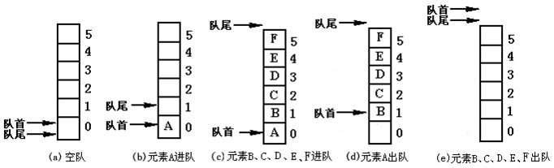

# 栈（stack）

## 定义


- **是一种特殊的线性表，这种表只能在固定的一端进行插入与删除操作。**

- **固定插入的一端叫栈顶 (top)，而另一端称为栈底 (bottom)。位于栈顶和栈底的元素分别称为顶元和底元。当表中无元素时，称为空栈**
  - 栈顶（Top）：线性表允许进行插入和删除的那一端

  - 栈底（Bottom）：固定的，不允许进行插入和删除的另一端

- **先进后出，后进先出**（栈中元素后进去的必然先出来，即后进先出 LIFO（Last In First Out））

## 图示


### 注意事项

- **栈底指针 $base$ 是固定的，而栈顶指针 $top$ 随着插入和删除的操作而不断变化。**

- 后插入的元素永远比先插入的元素先出栈

- 栈空和栈满：


## 栈的操作及其效率

| 方法     | 描述                   | 时间复杂度 |
| :------- | :--------------------- | :--------- |
| `push()` | 元素入栈（添加至栈顶） | $𝑂(1)$     |
| `pop()`  | 栈顶元素出栈           | $𝑂(1)$     |
| `peek()` | 访问栈顶元素           | $𝑂(1)$     |

### 栈的典型应用

**浏览器中的后退与前进、软件中的撤销与反撤销：**每当我们打开新的网页，浏览器就会对上一个网页执行入栈，这样我们就可以通过后退操作回到上一个网页。后退操作实际上是在执行出栈。如果要同时支持后退和前进，那么需要两个栈来配合实现。

## 顺序栈

**顺序栈**:堆栈的**顺序存储结构**，利用**一组地址连续的存储单元**依次存放自栈底到栈顶之间的数据元素。（也就是数组）

 在顺序栈中，`top` 起到指示栈顶元素的作用，它的值是数组中的**下标**，因此 `top` 是一个相对指针


### 顺序栈的结构体

栈遵循先入后出的原则，因此我们只**能在栈顶添加或删除元素**。然而，数组和链表都可以在任意位置添加和删除元素，**因此栈可以视为一种受限制的数组或链表**。换句话说，我们可以“屏蔽”数组或链表的部分无关操作，使其对外表现的逻辑符合栈的特性。

```c
/* 宏定义 */
#define STACK_INIT_SIZE 100     // 顺序栈存储空间的初始分配量
#define STACKINCREMENT  10      // 顺序栈存储空间的分配增量
/* 顺序栈元素类型定义 */
typedef int SElemType;

// 顺序栈元素结构
typedef struct {
    SElemType* base;               // 栈底指针
    SElemType* top;                // 栈顶指针
    int stacksize;                 // 当前已分配的存储空间，以元素为单位
} SqStack;
```

#### 初始化

```c
/*
 * 初始化
 *
 * 构造一个空栈。初始化成功则返回OK，否则返回ERROR。
 */
Status InitStack(SqStack* S) {
    if(S == NULL) {
        return ERROR;
    }
    
    (*S).base = (SElemType*) malloc(STACK_INIT_SIZE * sizeof(SElemType));
    if((*S).base == NULL) {
        exit(OVERFLOW);
    }
    
    (*S).top = (*S).base;
    (*S).stacksize = STACK_INIT_SIZE;
    
    return OK;
}
```

#### 出栈和入栈

由于入栈的元素可能会源源不断地增加，因此我们可以使用动态数组，这样就无须自行处理数组扩容问题。

```c
/*
 * 入栈
 *
 * 将元素e压入到栈顶。
 */
Status Push(SqStack* S, SElemType e) {
    if(S == NULL || (*S).base == NULL) {
        return ERROR;
    }
    
    // 栈满时，追加存储空间
    if((*S).top - (*S).base >= (*S).stacksize) {
        (*S).base = (SElemType*) realloc((*S).base, ((*S).stacksize + STACKINCREMENT) * sizeof(SElemType));
        if((*S).base == NULL) {
            exit(OVERFLOW);     // 存储分配失败
        }
        
        (*S).top = (*S).base + (*S).stacksize;
        (*S).stacksize += STACKINCREMENT;
    }
    
    // 进栈先赋值，栈顶指针再自增
    *(S->top++) = e;
    
    return OK;
}
```

出栈：

```c
/*
 * 出栈
 *
 * 将栈顶元素弹出，并用e接收。
 */
Status Pop(SqStack* S, SElemType* e) {
    if(S == NULL || (*S).base == NULL) {
        return ERROR;
    }
    
    if((*S).top == (*S).base) {
        return ERROR;
    }
    
    // 出栈栈顶指针先递减，再赋值
    *e = *(--(*S).top);
    
    return OK;
}
```

## <font color = red> 考点3 ： 栈的输出</font>

[题目：一个栈的输入序列为a、b、c，则下列序列中不可能是栈的输出序列的是（）。_哔哩哔哩_bilibili](https://www.bilibili.com/video/BV1Yx4y197oC/?spm_id_from=333.337.search-card.all.click&vd_source=3310f07bcb7152dc48cc5e65834e98b5)

#### 有六个元素 `6、5、4、3、2、1`的顺序进栈, 问下列哪一个不是合法的出栈序列?

- A.  `5 4 3 6 1 2 `
- B.  `4 5 3 1 2 6 `
- C.  `3 4 6 5 2 1 `
- D.  `2 3 4 1 5 6 `

#### 答：

A : 合法

| 出入栈  |     栈     |        输出        |
| :-----: | :--------: | :----------------: |
| 入栈：6 |  栈: [6]   |         /          |
| 入栈：5 | 栈: [6, 5] |         /          |
| 出栈：5 |  栈: [6]   |        [5]         |
| 入栈：4 | 栈: [6, 4] |        [5]         |
| 出栈：4 |  栈: [6]   |       [5, 4]       |
| 入栈：3 | 栈: [6, 3] |       [5, 4]       |
| 出栈：3 |  栈: [6]   |     [5, 4, 3]      |
| 出栈：6 |   栈: []   |    [5, 4, 3, 6]    |
| 入栈：2 |  栈: [2]   |    [5, 4, 3, 6]    |
| 入栈：1 | 栈: [2, 1] |    [5, 4, 3, 6]    |
| 出栈：1 |  栈: [2]   |  [5, 4, 3, 6, 1]   |
| 出栈：2 |   栈: []   | [5, 4, 3, 6, 1, 2] |

**B. 4 5 3 1 2 6** : 合法

**C. 3 4 6 5 2 1**

- 出栈 3（合法）
- 出栈 4（合法）
- 出栈 6（不合法，只能出栈 5 ，无法出栈 6）

→ 这个序列不合法

**D. 2 3 4 1 5 6** ： 合法

# 队列

队列：受约束的线性表，只允许**在队尾插入，在队头删除**

- **先进先出，后进后出**




- 队列的插入称为**进队**，队列的删除称为**出队**

- 数据元素从**rear（队尾，上方）**进队，从**front（队首，下方）**出队

> 为什么要用双指针？
>
> **在数组中删除队首元素的时间复杂度为 $O(n)$** ，这会导致出队操作效率较低。我们可以采用以下巧妙方法来避免这个问题：
>
> 我们可以使用一个变量 `front` 指向队首元素的索引，并维护一个变量 `size` 用于记录队列长度。定义 `rear = front + size` ，这个公式计算出的 `rear` 指向队尾元素之后的下一个位置

- **先进入队列的元素比后进入队列的元素先出队列（后进入队列的元素比先进入的元素后出队列）**，即队列是一个**先进先出**(FIFO)（First In First Out）表

### 队列操作

| 方法名   | 描述                         |
| -------- | ---------------------------- |
| `push()` | 元素入队，即将元素添加至队尾 |
| `pop()`  | 队首元素出队                 |


#### 队列典型应用

- **淘宝订单**。购物者下单后，订单将加入队列中，系统随后会根据顺序处理队列中的订单。在双十一期间，短时间内会产生海量订单，高并发成为工程师们需要重点攻克的问题。

- **各类待办事项**。任何需要实现“先来后到”功能的场景，例如打印机的任务队列、餐厅的出餐队列等，队列在这些场景中可以有效地维护处理顺序。

## 顺序队

> 栈、队列、树等等数据结构都是由**数组和链表**这两个基本数据结构所表示，因此，学好第一章是后面的基础

用数组来实现队列

但是对于队列，顺序表（数组）表示的队列很容易发生“假溢出”情况

### 假溢出

当元素被插入到数组中下标最大的位置上时，数组的底端还有空闲空间，此时如果还有元素入队，就会发生“溢出”现象，显然这种溢出并不是真正的溢出，而是**“假溢出”**。

如图所示


数组仍有两个单位空间没有使用，但是当要在队尾入队时，需要开辟新的空间。

- 相当于：**“上面满了，下面还有空的“**。

- **假溢出**的判断条件是： $rear \geq maxsize $ 且  $front > 0$

- **假溢出**只存在于**非循环顺序队列**中


为了解决这个问题，提出了一种队列 ：循环队列

---

## <font color = red> 重点3 ： 顺序循环队列的判定</font>

> 事实上，本项目中每一个插入的视频都是**重点**：需要插入视频的内容 = 会考 + 不容易理解  = 重点

### 顺序循环队列

#### 定义

**顺序循环队列**就是**把顺序队列改造成一个头尾相连的循环表**

- 顺序循环队列初始状态为`front = rear = 0`
- 入队时，把元素插到 `rear`指示位置，然后 `rear++`
- 出队时，把`front`指示位置元素删除，然后 `front++`


> 如何在计算机中实现循环队列？
>
> 这里循环队列本质上还是一个数组，对于“环形“数组（这个环形实际上是我们认为”想象“出来的，在计算机中，循环队列实际上仍然是一个数组），我们需要让 `front` 或 `rear` 在越过数组尾部时，直接回到数组头部继续遍历。这种周期性规律可以通过“**取余**操作”来实现

若循环队列如图所示，为数组 $a[5]$,有 $<0\ 1\ 2\ 3\ 4\ 5 >$ 六个位置

判断下次进入的位置：例：若 $maxsize = 6$，$rear = 5$, 则下次进队的位置为 $0$，因为 `(rear+1)%6 = 0`，因此队列**当前元素个数：**
$$
(Q.rear - Q.front + MAXQSIZE) \% MAXQSIZE
$$
如果不理解，读者可以参考以下内容：

[3.6 循环队列_哔哩哔哩_bilibili](https://www.bilibili.com/video/BV1xQ4y1r7KS/?spm_id_from=333.337.search-card.all.click&vd_source=3310f07bcb7152dc48cc5e65834e98b5)

> 但是由此引发了一个问题，我们需要更新关于队空、队满的判断式：

#### 状态图示

- 第一种状态：队列中有元素（既非空，也非满）:  `rear != front`

- 第二种状态：队满 `(rear == front)` && **`front`与`rear`所指示的位置有元素**

- 第三种状态：队空 `(rear == front)` && **`front`与`rear`所指示的位置无元素**


可以注意到，队满和队空的时候，指针都是 `front == rear`,在代码中，我们有两个方法来**区别队满与队空**

1. 牺牲一个单元来区分队满和队空，也就是入队时少用一个单元

2. 增设 `size`，表示元素个数，如果为空`size = 0` ，不为空则 `size = 1`。

#### 注意事项

- 顺序循环队列可以解决”假溢出“问题，但是会带来”无法判空“的问题。
- 顺序队列判空条件是`rear == front`，而满足这个条件的顺序循环队列有可能为空，有可能为满

> 队列表达式
>
> 1. 队空的条件： `Q.front == Q.rear`
>
> 2. 队满的条件： `(Q.rear+ 1)%MAXQSIZE == Q.front`
>
> 3. 入队：`Q.rear = (Q.rear + 1)% MAXQSIZE`
>
> 4. 出队：`Q.front = (Q.front + 1)% MAXQSIZE`
>
> 5. 当前元素个数： `(Q.rear - Q.front + MAXQSIZE) % MAXQSIZE`
>
>可以参考：[循环队列_哔哩哔哩_bilibili](https://www.bilibili.com/video/BV1cg411c7Rh/?spm_id_from=333.788.recommend_more_video.1&vd_source=3310f07bcb7152dc48cc5e65834e98b5)

一图流：


## 链队

队列的链式存储结构，其实就是线性表的单链表，只不过需要加点限制，只能表尾插入元素，表头删除元素。

为了方便操作，我们分别设置队头指针和队尾指针，队头指针指向头结点，队尾指针指向尾结点

# 栈和队列的应用

> 以下两种问题，对于计算机来说，需要用到栈来进行操作，在做题时，也可以**手算**（靠技巧）
>
> 例：
>
> - 从表达式的角度考察： `a*(b+c)-d`的后缀表达式是什么
> - 从栈的角度考察 ：写出计算机将 `a*(b+c)-d`变为后缀表达式中每一步的栈的内容
>
> 显然后者更难，但是考察概率较低

[3.3.1_栈在括号匹配中的应用_哔哩哔哩_bilibili](https://www.bilibili.com/video/BV1b7411N798?p=27&vd_source=3310f07bcb7152dc48cc5e65834e98b5)

以下视频讲的就是如何**手算**表达式，而非计算机工作，若想了解后者，可访问王道数据结构

[数据结构---前缀 中缀 后缀 表达式之间的转换_哔哩哔哩_bilibili](https://www.bilibili.com/video/BV1Rf4y1G7XY/?spm_id_from=333.337.search-card.all.click&vd_source=3310f07bcb7152dc48cc5e65834e98b5)

## <font color = red> 考点4 ： 表达式转换</font>

#### 表达式a\*(b+c)-d的后缀表达式是(  )

- A.  `a b c d * + - `
- B.  `a b c + * d - `
- C.  `a b c * + d - `
- D.  `- + * a b c d `

#### 答：

1. **括号内的运算**：首先处理 `b+c`，其后缀为 `b c +`
2. **乘法运算**：接下来计算 `a*(b+c)`，合并后得到 `a b c + *`
3. **减法运算**：最后，整体表达式 `a*(b+c)-d` 后缀为 `a b c + * d -`

因此，正确的后缀表达式是 **B**: `a b c + * d -`
