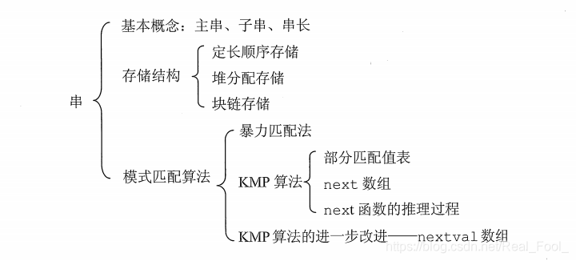
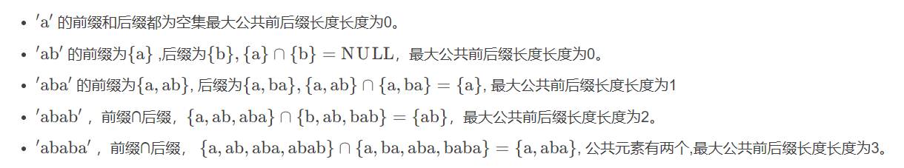

# 串、数组和广义表

## 串



串即字符串，由 $n(n≥0)$个**字符**组成的有限序列。一般记为：$S='a_1a_2…a_n'$

- $S$ 是串名

- $a_i(1≤i≤n)$ 可以是英文字母、数字字符或其他字符

- 串中字符的个数 $n$ 称为串的长度；$n=0$ 时是空串。

**串就是是数据元素为单个字符的特殊线性表**

1. 串是内容受限的线性表,它限定了表中的元素为字符
2. 串长：串中字符个数 $(n≥0),n=0$ 时称为空串
3. 空白串：由一个或多个空格符组成的串（区别于空串）

> $\uparrow$ 不考捏

4. **当两个串的长度相等，并且各个对应位置的字符都相等时，才称这两个串相等**（见下文串的运算）

### 子串

**子串：串中任意个连续的字符组成的子序列称为该串的子串**

设串 $A$ 和 $B$ 分别为 $A='This\ is \ a \ string'$，$B='is'$  则 $B$ 是 $A$ 的子串，$A$ 为主串

有两个串 $a$ 和 $b$，如果 $a$ 中可以找到几个连续字符组成的串与 $b$ 完全相同，则称 $a$ 是 $b$ 的主串，$b$ 是 $a$ 的子串：

再例如，若 $a = 'shujujiegou'$，$b ='shuju'$，由于$ a$ 中也包含 $'shuju'$，因此串 $a$ 和串 $b$ 是主串和子串的关系

> - 空串是任何串的子串.
> - 一个串也可以看成是自身的子串
> - 子串个数公式：**${n(n+1) \over 2}+1$**
> - 真子串：除本身之外的其它子串，真子串个数公式：${n(n+1) \over 2}$

---

## 串的运算

给定两个串：$ X ='x_1x_2…x_n', Y ='y_1y_2…y_m'$，有如下运算

1. 创建串
2. **连接（Concatenation）**：将两个或多个串连接在一起，形成一个新的串。
3. **查找** ： 查找子串在主串中的位置。
4. **比较**：**逐字符比较**
   - **相等** ：当 $n=m$ 且 $x_1=y_1,x_2=y_2, …, x_n= y_m$时， 称 $X=Y$
   - **不等** ：**从左到右**逐个字符进行比较，直到遇到不同字符或到达某个字符串的末尾为止。在字符比较时，使用字符的`ASCII`值。通常，`ASCII`值较小的字符被认为是"小"字符串
5. **求串长**
6. **求子串**

## 串的模式匹配 ： Knuth–Morris–Pratt 算法

> 本节将是数据结构生涯里最重量级的东西，期末考试的无敌压轴题，

[最浅显易懂的 KMP 算法讲解_哔哩哔哩_bilibili](https://www.bilibili.com/video/BV1AY4y157yL/?spm_id_from=333.337.search-card.all.click&vd_source=3310f07bcb7152dc48cc5e65834e98b5)

### 什么是字符串匹配？

字符串匹配是指在一个较大的字符串（主串）中查找一个或多个子字符串（模式串）的过程。这个过程可以用于多种应用，包括文本搜索、数据检索和信息处理等。

### KMP的各种概念

1. 模式字符串（Pattern）

​	模式字符串是你想要在主字符串中查找的部分。

2. 主字符串（Text）

​	主字符串是要搜索的文本。例如，如果你要在 `"ababcabcac"` 中查找模式 `"abc"`

3. 前缀（Prefix）

​	前缀是指字符串的子字符串，其中**包含字符串的开头部分，但不包括整个字符串本身**。例如，`"abc"` 的前缀包括两个： `"a"、"ab"`。💡

4. 后缀（Suffix）

​	后缀是字符串的尾部部分，不包括整个字符串本身。例如，`"abc"` 的后缀包括 `"c"、"bc"`。⚡️

5. 部分匹配表（LPS Array）

​	LPS（Longest Prefix which is also Suffix）数组用于记录模式字符串中各个位置的最长相等前缀和后缀的长度。**这个表能够帮助算法在不匹配的情况下决定如何移动模式字符串，而不是每次都回退。**/(ㄒoㄒ)/~~

### 1. 问题背景

假设你有两个字符串：

- 主字符串：`S = "abaabaabc"`
- 模式字符串：`P = "abc"`

你想知道`P`在`S`中出现的位置。

### 2. 传统方法的缺点

如果用简单的方法（比如暴力枚举），我们可能会对每个字符逐个比较。这在遇到重复字符时，会浪费很多时间。例如，在`S = "abcabcabc"`中，第一次匹配后如果失败，接下来的比较会再次检查 `a`、`b`、`c` 等字符，从而导致重复工作。

### 3. KMP的基本思想

KMP算法利用"部分匹配"的信息，避免重复操作。它通过一个**“部分匹配表”**（也叫做“前缀表”）来存储每个字符的部分匹配信息。

#### 部分匹配表（前缀表）

对于模式字符串`P`，部分匹配表记录了每个位置之前的子串中最长的相等前后缀的长度。例如：

对于`P = "abc"`，部分匹配表为 `[0, 0, 0]`，因为没有任何字符前后的相同部分。

当比较过程中出现不匹配时，可以直接使用这个表跳过重复的字符，不需要从头开始

如：



### 4. KMP算法的步骤

1. **构建部分匹配表**：根据模式字符串创建前缀表。
2. **进行匹配**：用指针分别指向主字符串和模式字符串，当字符匹配时指针都移动；当字符不匹配时，根据部分匹配表跳过一些比较。

因此，我们要解决两个问题

1. 如何求部分匹配表
2. 如何进行匹配


# 数组

> 数组和广义表都是既不是重点也不是难点，老师的ppt要求如下：
>
> 本章基本学习要点如下
>
> 1. 理解数组和一般线性表之间的差异。
> 2. 重点学握数组的顺序存储结构和元素地址计算方法。
> 3. **学握各种特殊矩阵如对称矩阵、上、下三角矩阵和对角矩阵的压缩存储方法**。
> 4. 了解稀疏矩阵的各种存储结构以及基本运算实现算法
> 5. **掌握广义表的定义和广义表的链式存储结构**。学握广义表的基本运算,包括创建广义表、输出广义表
> 6. **求广义表的长度和深度**
>
> 因此对症下药即可

数组是线性表的推广，特点是结构中的元素本身可以是具有某种结构的数据，但属于同一数据类型

### 一维数组
一维数组可看成是一个线性表或一个向量，存储在一块连续的存储单元中。

一维数组记为`A[n]`或$A=(a_0，a_1，……，a_{(n-1)})$ ，一维数组中 $a_i$ 的存储地址 $LOC(a_i)$ 可由下式求出：
$$
LOC(a_i)=LOC(a_0)+i*L (0≤i<n)
$$

- **$LOC(a_i)$**：表示数组中第 $i$ 个元素 $a_i$ 的存储地址
- **$LOC(a_0)$**：表示数组的第一个元素 $a_0$ 的存储地址（即数组的起始地址）
- **i**：表示索引，范围是 `0≤i<n` ，其中 $n$ 是数组的长度
- **L**：表示每个元素所占用的字节数（也就是元素的大小）

### 二维数组

二维数组是一个包含**多个元素的数组**，其中每个元素本身又是一个数组。这种数据结构可以看作是一个“表格”或“矩阵”，它有行和列。

二维数组的每个元素用两个索引来表示：一个用于行，一个用于列。

# 广义表

## 概念

广义表简称表，它是线性表的推广。一个广义表是 $n$ 个元素的一个序列，若 $n=0$ 时则称为空表。设 $a_i$ 为广义表的第  $i$ 个元素,则广义表 $G$ 的一般表示与线性表相同

1. **基本元素（原子）**：

   广义表的最基本单位，它可以是数据（如数字、字符等）。

2. **广义表**：

   广义表本身可以包含原子元素，也可以包含其他广义表。广义表通常用括号表示。例如，`(1, 2, (3, 4), 5)` 是一个广义表，其中包含原子元素 `1`、`2`、`5`，以及另一个广义表 `(3, 4)`。

3. **递归结构**：

   广义表的定义是递归的：一个广义表可以是空表（`nil`），也可以是由一个头元素（原子或子表）和一个尾元素（广义表）组成。

`((1，2),(3(4，5)))` ： 深度3 长度2

- 长度

  广义表中所包含的数据元素的个数

  例如，在广义表 (a,(b,c,d)) 中，它包含一个原子和一个子表，因此该广义表的长度为 2。

  再比如，广义表 ((a,b,c)) 中只有一个子表 (a,b,c)，因此它的长度为 1。

- 深度

  可以通过观察该表中所包含括号的层数间接得到。这里需要注意，数左括号（或右括号）时同一层次的多个括号只计算一次


---

## 存储

广义表的存储结构

1. 存储结构一

   存储结构一如下示意图所示：表示原子的节点由两部分构成，分别是 tag 标记位和原子的值，表示子表的节点由三部分构成，分别是 tag 标记位、hp 指针和 tp 指针。
   tag 标记位用于区分此节点是原子还是子表，通常原子的 tag 值为 0，子表的 tag 值为 1；
   子表节点中的 hp 指针用于连接本子表中存储的原子或子表；
   tp 指针用于连接广义表中下一个原子或子表。

   ```C
   typedef struct GNode{
   int tag;         // 标志域, 0表示原子, 1表示子表
   union{
   char atom;   //  原子结点的值域
   struct{
   struct GNode * hp, *tp;
   }ptr;   // 子表结点的指针域, hp指向表头, tp指向表尾
   }subNode;
   }GLNode, *Glist;
   ```

   ~~广义表中两种节点的表示代码定义如下：
   定义中使用了 union 共用体，因为同一时间此节点不是原子节点就是子表节点，当表示原子节点时，就使用 atom 变量；反之则使用 ptr 结构体。~~

1. 存储结构二
   另一种存储结构的原子的节点也由三部分构成，分别是 ： tag 标记位、原子值和 tp 指针构成；表示子表的节点由三部分构成，分别是 ： tag 标记位、hp 指针和 tp 指针，示意图如下：

    代码定义如下:

    ```C
   typedef struct GNode {
   int tag;                // 标志域, 0表示原子, 1表示子表
   union {
   int atom;          // 原子结点的值域
   struct GNode* hp;  // 子表结点的指针域, hp指向表头
   }subNode;
   struct GNode* tp;     // 这里的tp相当于链表的next指针, 用于指向下一个数据元素
   }GLNode, *Glist;
    ```

---

### 结构画法

    例如，广义表 $\{a,\{b,c,d\}\}$ 用该存储结构的存储示意图如下 :

    

**画法:(董石应该参考的下者,其实一样,只有表头有点差距)**

- **三个框中 左边1表示是子表 0表示是元素**

- **中间表示 1 子表下面元素 2 子表下面的子表**

- **同级元素用链表表示 有则接上 无则空指针**

### 参考:

**1. 广义表存储结构图的绘制参**

[blog.csdn.net](https://blog.csdn.net/qq_43571261/article/details/121810025?ops_request_misc=%257B%2522request%255Fid%2522%253A%2522167449194416800222866400%2522%252C%2522scm%2522%253A%252220140713.130102334.pc%255Fall.%2522%257D&request_id=167449194416800222866400&biz_id=0&utm_medium=distribute.pc_search_result.none-task-blog-2~all~first_rank_ecpm_v1~rank_v31_ecpm-5-121810025-null-null.142^v71^one_line,201^v4^add_ask&utm_term=%E5%B9%BF%E4%B9%89%E8%A1%A8%E7%9A%84%E9%93%BE%E5%BC%8F%E5%AD%98%E5%82%A8%E7%BB%93%E6%9E%84&spm=1018.2226.3001.4187)

1. **9. 广义表 - 广义表概念，存储结构，深度/长度，复制算法**

   [blog.csdn.net](https://blog.csdn.net/weixin_44289254/article/details/123693094?ops_request_misc=%257B%2522request%255Fid%2522%253A%2522167449140116800192255666%2522%252C%2522scm%2522%253A%252220140713.130102334..%2522%257D&request_id=167449140116800192255666&biz_id=0&utm_medium=distribute.pc_search_result.none-task-blog-2~all~top_positive~default-1-123693094-null-null.142^v71^one_line,201^v4^add_ask&utm_term=%E5%B9%BF%E4%B9%89%E8%A1%A8&spm=1018.2226.3001.4187)

# 3. KMP

### **最长相等前后缀**

什么是最长相等前后缀


字符串 $abcdab$
前缀的集合：$\{a,ab,abc,abcd,abcda\}
$

后缀的集合：$\{b,ab,dab,cdab,bcdab\}$

那么最长相等前后缀不就是ab嘛.

做个小练习吧:

字符串：$abcabfabcab$中最长相等前后缀是什么呢：

对就是 $abcab$

next数组作用有两个：

1. $next[i]$的值表示下标为$i$的字符前的字符串最长相等前后缀的长度

2. 表示该处字符不匹配时应该回溯到的字符的下标

#### 参考：

1. **数据结构KMP算法配图详解（超详细）**

   [blog.csdn.net](https://blog.csdn.net/weixin_46007276/article/details/104372119?ops_request_misc=%257B%2522request%255Fid%2522%253A%2522167609052416800180648151%2522%252C%2522scm%2522%253A%252220140713.130102334..%2522%257D&request_id=167609052416800180648151&biz_id=0&utm_medium=distribute.pc_search_result.none-task-blog-2~all~top_positive~default-1-104372119-null-null.142^v73^insert_down3,201^v4^add_ask,239^v1^insert_chatgpt&utm_term=kmp%E7%AE%97%E6%B3%95&spm=1018.2226.3001.4187)

1. **KMP算法详解（超级详细）**

   [blog.csdn.net](https://blog.csdn.net/qq_45806146/article/details/104911112?ops_request_misc=&request_id=&biz_id=102&utm_term=kmp%E7%AE%97%E6%B3%95&utm_medium=distribute.pc_search_result.none-task-blog-2~all~sobaiduweb~default-9-104911112.142^v73^insert_down3,201^v4^add_ask,239^v1^insert_chatgpt&spm=1018.2226.3001.4187)


[字符串匹配的KMP算法 - 阮一峰的网络日志](https://www.ruanyifeng.com/blog/2013/05/Knuth–Morris–Pratt_algorithm.html)


