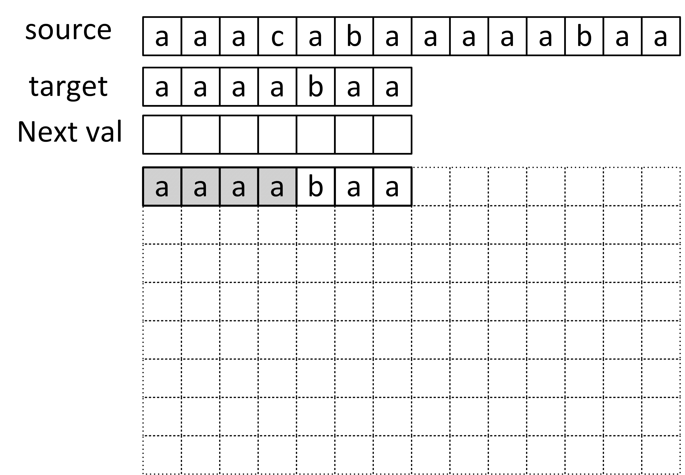

# 串、数组和广义表

## 串


串即字符串，由 $n(n≥0)$个**字符**组成的有限序列。一般记为：$S='a_1a_2…a_n'$

- $S$ 是串名

- $a_i(1≤i≤n)$ 可以是英文字母、数字字符或其他字符

- 串中字符的个数 $n$ 称为串的长度；$n=0$ 时是空串。

**串就是是数据元素为单个字符的特殊线性表**

1. 串是内容受限的线性表,它限定了表中的元素为字符
2. 串长：串中字符个数 $(n≥0),n=0$ 时称为空串
3. 空白串：由一个或多个空格符组成的串（区别于空串）

> $\uparrow$ 不考捏

4. **当两个串的长度相等，并且各个对应位置的字符都相等时，才称这两个串相等**（见下文串的运算）

### 子串

**子串：串中任意个连续的字符组成的子序列称为该串的子串**

有两个串 $a$ 和 $b$，如果 $a$ 中可以找到几个连续字符组成的串与 $b$ 完全相同，则称 $a$ 是 $b$ 的主串，$b$ 是 $a$ 的子串：

例如

* 串 $A$ 和 $B$ 分别为 $A='This\ is \ a \ string'$，$B='is'$  则 $B$ 是 $A$ 的子串，$A$ 为主串
* 若 $a = 'shujujiegou'$，$b ='shuju'$，由于$ a$ 中也包含 $'shuju'$，因此串 $a$ 和串 $b$ 是主串和子串的关系

> - 空串是任何串的子串.
> - 一个串也可以看成是自身的子串
> - 子串个数公式：**${n(n+1) \over 2}+1$**
> - 真子串：除本身之外的其它子串，真子串个数公式：${n(n+1) \over 2}$

---

## 串的运算

给定两个串：$ X ='x_1x_2…x_n', Y ='y_1y_2…y_m'$，有如下运算

1. 创建串
2. **连接（Concatenation）**：将两个或多个串连接在一起，形成一个新的串。
3. **查找** ： 查找子串在主串中的位置。
4. **比较**：**逐字符比较**
   - **相等** ：当 $n=m$ 且 $x_1=y_1,x_2=y_2, …, x_n= y_m$时， 称 $X=Y$
   - **不等** ：**从左到右**逐个字符进行比较，直到遇到不同字符或到达某个字符串的末尾为止。在字符比较时，使用字符的`ASCII`值。通常，`ASCII`值较小的字符被认为是"小"字符串
5. **求串长**
6. **求子串**

## 串的模式匹配 ： Knuth–Morris–Pratt 算法

> 本节将是数据结构生涯里最重量级的东西，期末考试的必考压轴题，

### 什么是字符串匹配？

字符串匹配是指在一个较大的字符串（主串）中查找一个或多个子字符串（模式串）的过程。这个过程可以用于多种应用，包括文本搜索、数据检索和信息处理等。

### KMP的各种概念

1. 模式字符串（Pattern）

​	模式字符串是你想要在主字符串中查找的部分。

2. 主字符串（Text）

​	主字符串是要搜索的文本。例如，如果你要在 `"ababcabcac"` 中查找模式 `"abc"`

3. 前缀（Prefix）

​	前缀是指字符串的子字符串，其中**包含字符串的开头部分，但不包括整个字符串本身**。例如，`"abc"` 的前缀包括两个： `"a"、"ab"`。💡

4. 后缀（Suffix）

​	后缀是字符串的尾部部分，不包括整个字符串本身。例如，`"abc"` 的后缀包括 `"c"、"bc"`。⚡️

5. **部分匹配表（LPS Array）也叫：失配数组**

​	LPS（Longest Prefix which is also Suffix）是一个数组，该数组用于记录模式字符串中**各个位置的最长相等前缀和后缀的长度**。/(ㄒoㄒ)/~~

### 1. 问题背景

假设你有两个字符串：

- 主字符串：`S = "ababcabcacbab"`
- 模式字符串：`P = "abcac"`

你想知道`P`在`S`中出现的位置。

### 2. 传统方法的缺点

如果用简单的方法（比如暴力枚举），我们可能会对每个字符逐个比较。这在遇到重复字符时，会浪费很多时间。例如，匹配`S = "ababcabcacbab"`和 `P = abcac`，第一次匹配后如果失败，接下来的比较会再次检查 `a`、`b`、`c` 等字符，从而导致重复工作。

如图：


### 3. KMP

#### 部分匹配表（前缀表）

对于模式字符串`P`，部分匹配表记录了**每个位置之前的子串中最长的相等前后缀的长度**

例如：`P = "abc"`，部分匹配表为 `[0, 0, 0]`，因为没有任何字符前后的相同部分。

当比较过程中出现不匹配时，可以直接使用这个表跳过重复的字符，不需要从头开始比较

#### 如何求一个串的部分匹配表和 `next`数组？

如串`ababa`的部分匹配表【也叫最长（大）相等前后缀】：

- `a`的前缀和后缀都为空集，最长公共前后缀长度长度为 $0$
- `ab`的前缀为 $\{a\}$,后缀为$\{b\}$
  - $\{a\} ∩ \{b\}= NULL$，最大公共前后缀长度长度为 $0$。
- `aba`的前缀为 $\{a,ab\}$ ，后缀为$\{a,ba\}$
  - $\{a,ab\}∩\{a,ba\}={a}$,最大公共前后缀长度长度为 $1$
- `abab`：$\{a,ab,aba\}∩\{b,ab,bab\}=\{ab\}$ ，最大公共前后缀长度长度为 $2$
- `ababa`：$\{a,ab,aba,abab\}∩\{a,ba,aba,baba\}=\{a,aba\}$，公共元素有两个,最大公共前后缀长度长度为 $3$

因此该串部分匹配表为 ： `[0,0,1,2,3]`

#### next数组

> 需要注意，next数组的核心含义就是：当主串和子串中第 `i` 位不匹配时，我们想知道下一次应该匹配子串的第几位，因此，你可以硬推`next`数组

我们在求如下条件的`next`数组

1. 子串从 $1$ 开始计数
2. 当第 $i$  位比较失败时，访问`next`数组第 $i$ 个数`next[i+1]`，然后比较主串与子串`next[i+1]`位

如何从部分匹配表转换成`next`数组:

部分匹配表中：

1. 删去最后一位，将所有数右移一位
2. 为第一位赋值 `-1`
3. 部分匹配表所有数 `+1`

然后就得到`next`数组了

| 位数               | 1    | 2    | 3    | 4    | 5    |
| ------------------ | ---- | ---- | ---- | ---- | ---- |
| `子串`             | a    | b    | a    | b    | a    |
| `部分匹配表`       | 0    | 0    | 1    | 2    | 3    |
| `右移并赋值第一位` | -1   | 0    | 0    | 1    | 2    |
| `next`             | 0    | 1    | 1    | 2    | 3    |
| `改进`             | 0    | 1    | 0    | 1    | 0    |

> 网上有两个主流版本
>
> 1. 和书上一样，求出`next`数组，按上文使用
> 2. 不求`next`数组，直接使用部分匹配表，但使用方式如下：
>
> 查表**最后一个匹配字符**对应的`部分匹配值` ，按照下面的公式算出向后移动的位数：
> $$
> 移动位数 = 已匹配的字符数 - 对应的部分匹配值
> $$
> 如下文：
>
> [字符串匹配的KMP算法 - 阮一峰的网络日志](https://www.ruanyifeng.com/blog/2013/05/Knuth–Morris–Pratt_algorithm.html)

### 4. KMP算法的步骤

1. **写出部分匹配表**：根据模式字符串创建前缀表
2. **根据前缀表求出next数组**
3. **进行匹配**：用指针分别指向主字符串和模式字符串，当字符匹配时指针都移动；当字符不匹配时，根据部分匹配表跳过一些比较。

因此，我们要解决两个问题

1. 如何求next数组
2. 如何进行匹配

如果你还是不明白，那么希望你带着这两个问题找点视频看，

[【数据结构——六分钟学会next数组】](https://www.bilibili.com/video/BV1qY411e7do/?share_source=copy_web&vd_source=f6ff1f6b32d145cf17622a2f18e41586) 

[【最浅显易懂的 KMP 算法讲解】](https://www.bilibili.com/video/BV1AY4y157yL/?share_source=copy_web&vd_source=f6ff1f6b32d145cf17622a2f18e41586) 

### * next数组的代码

> KMP算法不仅给出了一种巧妙的匹配方式，也给出了十分高效求部分匹配表的的方法

```c
typedef unsigned char SString[MAXSTRLEN + 1];       // 0号单元存放串的长度

/*
 * ████████ 算法4.7 ████████
 *
 * 计算模式串的“失配数组”，用于KMP算法。
 */
void get_next(SString T, int next[]) {
    int i = 1;
    int j = 0;
    
    // 模式串第一个字符处失配时，模式串需要从头比较，主串需要前进到下一个位置比较
    next[1] = 0;
    
    // 遍历模式串上的字符
    while(i < T[0]) {
        if(j == 0 || T[i] == T[j]) {
            i++;
            j++;
            next[i] = j;
        } else {
            j = next[j];
        }
    }
}
```

## 改进的KMP算法

我们上面定义的`next`数组仍有缺陷

假设文本串为 `aaabaaaab`，模式串为 `aaaab`

根据前面的讲述，我们可以得到模式串的next数组值如下：

| 位数     | 1    | 2    | 3    | 4    | 5    |
| -------- | ---- | ---- | ---- | ---- | ---- |
| `模式串` | a    | a    | a    | a    | b    |
| `next`   | 0    | 1    | 2    | 3    | 4    |

- 第一次比较冲突发生在第四位：

| 位     | 1    | 2    | 3    | 4    | 5    | 6    | 7    | 8    | 9    |
| ------ | ---- | ---- | ---- | ---- | ---- | ---- | ---- | ---- | ---- |
| 文本串 | a    | a    | a    | b    | a    | a    | a    | a    | b    |
| 模式串 | a    | a    | a    | a    | b    |      |      |      |      |
| `next` | 0    | 1    | 2    | 3    |      |      |      |      |      |

- 第二次比较，根据`next`值，`next[4]=3`，需要将第`3`位与该位置对齐：

| 位     | 1    | 2    | 3    | 4    | 5    | 6    | 7    | 8    | 9    |
| ------ | ---- | ---- | ---- | ---- | ---- | ---- | ---- | ---- | ---- |
| 文本串 | a    | a    | a    | b    | a    | a    | a    | a    | b    |
| 模式串 |      | a    | a    | a    | a    | b    |      |      |      |
| `next` |      | 0    | 1    | 2    |      |      |      |      |      |

- 第三次比较，但此时仍有冲突，这时冲突发生在模式串的第`3`位，根据`next[3]=2`，需要将第二位与此位置对齐：

| 位     | 1    | 2    | 3    | 4    | 5    | 6    | 7    | 8    | 9    |
| ------ | ---- | ---- | ---- | ---- | ---- | ---- | ---- | ---- | ---- |
| 文本串 | a    | a    | a    | b    | a    | a    | a    | a    | b    |
| 模式串 |      |      | a    | a    | a    | a    | b    |      |      |
| `next` |      |      | 0    | 1    |      |      |      |      |      |

- 第四次比较，仍有冲突，发生在模式串第二位，`next[2]=1`，将模式串第一位与此位置对齐：

| 位     | 1    | 2    | 3    | 4    | 5    | 6    | 7    | 8    | 9    |
| ------ | ---- | ---- | ---- | ---- | ---- | ---- | ---- | ---- | ---- |
| 文本串 | a    | a    | a    | b    | a    | a    | a    | a    | b    |
| 模式串 |      |      |      | a    | a    | a    | a    | b    |      |
| `next` |      |      |      | 0    |      |      |      |      |      |

- 第五次比较，`next[1]=0`，将模式串第一位与此位置对齐：

| 位     | 1    | 2    | 3    | 4    | 5    | 6    | 7    | 8    | 9    |
| ------ | ---- | ---- | ---- | ---- | ---- | ---- | ---- | ---- | ---- |
| 文本串 | a    | a    | a    | b    | a    | a    | a    | a    | b    |
| 模式串 |      |      |      |      | a    | a    | a    | a    | b    |
| `next` |      |      |      |      | 0    | 1    | 2    | 3    | 4    |

但整个过程效率很低，因为模式串前四个字符都为`a`，当前四位发生冲突时，就可以知道应该直接将第  $0$ 位和该位置对齐，中间的几次比较和移动都是多余的

因此，`nextval`所做的工作就是对`next`值进行一次修正，排除掉无效移动

| 位数      | 1    | 2    | 3    | 4    | 5    |
| --------- | ---- | ---- | ---- | ---- | ---- |
| 模式串    | a    | a    | a    | a    | b    |
| `next`    | 0    | 1    | 2    | 3    | 4    |
| `nextval` | 0    | 0    | 0    | 0    | 4    |

## <font color = red> 考点6 ： KMP</font>

**画出改进的KMP算法的对比过程，写出改进后的失配函数值**

* `source` ： 源串
* `target` ： 目标串
* `next val` ：部分匹配表 

第一次对比已经画出，请在后面画出剩余字符串移动和对比的情况，用阴影框表示对比的字符



`nextval`：

|     `i`      | 1    | 2    | 3    | 4    | 5    | 6    | 7    |
| :----------: | ---- | ---- | ---- | ---- | ---- | ---- | ---- |
|   `target`   | a    | a    | a    | a    | b    | a    | a    |
| `部分匹配表` | 0    | 1    | 2    | 3    | 0    | 1    | 2    |
|    `next`    | 0    | 1    | 2    | 3    | 4    | 1    | 2    |
|  `nextval`   | 0    | 0    | 0    | 0    | 4    | 0    | 0    |

得到的 `next` 数组为：`[0，1，2，3，4，1，2]`

最终得到的 `nextval` 数组为：`[0，0，0，0，4，0，0]`

比较省略

# 数组

> 数组和广义表都是既不是重点也不是难点，老师的ppt要求如下：
>
> 本章基本学习要点如下
>
> 1. 理解数组和一般线性表之间的差异。
> 2. 重点学握数组的顺序存储结构和元素地址计算方法。
> 3. **学握各种特殊矩阵如对称矩阵、上、下三角矩阵和对角矩阵的压缩存储方法**。
> 4. 了解稀疏矩阵的各种存储结构以及基本运算实现算法
> 5. **掌握广义表的定义和广义表的链式存储结构**。学握广义表的基本运算,包括创建广义表、输出广义表
> 6. **求广义表的长度和深度**
>
> 因此对症下药即可

**数组是线性表的推广**，特点是结构中的元素本身可以是具有某种结构的数据，但属于同一数据类型

### 一维数组
一维数组可看成是一个线性表或一个向量，存储在一块连续的存储单元中。

一维数组记为`A[n]`或 $A=(a_0，a_1，……，a_{(n-1)})$ ，一维数组中 $a_i$ 的存储地址 $LOC(a_i)$ 可由下式求出：
$$
LOC(a_i)=LOC(a_0)+i*L (0≤i<n)
$$

- **$LOC(a_i)$**：表示数组中第 $i$ 个元素 $a_i$ 的存储地址
- **$LOC(a_0)$**：表示数组的第一个元素 $a_0$ 的存储地址（即数组的起始地址）
- **i**：表示索引，范围是 `0≤i<n` ，其中 $n$ 是数组的长度
- **L**：表示每个元素所占用的字节数（也就是元素的大小）

### 二维数组

二维数组是一个包含**多个元素的数组**，其中每个元素本身又是一个数组。这种数据结构可以看作是一个“表格”或“矩阵”，它有行和列。

二维数组的每个元素用两个索引来表示：一个用于行，一个用于列。

## 矩阵的压缩存储

在数值分析中，经常出现一些阶数很高的矩阵，同时在矩阵中有很多值相同的元素或零元素，可对这些矩阵进行压缩存储。压缩存储后，若能得到元素

$a_{ij}$ 的存储地址，则仍具有随机存取功能

基本思想：

- 值相同的元素分配一个存储空间
- 零元素不分配空间

按照矩阵中元素的分布特点，可以将矩阵分为两大类：

- 特殊矩阵：对称矩阵、三角矩阵、对角矩阵  ： 值相同的元素或零元素分布有规律。压缩存储后，仍具有随机存取功能

- 稀疏矩阵 ： 非零元少且分布无规律

### 1. 对称矩阵

对称矩阵：各数据元素沿主对角线对称的矩阵


**矩阵中有两条对角线，上图中的对角线称为主对角线，另一条从左下角到右上角的对角线为副对角线**

结合数据结构压缩存储的思想，可以使用一维数组存储对称矩阵

由于矩阵中沿对角线两侧的数据相等，因此**数组中只需存储对角线一侧（包含对角线）的数据**


 压缩存储元素个数：
$$
1 + 2 + 3 + ...... + n = {n(n+1) \over 2 }
$$
（下三角）矩阵求址：
$$
Loc(i,j)=Loc(1,1)+[ {i(i−1)\over 2} + (j−1) ]∗L (i≥j)
$$

### 2.三角矩阵


主对角线下的数据元素全部为`0`的矩阵为上三角矩阵，主对角线上元素全部为`0`的矩阵为下三角矩阵

这类特殊的矩阵的压缩存储方式：上（下）三角矩阵采用对称矩阵的方式存储；上（下）三角的数据（元素 0）不用存储：


 压缩存储元素个数：
$$
1 + 2 + 3 + ...... + n = {n(n+1) \over 2 }
$$


下三角矩阵求址：
$$
Loc(i,j)=Loc(1,1)+[ {i(i−1)\over 2} + (j−1) ]∗L (i≥j)
$$

### 3. 对角矩阵


## <font color = red> 重点4 ： 压缩的地址</font>

- 一个二维数组`A[7x7]`以行为主序存储`int`型数据(4字节)，第一个元素的地址为`2000h`（字节），那么第`5`行第`3`列的元素的地址是
- 一个二维数组`A[7x7]`是对称矩阵，按照对称矩阵的压缩存储方式存储其下三角和对角线元素，以行为主序存储`int`型数据(4字节)，第一个元素的地址为`2000h`（字节），那么第`5`行第`3`列的元素的地址是  

### 4. 稀疏矩阵

- 稀疏矩阵：矩阵中分布有大量的元素 `0`（非 `0` 元素非常少）

- 压缩存储稀疏矩阵的方法：只存储矩阵中的非 `0 `元素 ：稀疏矩阵非 `0` 元素的存储需同时存储该元素所在矩阵中的行标和列标。

#### 三元组存储法

在三元组存储法中，每个非零元素用一个三元组表示，三元组包含以下三个信息：

1. **行索引**（i）：非零元素所在的行。
2. **列索引**（j）：非零元素所在的列。
3. **值**（value）：非零元素的值。

**示例**

假设有一个稀疏矩阵如下：

```
0 0 3 0
0 0 0 4
5 0 0 0
0 7 0 0
```

使用三元组存储法表示为：

```
(i, j, value)
(0, 2, 3)
(1, 3, 4)
(2, 0, 5)
(3, 1, 7)
```

**优点**

- **节省空间**：只存储非零元素，减少了内存占用。
- **避免无效计算**：在计算过程中只处理非零元素，提高了效率。

## <font color = red> 重点5： 树的存储</font>

稀疏矩阵的三元组存储方式下，给出三元组在对应操作后的值（数组下标从0开始）


# 广义表

## 概念

广义表简称表，它是线性表的推广。一个广义表是 $n$ 个元素的一个序列，若 $n=0$ 时则称为空表。设 $a_i$ 为广义表的第  $i$ 个元素,则广义表 $G$ 的一般表示与线性表相同

1. **基本元素（原子）**：

   广义表的最基本单位，它可以是数据（如数字、字符等）。

2. **广义表**：

   **广义表本身可以包含原子元素，也可以包含其他广义表**。广义表通常用括号表示。例如，`(1, 2, (3, 4), 5)` 是一个广义表，其中包含原子元素 `1`、`2`、`5`，以及另一个广义表 `(3, 4)`。

3. **递归结构**：

   广义表的定义是递归的：一个广义表可以是空表，也可以是由一个头元素（原子或子表）和一个尾元素（广义表）组成。

### 广义表的深度和广度

#### 长度

广义表中所包含的数据元素的个数

例如，在广义表` (a,(b,c,d))` 中，它包含一个原子和一个子表，因此该广义表的长度为 `2`。

再比如，广义表 `((a,b,c))` 中只有一个子表 `(a,b,c)`，因此它的长度为 `1`。

#### 深度

可以通过观察该表中所包含括号的层数间接得到。这里需要注意，数左括号（或右括号）时同一层次的多个括号只计算一次

例如 ： `((1，2)，(3(4，5)))` ： 深度`3` 长度`2` 

> $\downarrow$ 忽略第五条


---

## 存储

广义表的存储结构 ： 链式结构

容易见到，广义表内主要有两种结构

1. 原子
2. 广义表


```c
/* 广义表（头尾链表存储表示）类型定义 */
typedef struct GLNode {
    ElemTag tag;    // 公共标记，用于区分原子结点和表结点
    
    // 原子结点和表结点的联合部分
    union {
        AtomType atom;          // atom是原子结点的值域，AtomType由用户定义
        struct {
            struct GLNode* hp;  // 指向表头
            struct GLNode* tp;  // 指向表尾
        } ptr;                  // 表结点的指针域
    } Node;
} GLNode;
```

存储结构一如下示意图所示：


1. 表示原子的节点由两部分构成，分别是 `tag 标记位`和 `原子的值`
2. 表示子表的节点由三部分构成，分别是 `tag 标记位`、`hp` 指针和 `tp` 指针

`tag` 标记位用于区分此节点是原子还是子表，

- 原子的 `tag` 值为 `0`
- 子表的 `tag` 值为 `1`

子表节点中的 `hp 指针`用于连接本子表中存储的原子或子表

`tp` 指针用于连接广义表中下一个原子或子表

## <font color = red> 考点6 ： 广义表</font>

### 请画出广义表 A=(a, ( ( ), b, c), (d) ) 的链式存储结构。此表的宽度w是_____，深度h是 **_____**_。


- 表示：略

- **宽度 (w)**：广义表在同一层中元素的数量。这个表在第一层有三个元素 `a`、`((),b,c)`、` (d)` ，所以其宽度 $w=3$
- **深度 (h)**：广义表的层次，即嵌套的最大程度。这里 `A` 最外层是 $1$ 层，然后里面还有子表，子表深度为 $2$，因此总体深度 $h=3$

> 这里涉及到空表是否算一个深度，此处有待商榷
