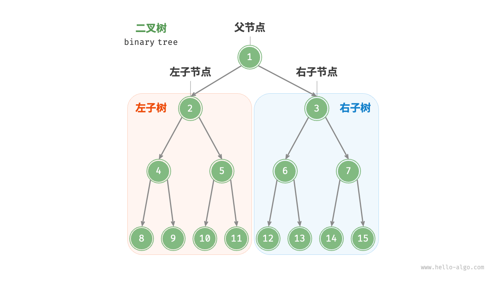

# 树

> 从本章开始，我们将从**线性**数据结构的学习，进化为**非线性**结构

树是一种非线性结构，树与线性表的逻辑关系不同。

树的定义是**递归**的，树本身也是一种递归的数据结构。其作为一种逻辑结构，同时也是一种分层结构。树适合表示具有**层次结构**的数据。

如图是两颗树：


## 定义

1. **树**：是 $n(n≥0)$ 个结点（元素）构成的有限集合。当 $n=0$ 时，称这棵树为空树。在一棵非空树T中：

    - 有且只有一个特殊的结点称为树的**根结点**，根结点没有前驱结点；
    - 当 $n＞1$，除根结点之外的其余数据元素被分成 $m(m>0)$ 个互不相交的集合 $T_1,T_2,…,T_m$，其中每一个集合$T_i(1≤i≤m)$本身又是一棵树。树$T_1,T_2,…,T_m$ 称为这个根结点的子树

    

2. **结点**：是数据元素的别名（上图中每一个圈圈称为一个结点）

3. **结点的度**：树中结点所拥有的子树的个数（子树的个数）

4. **树的度**：树中各结点度的最大值

5. **叶（子）结点**（终端结点）：度为0的结点。

    

6. **分枝结点**（非终端结点）：度不为0的结点。

7. 孩子：树中一个结点的子树的根结点。

8. **双亲：树中一个孩子结点的上层结点（唯一）。**

9. **兄弟：具有同一个双亲的孩子结点互成为兄弟。**

10. 子孙：一个结点的所有子树中的结点称之为该结点的子孙节点。

11. 祖先：从根结点到该结点所经分支上的所有结点。

12. 树的**层数**：根结点的层数规定为1，其余结点的层数依次递加$+1$。

       

13. **树的深度（高度）**：所有结点的最大层次。

14. 堂兄弟：双亲在同一层，且双亲不同的结点互为堂兄弟。

15. 有序树：如果一棵树中结点的各子树从左到右是有次序的，即若交换了某结点各子树的相对位置则构成不同的树，称这棵树为有序树；反之，则称为无序树。

16. **森林**：$m(m≥0)$棵不相交的树的集合称为森林。自然界中树和森林是不同的概念，但在数据结构中，树和森林只有很小的差别，任何一棵树，删去根结点就变成了森林。

> 以上概念都不会考，也不用记，**理解即可**，敢考[卷子给他撕了](https://www.bilibili.com/video/BV1b34y1T7wh/?share_source=copy_web&vd_source=f6ff1f6b32d145cf17622a2f18e41586&t=1)

### 树的数学性质

1. 性质1：树中的结点数等于所有结点的度数加 $1$ 

    证明：每个结点与指向它的一个分支一一对应，所以**除根结点**之外的结点数等于所有结点的分支数（即度数），从而可得树中的结点数等于所有结点的度数加$1$。

1. **性质2**：度为 $d$ 的树中**第** $i$ 层上至多有 $d^i-1 $ 个结点$(i≥1)$。

    证明：等比数列第$n$项

1. **性质3**：度为 $d$ 的叉树**前** $i$ 层至多有 $d^i-1 \over d- 1$ 个结点

    证明：等比数列前 $n$ 项和。

1. 性质4：具有 $n$ 个结点的度为 $d$ 的树的最小深度为（$[]$为取整符号） : $[log_d(n(d-1)+1)]$

    证明 ： 已知树度为$d$ 最小深度为 $h$ ，共有 $n$ 个节点， 已知 ：
    $$
    { d^{(h-1)} - 1 \over d - 1}   \leq  n \leq { d^{(h)} - 1 \over d - 1}
    $$
    根据著名的知二求一，化简可得性质4

## 二叉树

二叉树是一种特殊的树形结构，特点是每个结点**至多只有两棵子树，但其度（各个节点的度）可以小于2**；并且二叉树的子树有**左右之分**，即使树中结点只有一棵子树，也要区分其是左子树还是右子树。



### 性质

1. 性质1：在二叉树的第 $i$ 层上**至多**有 $2^i-1$ 个结点$(i\geq1)$

2. 性质2：深度为 $d$ 的二叉树**至多**有 $2^d-1$ 个结点$(k\geq1)$

3. 性质3：对任何一棵二叉树，如果其叶结点（度为$0$）数为 $n_0$ ,度为 $2$ 的结点数为 $n_2$，则 $n_0 = n_2+1$

> 证明：
>
> 性质一：等比数列第n项
>
> 性质二：等比数列前n项和
>
> 性质三：此处略
>
> 就略，敢考[卷子给他撕了](https://www.bilibili.com/video/BV1b34y1T7wh/?share_source=copy_web&vd_source=f6ff1f6b32d145cf17622a2f18e41586&t=1)

### 特殊的二叉树

1. 满二叉树

一棵高度为 $h$，且含有个 $2^h - 1$​ 个结点的二叉树称为满二叉树，即**树中的每层都含有尽可能多的结点**

​	

2. 完全二叉树

只有最底层的节点未被填满，且最底层节靠左填充。

如图：


如图是两棵**非完全二叉树**：


3. 二叉排序树

   - 左子树上所有结点的关键字均小于根结点的关键字;
   - 右子树上的所有结点的关键字均大于根结点的关键字;
   - 左子树和右子树又各是一棵二叉排序树。

4. 平衡二叉树

   树上任一结点的左子树和右子树的**深度**之差不超过 $1$。


> 二叉排序树和平衡二叉树将在后面介绍（重点知识）

## 二叉树的数据结构

树的存储结构主要分为两种

1. 顺序存储

2. 链式存储

> 本课中，我们主要使用链式存储表示二叉树，而顺序存储也很简单

### 顺序存储：

用一组地址连续的存储单元依次自上而下、自左至右（也就是层序遍历）储存**完全二叉树**的结点元素。

对于一般的二叉树，必须添加一些空结点。

如图：


## 链式存储

### 双亲表示法

采用一组连续空间来储存每个结点，同时在每个结点中增设一个**伪指针（下图为`parent`列）**，指示其双亲结点在数组中的位置。

根结点的下标为 $0$，其伪指针域为$-1$​。

如图 ： 双亲数组表示法


**双亲数组法**就是用一维结构体数组依次存储树中的各结点，数组中的一个元素表示树中的一个结点，数组元素中包括**结点本身的信息**和**结点的双亲结点在数组中的下标**。

### 孩子表示法

用指针表示出每个结点的孩子在存储空间的位置信息

#### 孩子数组法

如图：


**孩子数组法**用一维结构体数组依次存储树中的各结点，数组中的一个元素表示树中的一个结点，数组元素中包括**结点本身的信息**和**结点的孩子结点在数组中的下标**。

结点中指针（相对指针，下标）的个数等于树的度，若某结点无孩子，其相应的指针域为空（用-1表示）

#### 孩子兄弟表示法（二叉树）

在二叉树中，结点结构通常包括若干数据域和若干指针域，二叉链表至少包含 $3$ 个域:

1. 数据域 `data`
2. 左指针域 `lchild`
3. 右指针域 `rchild`

```c
/* 二叉树元素类型定义，这里假设其元素类型为char */
typedef char TElemType;

/* 二叉树结点定义 */
typedef struct BiTNode {
    TElemType data;             // 结点元素
    struct BiTNode* lchild;     // 左孩子指针
    struct BiTNode* rchild;     // 右孩子指针
} BiTNode;

/* 指向二叉树结点的指针 */
typedef BiTNode* BiTree;

```

### * 三叉树

三叉链表在二叉链表的基础上增加了指向双亲的指针域，使得查找结点的双亲操作更为便捷，时间复杂度为 \(O(1)\) 。

但由于增加了指针域，存储开销相对较大。在需要频繁查找结点双亲的应用场景中，三叉链表更为适用 

## 二叉树的操作

- 初始化：`Status InitBiTree(BiTree* T)`  
- 销毁 ： `Status ClearBiTree(BiTree* T)`
- 返回高度 ： `int BiTreeDepth(BiTree T)`
- 取值 ： `TElemType Value(BiTree T, TElemType e)`
- 赋值 ： `Status Assign(BiTree T, TElemType e, TElemType value)`
- 插入 ： `Status InsertChild(BiTree T, TElemType p, int LR, BiTree c)`
- 遍历 

## 二叉树的遍历

> 如何理解遍历？
>
> 遍历：将**所有**数据按线性输出。**遍历是一种线性的输出数据的方式**
>
> 例如：班级中老师需要选取所有同学背课文，面对 $7$ 行 $8$ 列的教室，老师可以正着选，反着选，但是所有选取方法都包含了一种**先后顺序**，这是在之前的数据类型中没有见到过的（因为之前的数据都是线性排列的，只需按顺序输出即可）
>
> **在非线性数据结构中，如何找到一种顺序并输出所有数据（遍历），是一个重要问题。**

从物理结构的角度来看，树是一种基于链表的数据结构，因此其遍历方式是**通过指针逐个访问节点**。然而，树是一种**非线性数据结构**，这使得遍历树比遍历链表更加复杂，需要借助搜索算法来实现。

二叉树常见的遍历方式包括**层序遍历、前序遍历、中序遍历和后序遍历**


### 深度优先搜索

前序、中序和后序遍历都属于*深度优先遍历（depth-first traversal）*，也称*深度优先搜索（depth-first search, DFS）*，它体现了一种**“先走到尽头，再回溯继续”**的遍历方式。

- 先序----根、左子树、右子树；

- 中序—左子树、根、右子树；

- 后序—左子树、右子树、根；

如何写出二叉树的遍历：[【二叉树的先序、中序、后序遍历排序】](https://www.bilibili.com/video/BV1tW4y1M7FC/?share_source=copy_web&vd_source=f6ff1f6b32d145cf17622a2f18e41586)

另一种更简单的形式：


> 如果不理解，请看[VCR](https://www.bilibili.com/video/BV1Ub4y147Zv/?spm_id_from=333.337.search-card.all.click&vd_source=3310f07bcb7152dc48cc5e65834e98b5)

[【纯干货】三分钟教会你遍历二叉树！学不会举报我！！_哔哩哔哩_bilibili](https://www.bilibili.com/video/BV1Ub4y147Zv/?spm_id_from=333.337.search-card.all.click&vd_source=3310f07bcb7152dc48cc5e65834e98b5)                    

!> 读者应深刻理解： **根、左子树、右子树** 这一序列

比如上图先序遍历（根左右）的遍历结果：
$$
1、2、4、5、3、6、7
$$
该遍历序列也符合**根左右**的排序：
$$
1（根）2、4、5（左子树）3、6、7（右子树）
$$
而且其左子树也符合**根左右**这一序列，如左子树 $ 2、3、5：$
$$
2（根）、4（左子树）、5（右子树）
$$

> 在递归遍历中，实际上三种遍历的区别仅仅是访问节点的位置不同

### 广度优先搜索

层序遍历（level-order traversal）**从顶部到底部逐层遍历二叉树，并在每一层按照从左到右的顺序访问节点**。

层序遍历本质上属于*广度优先遍历（breadth-first traversal）*，也称*广度优先搜索（breadth-first search, BFS）*，它体现了一种“一圈一圈向外扩展”的逐层遍历方式。


> 在课本和PPT中，还有对非递归遍历二叉树的内容，我相信它是不考的

## <font color = red> 考点7 ： 根据遍历确定二叉树</font>

二叉树经典考题，必考题 ： 由遍历序列构造二叉树

我们已知二叉树的中序序列，再已知先序序列或后序序列任一，即可确定唯一的一颗二叉树

> 只确定先序遍历和后序遍历，无法确定一颗二叉树，如：先序遍历 ：AB ， 后序遍历 ： BA

其实很简单，整个过程是一个**递归求根节点的过程，**

 确定根节点：

- 前序确定**第一个元素为根节点**

- 后序确定**最后一个元素为根节点**

- 中序**根节点左边为左子树部分，右边为右子树部分**

之后再将**中序左右两边分别再求根节点**

如下图：


## 例题：

已知一二叉树的先序序列为：`abcdefgih`，中序序列为：`cedgifhba`，画出此二叉树

## 森林

### 二叉树和森林转化

给定一颗树，我们可以找到**唯一**的二叉树与之对应


如果 $F={T_1,T_2,...,T_m}$ 是森林，则可按如下规则将其转换成一棵二叉树 `B=(root,LB,RB)` ：

- 若`F`为空，则`B`为空树；
- 若`F`非空，则`B`的根`root`是森林中第一棵树的根 `ROOT(T1)` ；
  - `B`的左子树`LB`是中根节点的子树森林 $F_1=T_{11},T_{12},...,T_{1m}$ 转换而成的二叉树；
  - `B`的右子树`RB`是森林 $F′={T_2,T_3,...,T_m}$ 转换而成的二叉树。

如果 `B=(root,LB,RB)` 是一棵二叉树，则可按如下规则将其转换成森林 $F={T_1,T_2,...,T_m}$ ：

- 若`B`为空，则`F`为空；

- 若`B`非空，则`F`中第一棵树 $T_1$ 的根 `ROOT(T_1)` 是二叉树`B`的根`root`； 

  - $T_1$ 中根结点的子树森林 $F_1$ 是由`B`的左子树`LB`转换而成的森林；
  - $F$中除 $T_1$ 之外其余树组成的森林 $F′={T_2,T_3,...,T_m}$ 是由`B`的右子树`RB`转换而成的森林

  [【数据结构 树和二叉树 考点四 树，森林与二叉树的转换】](https://www.bilibili.com/video/BV1NR4y11735/?share_source=copy_web&vd_source=f6ff1f6b32d145cf17622a2f18e41586) 

## 哈夫曼树

> 要了解哈夫曼树，首先要了解数据的传输

### 引入

假如有一份文件要从 `A` 传送到 `B`，因为电脑只能处理二进制数，因此我们需要：

 `A的初始文件文件 -> A编码二进制文件 -> B接收二进制文件 -> B解码二进制文件 -> B得到初始文件`

假如有一个文本，其中只有五种字符，分别为

- 字符:  `A  B  C  D  E`
- 各个字符频率:  `5  9  12  13  16`

总频率为： ` 5+9+12+13+16 = 55`

如果我们用`ASCII` 码编码：

| 字符 | 十进制 ASCII 码 | 二进制 ASCII 码 |
| :--: | :-------------: | :-------------: |
|  A   |       65        |    01000001     |
|  B   |       66        |    01000010     |
|  C   |       67        |    01000011     |
|  D   |       68        |    01000100     |
|  E   |       69        |    01000101     |

一共需要 `S = (5×8)+(9×8)+(12×8)+(13×8)+(16×8) = 440`个二进制数，显然，这是低效的

> 这里会有好事的同学问，为什么这是低效的呢？
>
> 事实上，这里涉及到了信息论中的信息熵，不多赘述，如有兴趣可以参考这个视频：
>
> [【如何理解信息熵】](https://www.bilibili.com/video/BV1oX4y1w7aG/?share_source=copy_web&vd_source=f6ff1f6b32d145cf17622a2f18e41586) 

在`Huffman`老头的努力下，我们可以给出一种更好的编码：

| 字符 | Huffman编码 |
| :--: | :---------: |
|  A   |    1110     |
|  B   |    1111     |
|  C   |     110     |
|  D   |     10      |
|  E   |      0      |

一共需要`(16×1)+(12×3)+(13×3)+(5×4)+(9×4) = 147 `个二进制数 ，相比之下节省了相当大的二进制数（ ${147\over 440} ≈ 0.3341. $😊✌️）

> 编码不仅要保证高效的压缩，还要保证**编码和解码的唯一性**：
>
> 哈夫曼编码确保没有任何一个编码是另一个编码的前缀。这意味着接收到的编码序列可以**唯一**地解码为原始字符
>
> 因此同学们不要轻易声称自己找到了一种更高效的编码方式，注意解码的唯一性

总而言之，我们要学习的是给定若干字符，如何求出它们的Huffman编码

### 基本概念

哈夫曼树又称最优树，有如下概念

1. **路径和路径长度**

   在一棵树中，从一个结点往下可以达到的孩子或孙子结点之间的通路，称为路径。

   通路中分支的数目称为路径长度。若规定根结点的层数为 $1$，则从根结点到第 $i$ 层结点的路径长度为 $i-1 $

   

2. **节点的权和带权路径长度**

​	若将树中结点赋给一个有着某种含义的数值，则这个数值称为该结点的权。

​	结点的带权路径长度为：从根结点到该结点之间的路径长度与该结点的权的乘积

​	

树的带权路径长度规定为所有叶子结点的带权路径长度之和，记为`WPL`如上图：树的带权路径长度为：
$$
WPL = (2+3) * 3 + 4 * 2 + 6 * 1 = 29
$$


### 霍夫曼树的构造（贪心算法）

**步骤**：

1. **初始化**：将每个权值视为独立的二叉树（仅含一个根结点，权值为该结点值），构成森林 *F*。
2. **合并**：每次从森林中选取两棵根权值最小的树，以它们为左、右子树构造新树，新树根权值为两棵子树根权值之和。
3. **迭代**：重复步骤 2，直到森林中只剩一棵树，即霍夫曼树。

### 示例

- 字符:  `A  B  C  D  E`
- 各个字符频率:  `5  9  12  13  16`

#### 1. 初始化

首先，创建一个最小堆（或优先队列），其中每个字符及其频率作为节点：

首先，创建一个最小堆（或优先队列），其中每个字符及其频率作为节点：

```plain
1A: 5
2B: 9
3C: 12
4D: 13
5E: 16
```

#### 2. 构建哈夫曼树

- 合并 A (5) 和 B (9)，形成新节点 AB (14)

```plain
1         AB(14)
2         /    \
3       A(5)   B(9)
```

- 合并 C (12) 和 AB (14)，形成新节点 CAB (26)。

```plain
1            CAB(26)
2           /    \
3         C(12)  AB(14)
4                /    \
5              A(5)   B(9)
6
```

- 合并 D (13) 和 CAB (26)，形成新节点 DACB (39)。

```plain
1             DCAB(39)
2             /    \
3           D(13) CAB(26)
4                 /    \
5               C(12)  AB(14)
6                      /    \
7                    A(5)   B(9)
```

- 合并 E (16) 和 DACB (39)，形成根节点 EDA (55)。

```plain
1                (55)
2               /    \
3             E(16)  (39)
4                   /    \
5                 D(13)  (26)
6                       /    \
7                     C(12)  (14)
8                           /    \
9                         A(5)   B(9)
10
```

### 3. 生成编码

从根节点向下遍历哈夫曼树，左子树为“0”，右子树为“1”，得到每个字符的哈夫曼编码：

- A: 1110
- B: 1111
- C: 110
- D: 10
- E: 0

> 视频参考： [【哈弗曼编码讲解】](https://www.bilibili.com/video/BV1TH4y1y7gT/?share_source=copy_web&vd_source=f6ff1f6b32d145cf17622a2f18e41586) 
>
> 视频几点问题：
>
> 1. 遇到相同的概率怎么办？
>
>    选取其中一个即可
>
> 2. 哈夫曼编码是唯一的吗？
>
>    造成哈夫曼树不唯一原因有
>
>    - 如问题 1 ，有相同概率使得某几个字符可以有不同的编码（但长度不变）
>    - 左子树为“0”，右子树为“1” **或** 左子树为“1”，右子树为“0”（选取问题）
>
>    但是这些不影响哈夫曼编码的压缩效率
>
> 3. 哈夫曼树只有度为`0`和`2`的节点

## <font color = red> 考点8：哈夫曼</font>

有字符串：`abbbababbbcddbabbbbb`，以字符出现的概率为节点的权值，构造并画出一个`huffman`树，并写出每个字符的哈夫曼编码

如果原始编码为`a=00,b=01,c=10,d=11`，请问采用`Huffman`编码前和编码后的字符串各有多少比特？

# * 树的计数

## 二叉树的计数

#### 1. **问题定义**

求 *n* 个结点的 **互不相似的二叉树的数量**（相似指结构相同，不考虑结点值，仅考虑形态）。

#### 2. **递归关系与卡特兰数（Catalan Number）**

设 $(b_n)$ 为 n 个结点的二叉树数量。对于任意二叉树，根结点的左子树有 i 个结点，右子树有 $(n-1-i)$ 个结点，

则递归公式为：
$$
b_n = \sum_{i=0}^{n-1} b_i \cdot b_{n-1-i}
$$
边界条件：$(b_0 = 1)$（空树）。

通过生成函数或数学归纳法可推导得 **卡特兰数** 公式：
$$
b_n = \frac{1}{n+1} \binom{2n}{n}
$$


#### 3. **树与二叉树的转换关系**

普通树（有序树，子树有顺序）可通过 **孩子兄弟表示法** 转换为二叉树：

- 树的根结点的第一个孩子作为二叉树的左孩子；
- 树的根结点的其他孩子作为左孩子的右兄弟。

由此，n 个结点的 **有序树的数量等于 $(n-1)$ 个结点的二叉树数量**，即：$(t_n = b_{n-1})$ 其中 $(t_n)$ 为 n 个结点的有序树数量，$(b_{n-1})$ 为 $(n-1)$ 个结点的二叉树数量。

| **类型**         | **计数公式**                                       | **核心思想**                        |
| ---------------- | -------------------------------------------------- | ----------------------------------- |
| n 个结点的二叉树 | 卡特兰数 $(b_n = \frac{1}{n+1}\binom{2n}{n})$      | 递归分割左、右子树，生成函数求解    |
| n 个结点的有序树 | $t_n = b_{n-1}$（通过孩子兄弟表示法转换）          | 树转换为二叉树，利用二叉树计数结果  |
| n 个结点的无序树 | 需额外考虑子树顺序无关性，较复杂（本书未重点讨论） | 需用组合数学方法，如 Pólya 计数定理 |

# * 回溯法与树的遍历

### 回溯法与树的遍历：概念、联系与区别

#### **一、回溯法（Backtracking）**

##### 1. **定义与核心思想**

- **定义**：回溯法是一种通过深度优先搜索（DFS）探索解空间的算法策略，用于求解满足约束条件的所有解或最优解。

- **核心思想**：

- 以 **树状结构（状态树）** 表示问题的解空间，每个结点代表一个中间状态；

- 从根结点出发，按深度优先策略探索每一条路径，若当前状态违反约束条件（“剪枝”），则回溯到上一层结点，尝试其他分支；

- 直到遍历所有可能的路径（找到所有解）或找到最优解。

##### 2. **典型应用场景**

- **组合搜索问题**：如八皇后问题、子集和问题、迷宫求解。

- **排列组合问题**：生成全排列、子集生成（如求幂集）。

- **约束满足问题**：数独求解、图的着色问题。

##### 3. **算法框架（伪代码）**

```
def backtrack(state, path):
    if 满足终止条件:
        记录解
        return
    for 每个可能的选择 in 当前状态的合法选择:
        执行选择，更新状态和路径
        if 状态合法:
            backtrack(新状态, 新路径)
        撤销选择（回溯）
```

#### **二、树的遍历（Tree Traversal）**

##### 1. **定义与分类**

- **定义**：按某种顺序访问树中每个结点一次且仅一次，是树结构的基本操作。

- **分类**：

- **深度优先遍历（DFS）**：先序遍历（根→左→右）、中序遍历（左→根→右）、后序遍历（左→右→根）。

- **广度优先遍历（BFS）**：层序遍历，按层次从左到右访问。

##### 2. **核心目的**

- **操作结点**：如打印结点值、计算树的高度、构建线索二叉树。

- **逻辑结构处理**：如二叉树的序列化与反序列化、路径搜索（如求根到叶子的路径和）。

##### 3. **实现方式**

- **递归实现**：利用递归栈隐式管理遍历路径（如先序遍历的递归代码）。

- **非递归实现**：显式使用栈（DFS）或队列（BFS）管理结点访问顺序。

#### **三、回溯法与树遍历的联系**

1. **解空间的树状表示**

- 回溯法的解空间常抽象为**状态树**，每个结点代表一个中间状态（如八皇后问题中每一层代表第 i 行皇后的位置），与树的结点一一对应。

- 回溯法的搜索过程等价于**深度优先遍历状态树**，优先探索当前路径的最深层结点（类似先序遍历）。

1. **深度优先策略**

- 回溯法本质是**带剪枝的深度优先搜索**，与树的先序 / 后序遍历均采用 “深度优先” 策略，优先探索子结点，再回溯处理兄弟结点。

1. **递归与栈的使用**

- 两者均常用递归实现（隐式使用调用栈），或显式使用栈结构管理状态（如非递归回溯法、非递归先序遍历）。

#### **四、核心区别**

| **特征**     | **回溯法**                                                   | **树的遍历**                                 |
| ------------ | ------------------------------------------------------------ | -------------------------------------------- |
| **目的**     | 搜索满足条件的解（一个或所有解），可能剪枝                   | 访问所有结点，无剪枝（遍历必须访问所有结点） |
| **解空间**   | 状态树（可能非二叉树，如 n 叉树，如八皇后的每行有 n 种选择） | 特定树结构（二叉树、多叉树），需遍历所有结点 |
| **约束条件** | 每一步需检查约束，违反则回溯（剪枝）                         | 无约束，按固定顺序访问所有结点               |
| **输出**     | 符合条件的解（可能多个或最优解）                             | 结点访问序列（如先序序列、中序序列）         |
| **典型示例** | 八皇后问题、子集和问题                                       | 二叉树求高度、层序打印结点值                 |

#### **五、应用对比示例**

##### **示例 1：八皇后问题（回溯法）**

- **状态树**：每一层代表第 i 行皇后的位置，每个结点表示前 i 行的合法布局。

- **回溯过程**：从第 1 行开始，尝试每个列位置，若与已放皇后冲突（同列或同对角线），则回溯到上一行，更换列位置。

- **与遍历的关系**：等价于遍历一棵 8 叉树，仅保留合法路径，剪去冲突分支。

##### **示例 2：二叉树先序遍历（树遍历）**

- **过程**：按 “根→左→右” 顺序访问所有结点，无剪枝，必须访问每个结点。

- **代码**：

```
void preOrder(BiTree root) {
    if (root != NULL) {
        visit(root);        // 访问根结点
        preOrder(root->lchild); // 遍历左子树
        preOrder(root->rchild); // 遍历右子树
    }
}
```

#### **六、总结**

1. **联系**：

- 回溯法以树状解空间为模型，采用深度优先策略，本质是**带剪枝的状态树遍历**。

- 树的遍历是基础操作，为回溯法提供了状态转移的逻辑框架（如递归访问子结点）。

1. **区别**：

- 回溯法是**问题求解算法**，目标是找到符合条件的解，需剪枝优化；

- 树的遍历是**数据结构操作**，目标是访问所有结点，无剪枝，顺序固定（先序、中序等）。

1. **核心价值**：

- 回溯法：解决复杂组合搜索问题，如排列、子集、约束满足问题；

- 树的遍历：是树结构操作的基础，用于遍历、修改、查询结点信息。

理解两者的关系后，可在实际问题中灵活运用：用树遍历的思想设计回溯法的状态转移，或用回溯法的剪枝策略优化树遍历的效率（如仅探索有效子树）。
