# 图

## 图的构成

**图（graph）**是一种**非线性数据结构**，由**顶点（vertex）**和 **边（edge）**组成。

我们可以将图 $𝐺$ 抽象地表示为一组顶点 $𝑉$ 和一组边 $𝐸$ 的集合。以下示例展示了一个包含 5 个顶点和 7 条边的图

$𝑉=\{1,2,3,4,5\}$

$𝐸=\{(1,2),(1,3),(1,5),(2,3),(2,4),(2,5),(4,5)\}$

$𝐺=\{𝑉,𝐸\}$​

> 图的数学表示：
>
> - $V$  ：图中有那些元素（**顶点**）  
>
> - $E$  ： $(1,2)$ 表示元素 $1$ 和元素 $2$ 有**边** 
>
>   注 ：有向边常用$<1,2>$来表示
>
> - $G$ ：图 

如图所示，**相较于线性关系（链表）和分治关系（树），网络关系（图）的自由度更高**，因而更为复杂

## 图的分类

### 方向

根据边是否具有方向，可分为**无向图**（undirected graph）和**有向图**（directed graph），如图所示。

- 在无向图中，边表示两顶点之间的**“双向”**连接关系，例如微信或 QQ 中的“好友关系”
- 在有向图中，边具有方向性，即 𝐴→𝐵 和 𝐴←𝐵 两个方向的边是**相互独立**的，例如微博或抖音上的“关注”与“被关注”关系

### 连通

根据所有顶点是否连通，可分为**连通图**（connected graph）和非**连通图**（disconnected graph）

连通 ： 任意两个顶点之间有路径存在

下图判断其是否是一个连通图

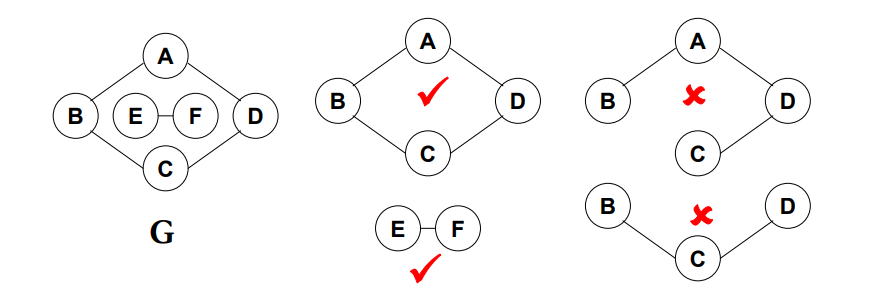

### 权值

我们还可以为边添加“权重”变量，从而得到如图所示的**有权图（weighted graph）**

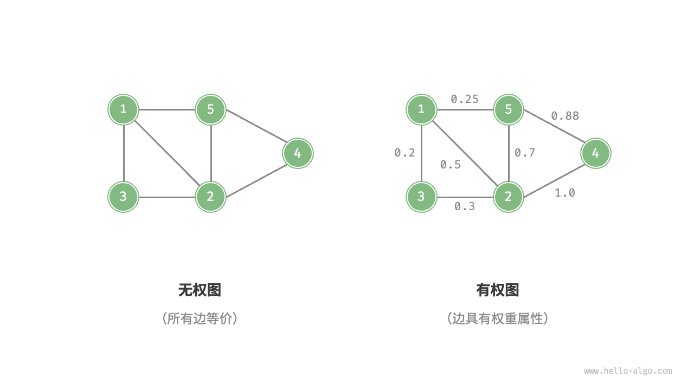

### 常用术语

- 邻接（adjacency）：当两顶点之间存在边相连时，称这两顶点“邻接”。
- 路径（path）：从顶点 A 到顶点 B 经过的边**构成的序列**被称为从 A 到 B 的“路径”
  - 路径长度：路径上边的数目

- **度（degree）**：一个顶点拥有的边数
  - 对于有向图，**入度（in-degree）**表示有多少条边指向该顶点，**出度（out-degree）**表示有多少条边从该顶点指出
  - 对于无向图，顶点的边数为度，度数之和是顶点边数的两倍

下图标出了每个顶点的度

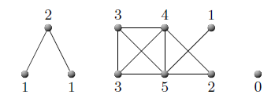

- **环** ：首尾相接的图

- 子图 ：设有两个图$G=(V,E)$和$G'=(V',E')$，若$E'$是 $E$ 的子集，$𝑉'$是$𝑉$的子集，则称$G'$是$G$的子图。

- 极大顶点数：再加 1个顶点就不连通了 

- 极大边数：包含子图中所有顶点相连的所有边

# 图的存储结构（表示）

**如何在计算机中表示一张图？**

图的常用表示方式包括**“邻接矩阵”**和**“邻接表”**

## 1. 邻接矩阵

设图的顶点数量为 𝑛 ，邻接矩阵（adjacency matrix）使用一个 $𝑛×𝑛$ 大小的矩阵来表示图，**每一行（列）代表一个顶点，矩阵元素代表边，用 $1$ 或$ 0$​​ 表示两个顶点之间是否存在边。**

边 ： $𝐸=\{(1,2),(1,3),(1,5),(2,3),(2,4),(2,5),(4,5)\}$​

那么图和邻接矩阵为（注意该图的顶点列表并不是按数字顺序）：

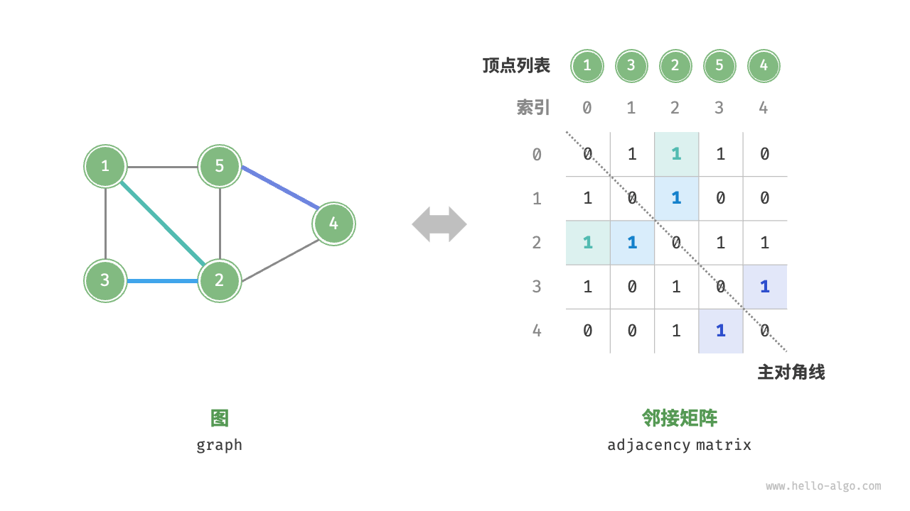

设邻接矩阵为 $G$、顶点列表为 $𝑉$ ，那么矩阵元素 $G[𝑖,𝑗]=1$ 表示顶点 $𝑉[𝑖]$到顶点 $𝑉[𝑗]$ 之间存在边，反之 $𝑀[𝑖,𝑗]=0$ 表示两顶点之间无边

### 特性

- **顶点不能与自身相连，因此邻接矩阵主对角线元素没有意义**
- 一个图的邻接矩阵是**唯一**的
- **对于无向图，两个方向的边等价，此时邻接矩阵一定关于主对角线对称**
- 将邻接矩阵的元素从 $1$ 和 $0$ 替换为权重，则可表示有权图

### 优缺点

- 优点：

    - 便于判断两个顶点之间是否有边， 即根据 $G[i][j] = 0$ 或 $1$ 来判断
    - 便于计算各个顶点的度

    对于无向图，邻接矩阵第 $i$ 行元素之和就是顶点 $i$ 的**度**；

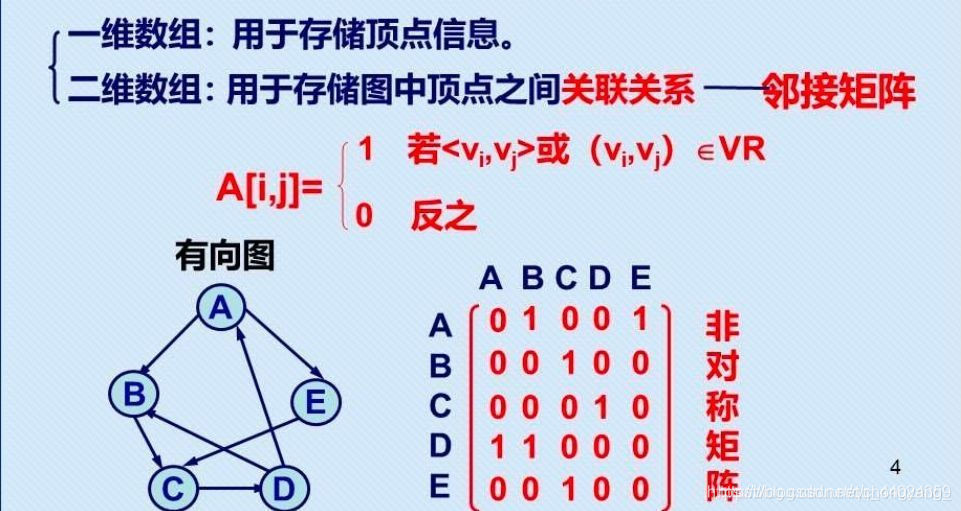

对于有向图，第 $i$ 行元素之和就是顶点 $i$ 的**出度**，第 $i$ 列元素之和就是顶点 $i$ 的**入度**

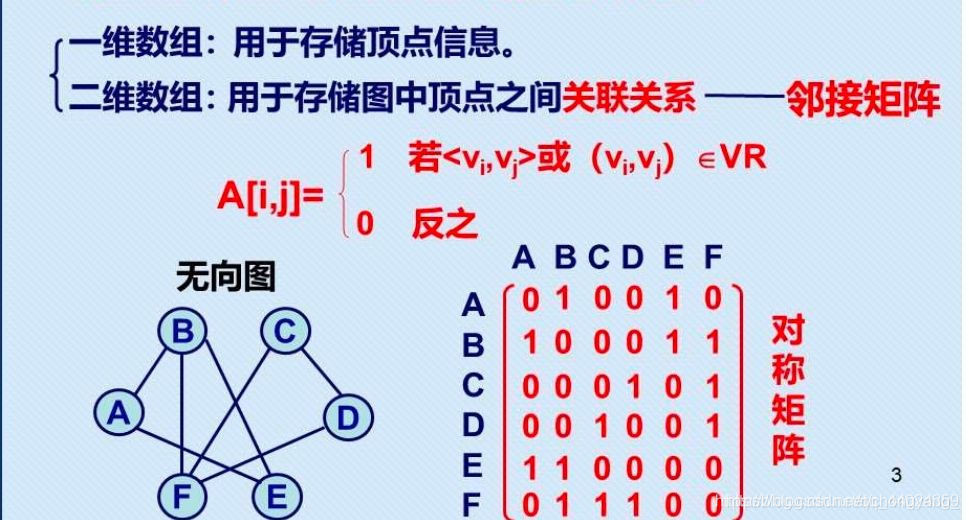

度：

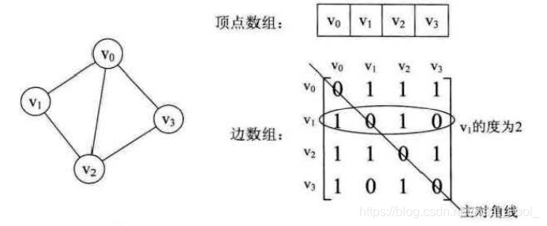

- 缺点：

    - **不便于增加和删除顶点**

    - 不便于统计边的数目，需要扫描邻接矩阵所有元素才能统计完毕，初始化的时间复杂度为 $O(n^2)$

    - 空间复杂度高（占用的空间多，适合稠密图）

## 2. 邻接表

邻接表（adjacency list）使用 $𝑛$ 个链表来表示图，链表节点表示顶点。第 $𝑖$ 个链表对应顶点 $𝑖$ ，**其中存储了该顶点的所有邻接顶点（与该顶点相连的顶点）**

### 特性

- 邻接表仅存储实际存在的边，而边的总数通常远小于 $𝑛^2$​ ，因此它相比与邻接矩阵更加节省**空间**。

- 在邻接表中需要通过遍历链表来查找边，因此其查找的**时间效率**不如邻接矩阵。
- 邻接表表示图不唯一（因为边的链表的表示可以是任意顺序）

### 优缺点

- 优点

  - 便于增加和删除结点

  - 便于统计边的数目

  - 空间效率高

- 缺点

  - 不便于判断顶点之间是否有边

  - 不便于计算**有向图**各个顶点的度

##  重点6 ： 图的存储

画出图的邻接矩阵和邻接表，并写出从顶点`0`开始的深度优先遍历和广度优先遍历序列

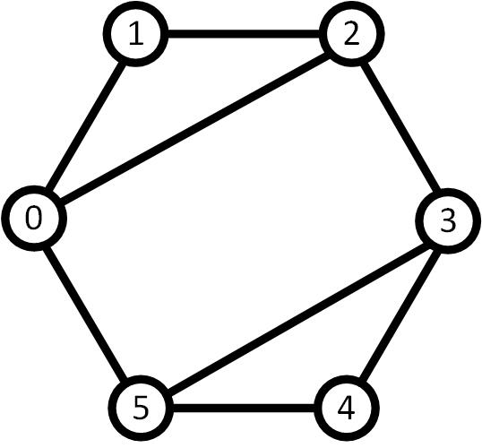

# 图的遍历

树代表的是“一对多”的关系，而图则具有更高的自由度，可以表示任意的“多对多”关系。因此，我们可以把树看作图的一种特例。显然，**树的遍历操作也是图的遍历操作的一种特例**。

图和树都需要应用搜索算法来实现遍历操作。图的遍历方式也可分为两种：广度优先遍历和深度优先遍历

## 1. 深度优先搜索（Depth First Search, DFS）【栈】

**深度优先遍历是一种优先走到底、无路可走再回头的遍历方式**。

如图所示，从左上角顶点出发，访问当前顶点的某个邻接顶点，直到走到尽头时返回，再继续走到尽头并返回，以此类推，直至所有顶点遍历完成。

也就是说：

1. 选取一个出发点
2. 从出发点开始，（按一定顺序）选取可以前进的点
3. 选取可以前进的点之一
4. 从该点再选择一个可以前进的点（要求未被经过的点）
5. 重复，直到无法前进或者达到终点
6. 退栈到前一个分岔口

## 2 . 广度优先搜索(Breadth First Search, BFS)【队列】

**广度优先遍历是一种由近及远的遍历方式，从某个节点出发，始终优先访问距离最近的顶点，并一层层向外扩张**。

如图所示，从左上角顶点出发，首先遍历该顶点的所有邻接顶点，然后遍历下一个顶点的所有邻接顶点，以此类推，直至所有顶点访问完毕。

也就是主要分三步：

1. 选取出发点
2. 所有可前进点进队，出发点退队
3. 重复操作直到达到终点

##  考点9：图的遍历

**画出图1的邻接矩阵和邻接表，并写出从顶点`0`开始的深度优先遍历和广度优先遍历序列。**

# 图的连通性

> 来到数据结构最高层：算 $\downarrow$法$\nearrow$

## 最小生成树问题

### 什么是生成树？

**一个连通图的生成树**是 ： 一个极小的连通子图，**它含有图中全部的顶点**，但只**有足以构成一棵树的n − 1 条边**

若砍去它的一条边，则会使生成树变成非连通图；若给它增加一条边，则会形成图中的一条回路

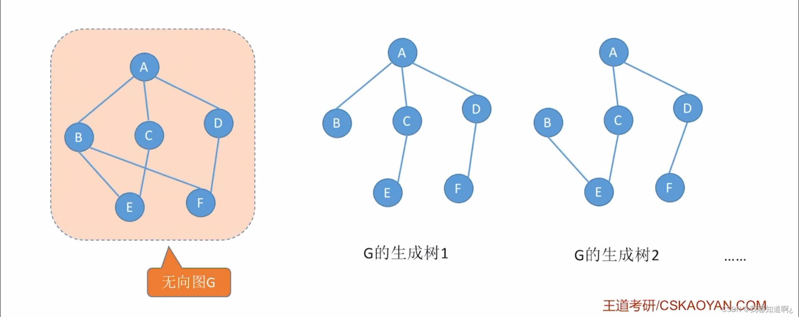

> 也就是说**生成树是一个连通图的子图**
>
> 1. **包含该图的所有顶点**
> 2. **所有顶点是连通的**
> 3. **边尽可能少**
>
> “树”中是不存在回路且连通的，所以生成树可以理解为：**剔除掉图中多余的边，但保证其连通（顶点是可达的）**
>

看不懂也不要紧，可以看看这个，看完再回头看，你会豁然开朗：

[【图-最小生成树-Prim(普里姆)算法和Kruskal(克鲁斯卡尔)算法】](https://www.bilibili.com/video/BV1wG411z79G/?share_source=copy_web&vd_source=f6ff1f6b32d145cf17622a2f18e41586) 

### 什么是最小生成树？

是一副连通加权无向图中一棵**权值最小**的生成树

对于一个带权连通无向图 $G = ( V , E )$，生成树不同，其中边的权值之和最小的那棵生成树（构造连通网的最小代价生成树），称为$G$的最小生成树(Minimum-Spanning-Tree, MST)

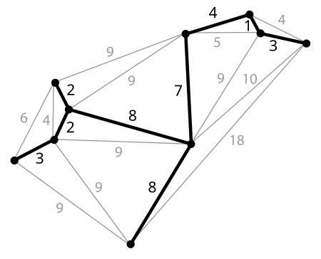

## 1. Prim（普利姆）算法

> 有趣的演示：
>
> [DSA Prim's Algorithm](https://www.w3schools.com/dsa/dsa_algo_mst_prim.php)

是图论]中的一种**贪心算法**，可在一个加权连通图中找到其最小生成树。意即由此算法搜索到的边子集所构成树中，不但包括了连通图里的所有顶点，且其所有边的权值之和亦为最小。

1. 首先随意找一个顶点，一般都是 $v_1$，
2. 然后找到与 $v_1$ 相连的权值最小的边（若有多条，则随机选取一条）
3. 找与这两个点相连的有最小权值的边，
4. 然后与找这三个点相连权值最小的边，
5. 一直重复，直到有 $n-1$ 条边，并且连接完所有的顶点，**注意，不能形成环**

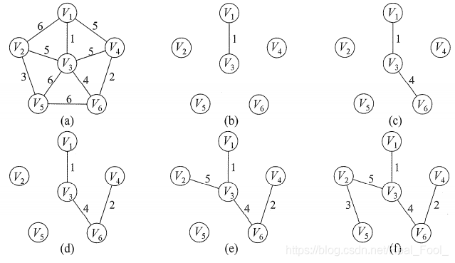

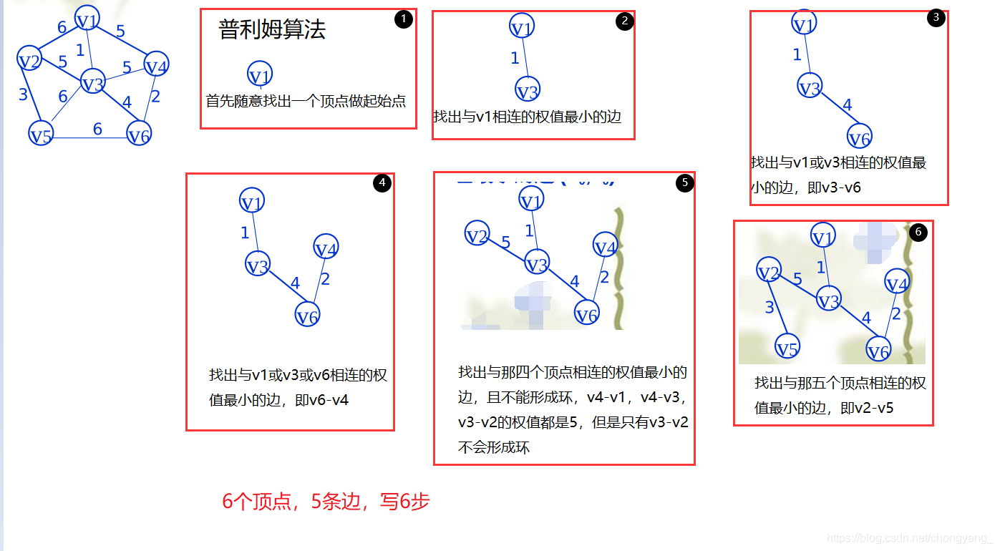

### 详细图解

> 这里的重点是`dist`、`res`、`集合V和S`的具体变化，要求读者能自己写出

`prim`算法实际上是一种贪心算法

现有图如下

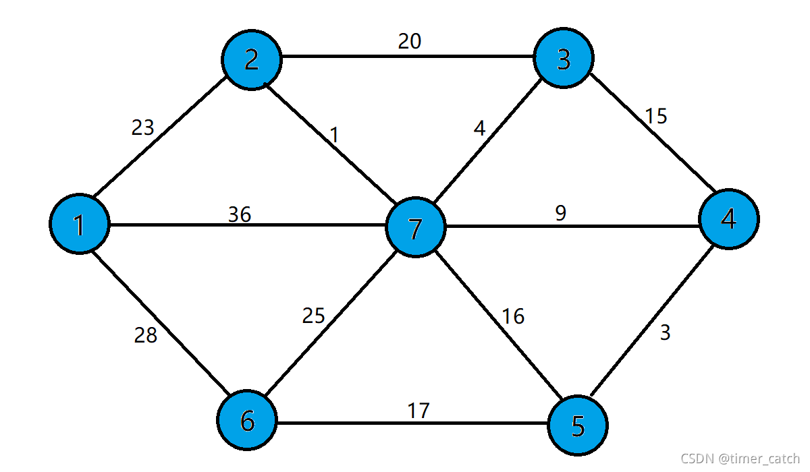

#### 初始化

我们有如下所需参数

1. $dist$ 数组 ，用来存储原点（随机选取的第一个点，这里为 $1$ 点）到第 $i$个元素的距离

2. 集合 $S$ 和 $V$，用于存放已知边和未知边**（贪心算法，逐步已知)**

   1. $S $： 未知点（蓝色的点）

   2. $V$：已知点（红色的点）

3. 变量 $res$​​ : 存放最小生成树所有边权值的和

$dist$ 初始时数据：

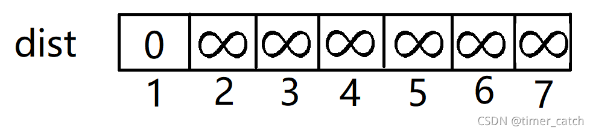

#### 过程

随机选取一个点：（初始化）

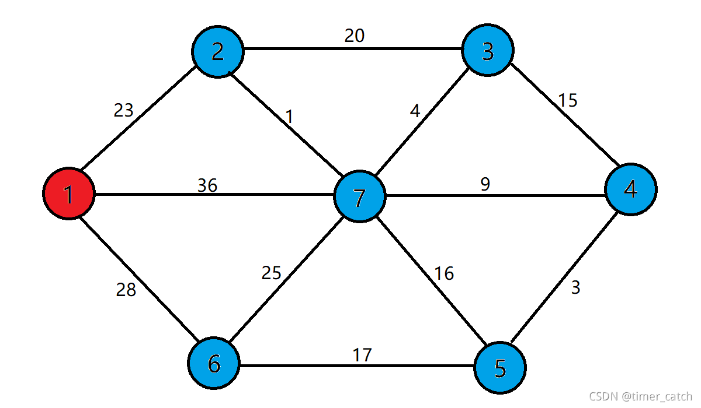

注意$dist$的数据要有所更改（因为在1边已知的情况下，到 $2$  $6$ $7$ 的距离不再为 无穷）

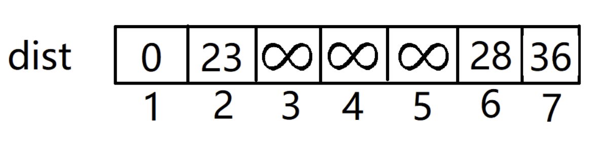

1. 选择离S集合最近的点加入S集合中，并且用新加入的点去更新dist数组，因为只有一个新的点加入到集合S中，到集合S的距离才有可能更新

    现在集合$S=\{1\}$，集合$V=\{2，3，4，5，6，7\}$，根据贪心策略，我们选择离集合$S$最近的点加入 ，即点$2$，并把这一条边的权值加到$res$中。

    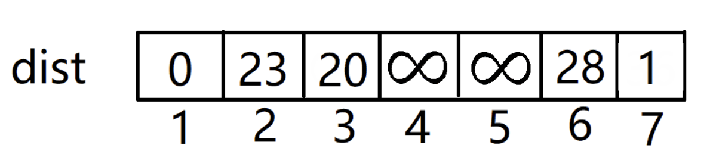

1. 集合更新为$S=\{1，2\}$，$V=\{3，4，5，6，7\}$，并用点2去更新$dist$数组，我们发现点$3$和点$7$（从$S$中的点出发）到原点的距离有变化，分别可以都可以通过边$2-3$，$2-7$缩短到集合S得距离,因此更新 3 和 7的$dist$数组

​	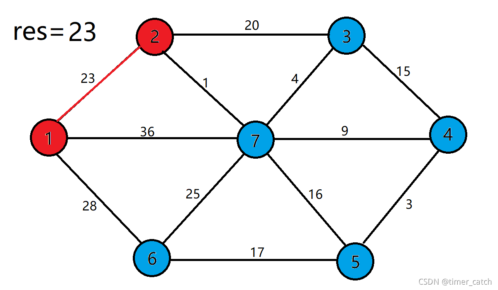

3. 重复知道V为空，可以得到权值和$res =  57$. $dist$：

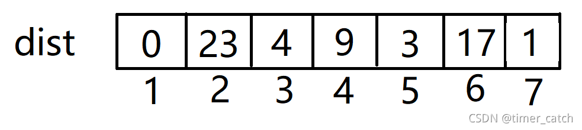

[最小生成树——Prim算法（详细图解）_prim算法构造最小生成树_skynesser的博客-CSDN博客](https://blog.csdn.net/qq_62213124/article/details/121597780)

## 2. Kruskal（克鲁斯卡尔）算法

> 演示：
>
> [DSA Kruskal's Algorithm](https://www.w3schools.com/dsa/dsa_algo_mst_kruskal.php)

### 过程

首先构造一个只含`n`个顶点的森林，然后依权值从小到大从连通网中选择边加入到森林中，并使森林中不产生回路，直至森林变成一棵树为止

> 也就是：
>
> 1. 新建图 ${\displaystyle G}$，${\displaystyle G}$ 中拥有原图中相同的节点，但没有边
> 2. 将原图中所有的边按权值从小到大排序
> 3. 从权值最小的边开始，如果这条边连接的两个节点于图 ${\displaystyle G}$ 中不在同一个连通分量中，则添加这条边到图 ${\displaystyle G}$ 中
> 4. 重复3，直至图 ${\displaystyle G}$ 中所有的节点都在同一个连通分量中

时间复杂度为：$O(elog_2e)$ 边数`e`越大，所耗费时间越长，则适合稀疏图，普利姆算法则更适合稠密图（边多的图）

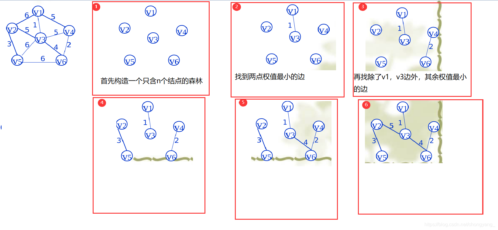

> 也是一种贪心算法

|                     图例                     |                             说明                             |
| :------------------------------------------: | :----------------------------------------------------------: |
| 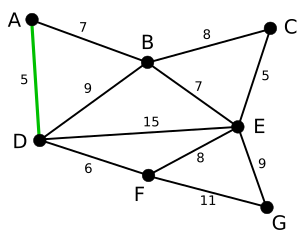 | **AD**和**CE**是最短的两条边，长度为5，其中**AD**被任意选出，以高亮表示。 |
| 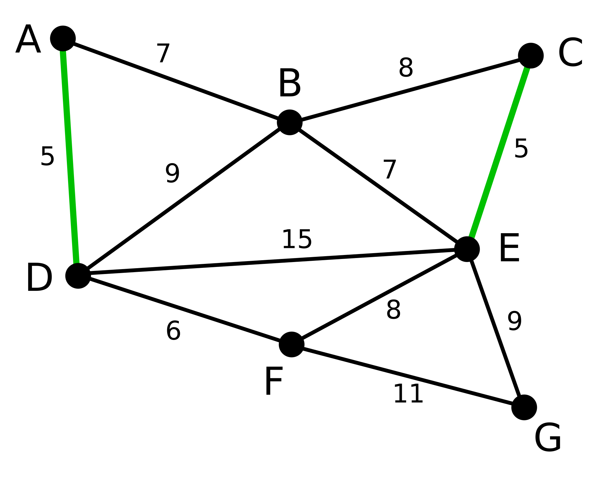 | 现在**CE**是不属于环的最短边，长度为5，因此第二个以高亮表示。 |
| 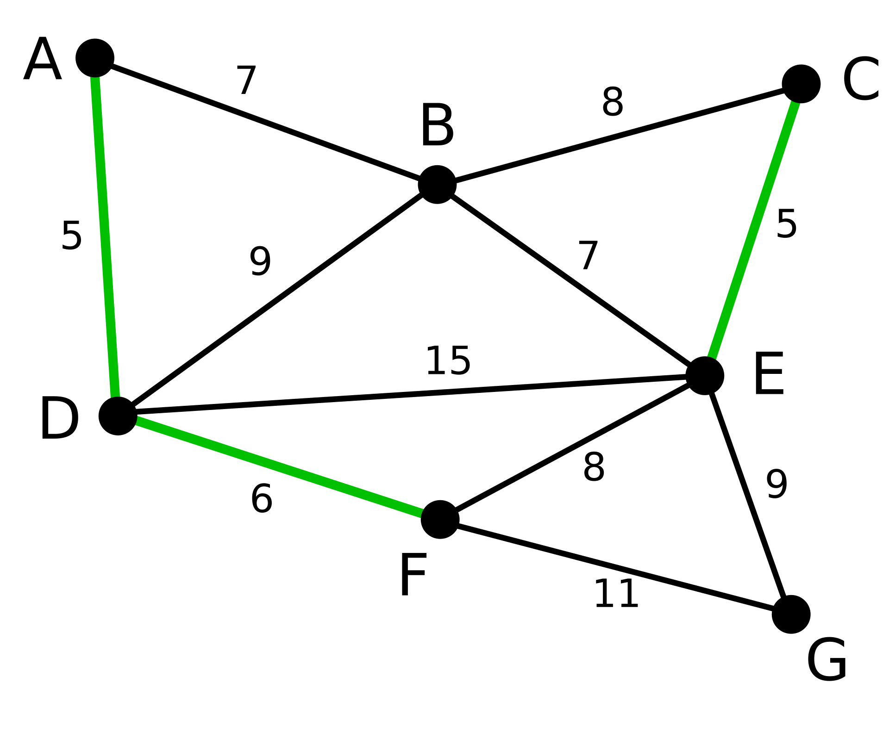 |        下一条边是长度为6的**DF**，同样地以高亮表示。         |
| 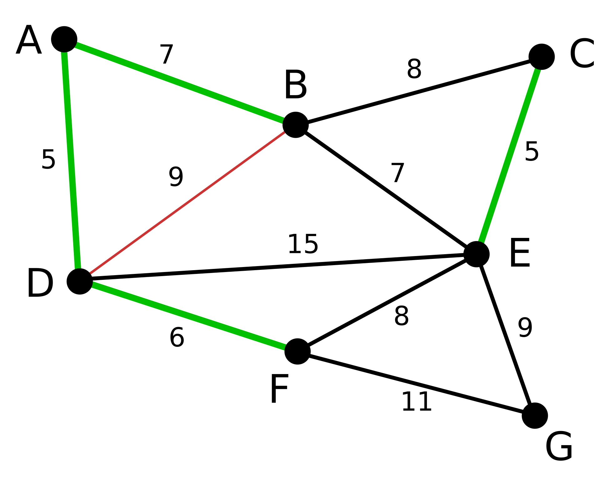 | 接下来的最短边是**AB**和**BE**，长度均为7。**AB**被任意选中，并以高亮表示。边**BD**用红色高亮表示，因为**B**和**D**之间已经存在一条（标为绿色的）路径，如果选择它将会构成一个环（**ABD**）。 |
| 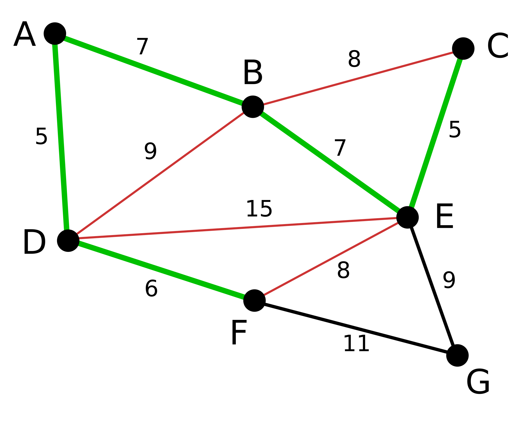 | 以高亮表示下一条最短边**BE**，长度为7。这时更多的边用红色高亮标出：会构成环**BCE**的**BC**、会构成环**DBEA**的**DE**以及会构成环**FEBAD**的**FE**。 |
|  | 最终，标记长度为9的边**EG**，得到最小生成树，结束算法过程。  |

##  考点10：最小生成树

**利用Kruskal算法在空白图中绘出下图2的最小生成树，并标明每条边入选的次序**

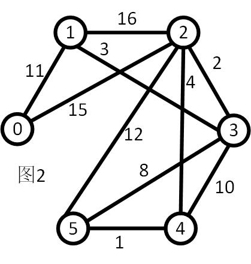

# 图的最短路径问题

寻找图（由顶点和路径组成的）中两顶点之间的最短路径。算法具体的形式包括：

- **确定起点的最短路径问题** - 也叫单源最短路问题，即已知起始结点，求最短路径的问题。在边权非负时适合使用`Dijkstra`算法
- **全局最短路径问题** - 也叫多源最短路问题，求图中所有的最短路径。适合使用`Floyd-Warshall`算法]

最短路径问题：**有向图带权图**中某一顶点(称为源点)到达另一顶点(称为终点)，如何找到一条路径使得沿此路径上各边上的权值总和达到最小

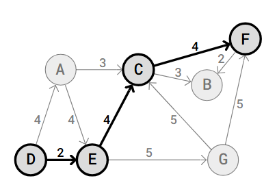

## 1. Dijkstra算法

**Dijkstra算法**是由荷兰计算机科学家艾兹赫尔·戴克斯特拉在1956年发现的算法戴克斯特拉算法使用类似**广度优先搜索**的方法解决带权图的**单源**最短路径问题

> 老戴（迪）头有如下成就
>
> - 提出信号量和PV原语，解决了哲学家就餐问题
> - 提出了一种最短路径算法（Dijkstra's Shortest Path First Algorithm）
> - 提出了银行家算法

1. 指定起点`s`(必须有一个起点)

2. 此外，引进两个集合`S`和`U` 
   - `S`的作用是记录**已求出最短路径的顶点**(以及相应的最短路径长度)
   - `U`则是记录还**未求出最短路径的顶点**(以及该顶点到起点`s`的距离)。

3. 初始时，
   - `S`中只有起点`s`
   - `U`中包含所有除`s`之外的顶点，并且`U`中顶点的路径是： 起点`s`到该顶点的路径。

4. 从`U`中找出路径最短的顶点，并将其加入到`S`中，并更新U中的顶点和顶点对应的路径

5.  重复`4`操作，直到遍历完所有顶点

如图 ：

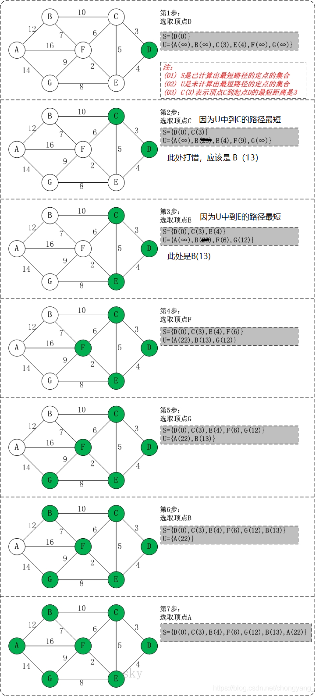

得到最终结果 `{D(0),C(3),E(4),F(6),G(12),B(13),A(22)}`22步即可到达

> 如不理解，观看视频
>
> [【图-最短路径-Dijkstra(迪杰斯特拉)算法】](https://www.bilibili.com/video/BV1uT4y1p7Jy/?share_source=copy_web&vd_source=f6ff1f6b32d145cf17622a2f18e41586) 
>
> 有趣的演示：
>
> [DSA Dijkstra's Algorithm](https://www.w3schools.com/dsa/dsa_algo_graphs_dijkstra.php)

## 2. Floyd-Warshall算法

> 直接观看
>
> [【图-最短路径-Floyd(弗洛伊德)算法】](https://www.bilibili.com/video/BV19k4y1Q7Gj/?share_source=copy_web&vd_source=f6ff1f6b32d145cf17622a2f18e41586) 

是解决**任意**两点间的最短路径的一种算法

> 算法的原理是[动态规划](https://zh.wikipedia.org/wiki/动态规划)

基本思想：若要解一个给定问题，我们需要解其不同部分（即子问题），再根据子问题的解以得出原问题的解

对于`n`个顶点的图`G`,求任意一对顶点 $V_i -> V_j$ 之间的最短路径可分为如下几个阶段:

初始:不允许在其他顶点中转，最短路径是?

1. 若允许在 $V_0$ 中转，最短路径是?
2. 若允许在 $V_0、V_1$ 中转，最短路径是?
3. 若允许在 $V_0、V_1、V_2$ 中转，最短路径是?
4. 若允许在 $V_0、V_1、V_2 .... V_{n-1}$ 中转，最短路径是?

弗洛伊德算法定义了**两个二维矩阵**：

- 矩阵`D`记录顶点间的最小路径
例如`D[0][3]= 10`，说明顶点 `0` 到 `3` 的最短路径为`10`

- 矩阵`P`记录顶点间最小路径中的中转点
例如`P[0][3] = 1`说明，`0` 到 `3`的最短路径轨迹为：`0 → 1 → 3`

它通过 $3$ 重循环，`k`为中转点，`v`为起点，`w`为终点，循环比较`D[v][w]`0和 `D[v][k] + D[k][w]`最小值，如果`D[v][k] + D[k][w]`为更小值，则把`D[v][k] + D[k][w]` 覆盖保存在`D[v][w]`中。

> 以某点为中介点，就是把某点的横竖两行提出来，然后把这两行两两对应的数字相加，看看是否小于当前该点的距离

# 有向无环图的应用

一个无环的有向图称做有向无环图(directed acycline graph)

## 拓扑排序：卡恩算法

当且仅当图中没有定向环时（即有向无环图），才有可能进行拓扑排序

**拓扑排序**就是将AOV网中所有顶点排成一个线性序列

AOV网（Activity On Vertex Network)是一个——**有向无回路的图**

- **顶点**——表示活动
- **用弧**——表示活动间的优先关系 

**拓扑排序不唯一**

> 在某校的选课系统中，存在这样的规则：每门课可能有若干门先修课，如果要修读某一门课，则必须要先修读此课程所要求的先修课后才能修读。假设一个学生同时只能修读一门课程，那么，被选课系统允许的他修完他需要所有课程的顺序是一个拓扑序。
>
> 在这个例子中，每一门课程对应有向图中的一个顶点，每一个先修关系对应一条有向边（从先修课指向需要先修课的课）

### 卡恩算法

假设`L`是存放结果的列表，先找到那些入度为零的节点，把这些节点放到`L`中，因为这些节点没有任何的父节点。然后把与这些节点相连的边从图中去掉，再寻找图中的**入度为零**的节点。对于新找到的这些入度为零的节点来说，他们的父节点已经都在`L`中了，所以也可以放入`L`

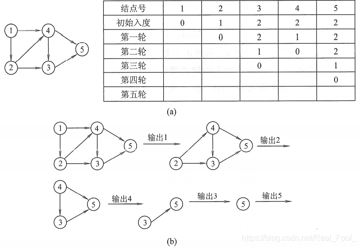

1. 从图中找到一个**没有前驱的顶点**输出
2. 删除以这个点为起点的边。(它的指向的边删除，为了找到下个没有前驱的顶点)
3. 重复上述，直到最后一个顶点被输出。**如果还有顶点未被输出，则说明有环**

##  考点11：拓扑排序

**写出下图的拓扑排序序列**

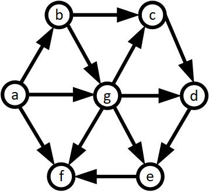

## AOE网

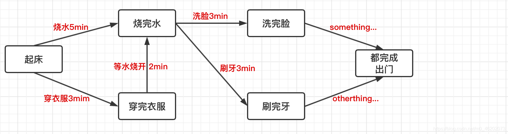

是带权有向无环图

> AOV网是一个有向无环图，AOE则是**带权**有向无环图

与AOV类似：

1. 其中**顶点**`a_i`表示**事件**（Event）
2. **弧**`v_k`表示活动（持续的）

再加入权：权表示活动持续的时间

AOE网可用来估算工程的完成时间

### AOE

AOE网的性质：

- 只有在进入某顶点的活动都已经结束，该顶点所代表的事件才发生
- 只有在某顶点所代表的事件发生后，从该顶点出发的各活动才开始

AOE研究的问题

1. 完成整项工程至少需要多少时间？
2. 哪些活动是影响工程进度的关键？

#### AOE问题

1. 活动`a_i`的**最早开始时间**`e[i]`

2. 活动`a_i`的**最晚开始时间**`l[i]`
3. 事件`v_k`的最早发生时间：`ve[k]`
4. 事件`v_k`的最迟发生时间：`vl[k]`

在AOE网中，所有活动都完成才能到达终点，因此完成整个工程所必须花费的时间（即最短工期）应该为**源点到终点的最大路径长度**。具有最大路径长度的路径称为**关键路径**。关键路径上的活动称为**关键活动**

[【王道计算机考研 数据结构】](https://www.bilibili.com/video/BV1b7411N798/?p=70&share_source=copy_web&vd_source=f6ff1f6b32d145cf17622a2f18e41586) 

[图——关键路径_傅华涛Fu的博客-CSDN博客_图的关键路径](https://blog.csdn.net/fu_jian_ping/article/details/88962697?ops_request_misc=%257B%2522request%255Fid%2522%253A%2522160535975419724838504808%2522%252C%2522scm%2522%253A%252220140713.130102334..%2522%257D&request_id=160535975419724838504808&biz_id=0&utm_medium=distribute.pc_search_result.none-task-blog-2~all~top_click~default-1-88962697.pc_first_rank_v2_rank_v28&utm_term=%E5%9B%BE%E7%9A%84%E5%85%B3%E9%94%AE%E8%B7%AF%E5%BE%84&spm=1018.2118.3001.4449)

##  考点12：SB题

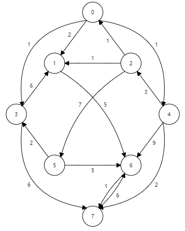

- 利用Dijkstra算法，计算图中顶点`0`到其它顶点的最短路径，写出并上传矩阵的值。记录你完成本题所需要的时间
- 利用Floyd算法算出图3所有顶点到其它顶点的最终的代价`cost`矩阵和最短路径`path`矩阵。记录你完成本题所需要的时间
