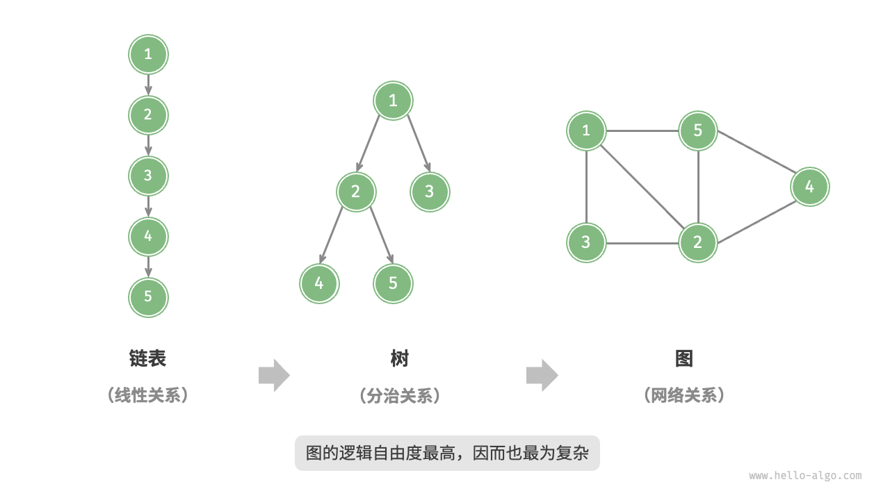
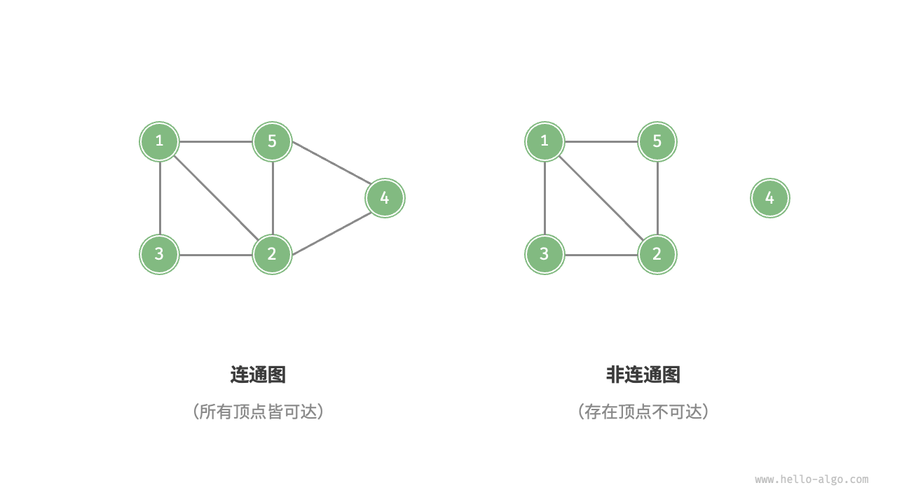
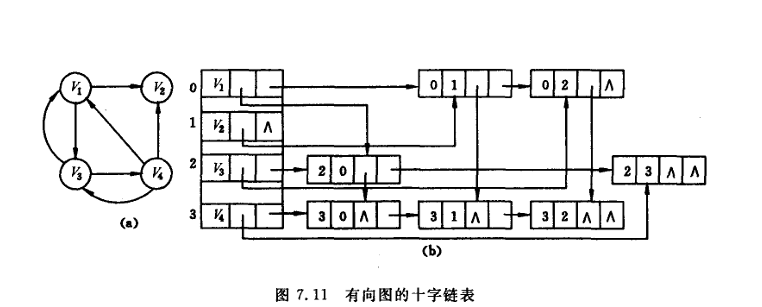
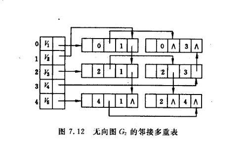
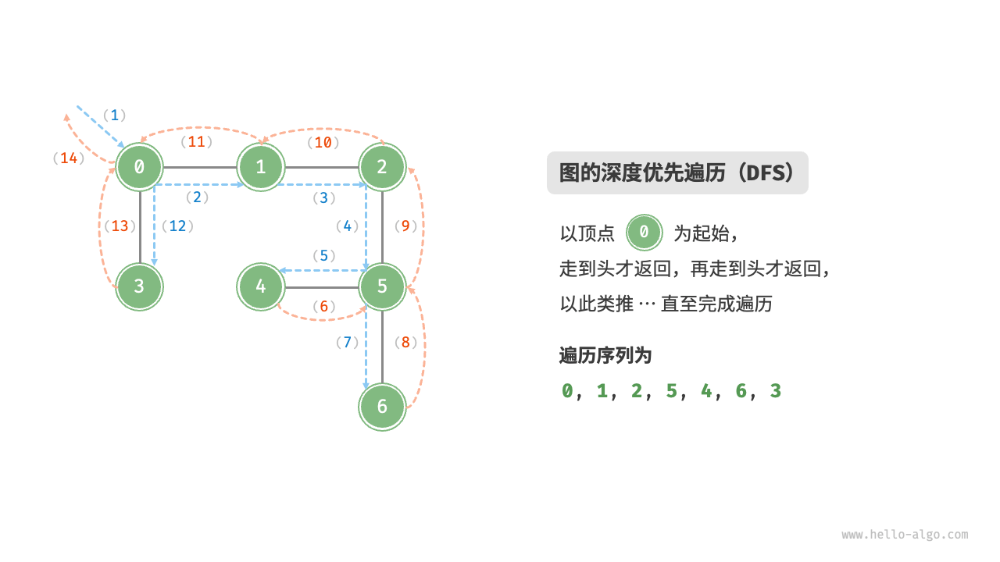
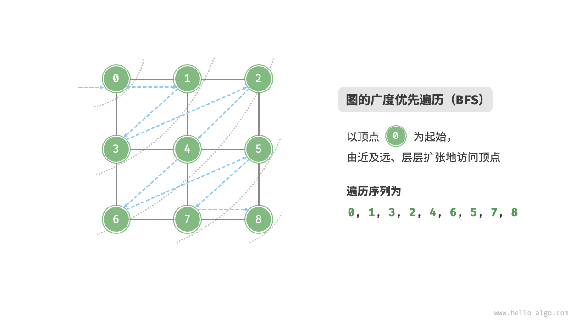
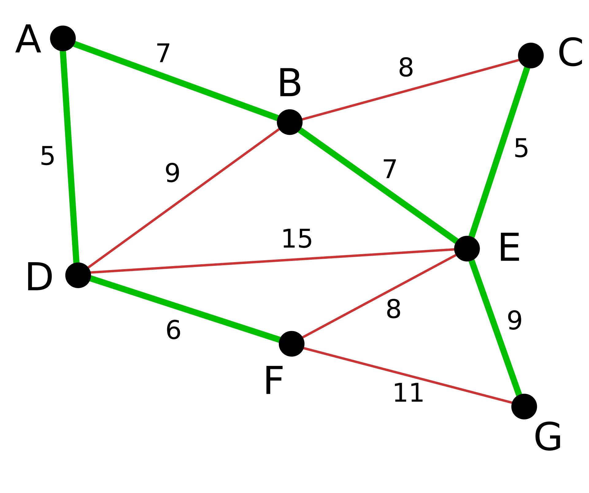

# 图

## 图的构成

**图（graph）**是一种**非线性数据结构**，由**顶点（vertex）**和 **边（edge）**组成。

我们可以将图 $𝐺$ 抽象地表示为一组顶点 $𝑉$ 和一组边 $𝐸$ 的集合。以下示例展示了一个包含 5 个顶点和 7 条边的图

$𝑉=\{1,2,3,4,5\}$

$𝐸=\{(1,2),(1,3),(1,5),(2,3),(2,4),(2,5),(4,5)\}$

$𝐺=\{𝑉,𝐸\}$​

> 图的数学表示：
>
> - $V$  ：图中有那些元素（**顶点**）  
>
> - $E$  ： $(1,2)$ 表示元素 $1$ 和元素 $2$ 有**边** 
>
>   注 ：有向边常用$<1,2>$来表示
>
> - $G$ ：图 

如图所示，**相较于线性关系（链表）和分治关系（树），网络关系（图）的自由度更高**，因而更为复杂



## 图的分类

### 方向

根据边是否具有方向，可分为**无向图**（undirected graph）和**有向图**（directed graph），如图所示。

- 在无向图中，边表示两顶点之间的**“双向”**连接关系，例如微信或 QQ 中的“好友关系”
- 在有向图中，边具有方向性，即 𝐴→𝐵 和 𝐴←𝐵 两个方向的边是**相互独立**的，例如微博或抖音上的“关注”与“被关注”关系


### * 连通

根据所有顶点是否连通，可分为**连通图**（connected graph）和非**连通图**（disconnected graph）

连通 ： 两个顶点之间有路径存在

【连通图 ： 任意两个顶点连通】

**连通分量** ： 连通分量是**无向图**中的一个极大连通子图（该子图本身是连通的，并且再增加任何一个不在此子图中的顶点，它就不再连通），连通分量是针对非连通图而言的，非连通图可以被划分为多个极大连通子图，这些极大连通子图就是连通分量。

也就是说，连通分量的性质有：

1. 连通性：如果从图中的一个顶点可以通过一系列边到达另一个顶点，那么这两个顶点是连通的。如果图中的任意两个顶点都是连通的，那么这个图是连通图。如果图不是连通图，那么它可以被划分为多个连通分量。
2. 极大性：连通分量是极大的连通子图，意味着在**这个子图中添加任何一个不属于该子图的顶点或边都会使它不再连通**

**求解方法**

1. 深度优先搜索（DFS）或广度优先搜索（BFS）：可以从图中的任意一个顶点开始进行深度优先搜索或广度优先搜索。搜索过程中访问到的顶点都属于同一个连通分量。当搜索结束后，如果图中还有未被访问的顶点，那么从这些顶点中任选一个继续进行搜索，直到所有顶点都被访问过。
2. 并查集：并查集是一种用于处理不相交集合合并与查询问题的数据结构。可以使用并查集来快速判断两个顶点是否属于同一个连通分量，并将不同的连通分量合并。

有向图的连通性相较于无向图更为复杂。

***一、强连通性**

1. 定义：如果在有向图中，对于任意两个顶点 `u` 和 `v`，都存在从 `u` 到 `v` 的路径以及从 `v` 到 `u` 的路径，那么这个有向图是强连通的。
2. 性质：
   - 强连通有向图的极大强连通子图称为强连通分量。
   - 一个有向图可以被划分为若干个强连通分量。
3. 求解方法：可以使用 Kosaraju 算法或 Tarjan 算法来求解有向图的强连通分量。这些算法通常基于深度优先搜索（DFS）实现。

***二、弱连通性**

1. 定义：如果将有向图中的所有边转换为无向边后，得到的无向图是连通的，那么这个有向图是弱连通的。
2. 性质：
   - 弱连通有向图不一定是强连通的，但强连通有向图一定是弱连通的。
   - 弱连通有向图可以包含多个强连通分量。



下图判断其是否是一个连通图


### 权值

我们还可以为边添加“权重”变量，从而得到如图所示的**有权图（weighted graph）**


### 常用术语

- 邻接（adjacency）：当两顶点之间存在边相连时，称这两顶点“邻接”。
- 路径（path）：从顶点 A 到顶点 B 经过的边**构成的序列**被称为从 A 到 B 的“路径”
  - 路径长度：路径上边的数目

- **度（degree）**：一个顶点拥有的边数
  - 对于有向图，**入度（in-degree）**表示有多少条边指向该顶点，**出度（out-degree）**表示有多少条边从该顶点指出
  - 对于无向图，顶点的边数为度，度数之和是顶点边数的两倍

下图标出了每个顶点的度


- **环** ：首尾相接的图
- 子图 ：设有两个图$G=(V,E)$和$G'=(V',E')$，若$E'$是 $E$ 的子集，$𝑉'$是$𝑉$的子集，则称$G'$是$G$的子图。

### 完全图

**完全图**：对于无向图而言，如果任意两个顶点之间都存在边，这样的无向图就是完全图。若有 n 个顶点，那么边的数量达到$\frac{1}{2}n(n - 1)$条时就是完全图。

**有向完全图**：针对有向图，如果任意两个不同顶点之间都存在方向相反的两条弧，这种有向图就是有向完全图 。当有 n 个顶点时，弧的数量为$n(n - 1)$条。

**稀疏图**：通常当图中边或弧的数量较少，一般满足 $e < nlogn$（e表示边或弧的数量，n表示顶点数量 ）时，这样的图被称为稀疏图。

- 极大顶点数：再加 1个顶点就不连通了 
- 极大边数：包含子图中所有顶点相连的所有边

# 图的存储结构（表示）

**如何在计算机中表示一张图？**

图的常用表示方式包括**“邻接矩阵”**和**“邻接表”**

## 1. 邻接矩阵

设图的顶点数量为 𝑛 ，邻接矩阵（adjacency matrix）使用一个 $𝑛×𝑛$ 大小的矩阵来表示图，**每一行（列）代表一个顶点，矩阵元素代表边，用 $1$ 或$ 0$​​ 表示两个顶点之间是否存在边。**

边 ： $𝐸=\{(1,2),(1,3),(1,5),(2,3),(2,4),(2,5),(4,5)\}$​

那么图和邻接矩阵为（注意该图的顶点列表并不是按数字顺序）：


设邻接矩阵为 $G$、顶点列表为 $𝑉$ ，那么矩阵元素 $G[𝑖,𝑗]=1$ 表示顶点 $𝑉[𝑖]$到顶点 $𝑉[𝑗]$ 之间存在边，反之 $𝑀[𝑖,𝑗]=0$ 表示两顶点之间无边

### 特性

- **顶点不能与自身相连，因此邻接矩阵主对角线元素没有意义**
- 一个图的邻接矩阵是**唯一**的
- **对于无向图，两个方向的边等价，此时邻接矩阵一定关于主对角线对称**
- 将邻接矩阵的元素从 $1$ 和 $0$ 替换为权重，则可表示有权图

### 优缺点

- 优点：

    - 便于判断两个顶点之间是否有边， 即根据 $G[i][j] = 0$ 或 $1$ 来判断
    - 便于计算各个顶点的度

    对于无向图，邻接矩阵第 $i$ 行元素之和就是顶点 $i$ 的**度**；

### 图的数组表示法（邻接矩阵）

- **顶点数组**：用一维数组 `vexs[]` 存储图的顶点信息。
- 邻接矩阵表示顶点间的关系

```c
#define MAX_VERTEX_NUM 20  // 最大顶点数
#define INFINITY INT_MAX    // 表示无穷大（无权值的边）

typedef enum { DG, DN, UDG, UDN } GraphKind; // 图的类型：有向图、有向网、无向图、无向网

typedef struct {
    VertexType vexs[MAX_VERTEX_NUM];  // 顶点数组（VertexType为顶点数据类型）
    int arcs[MAX_VERTEX_NUM][MAX_VERTEX_NUM]; // 邻接矩阵（无权图用0/1，带权图用权值）
    int vexnum, arcnum;  // 顶点数和边/弧数
    GraphKind kind;      // 图的类型
} MGraph;
```


对于有向图，第 $i$ 行元素之和就是顶点 $i$ 的**出度**，第 $i$ 列元素之和就是顶点 $i$ 的**入度**


度：


- 缺点：

    - **不便于增加和删除顶点**

    - 不便于统计边的数目，需要扫描邻接矩阵所有元素才能统计完毕，初始化的时间复杂度为 $O(n^2)$

    - 空间复杂度高（占用的空间多，适合稠密图）

## 2. 邻接表

邻接表（adjacency list）使用 $𝑛$ 个链表来表示图，链表节点表示顶点。第 $𝑖$ 个链表对应顶点 $𝑖$ ，**其中存储了该顶点的所有邻接顶点（与该顶点相连的顶点）**


### 特性

- 邻接表仅存储实际存在的边，而边的总数通常远小于 $𝑛^2$​ ，因此它相比与邻接矩阵更加节省**空间**。

- 在邻接表中需要通过遍历链表来查找边，因此其查找的**时间效率**不如邻接矩阵。
- 邻接表表示图不唯一（因为边的链表的表示可以是任意顺序）

### 图的邻接表表示法的存储结构

```c
#include <stdio.h>
#include <stdlib.h>

// 定义顶点数据类型（可根据需求修改，如char、int等）
typedef char VertexType;  
// 边表节点（适用于带权图，无权图可省略weight）
typedef struct EdgeNode {  
    int adjvex;          // 邻接顶点的索引（假设顶点用0~n-1编号）
    int weight;         // 边的权值（网需要，无权图可删除）
    struct EdgeNode *next; // 指向下一个邻接节点
} EdgeNode;

// 顶点表节点
typedef struct VertexNode {  
    VertexType data;    // 顶点数据
    EdgeNode *firstedge; // 指向第一条邻接边
} VertexNode, AdjList[MAX_VERTEX_NUM]; // AdjList为顶点表数组

// 图的整体结构
typedef struct {  
    AdjList vertices;   // 顶点表
    int vexnum, arcnum; // 顶点数、边/弧数
    int kind;           // 图的类型（0表示无向图，1表示有向图，2表示无向网，3表示有向网）
} ALGraph;
```

### 优缺点

- 优点

  - 便于增加和删除结点

  - 便于统计边的数目

  - 空间效率高
- 缺点

  - 不便于判断顶点之间是否有边
- 不便于计算**有向图**各个顶点的度


## * 十字链表

### 结构组成

1. 顶点结点：
   - 包含数据域，用于存储顶点信息。
   - 入边表头指针 `firstin`，指向以该顶点为终点的入边表的第一个边结点。（入边）
   - 出边表头指针 `firstout`，指向以该顶点为起点的出边表的第一个边结点。（出边）
2. 边结点：
   - 包含尾域 `tailvex` 和头域 `headvex`，分别表示该边的尾顶点和头顶点在图中的位置。
   - 入边指针 `inlink` 和出边指针 `outlink`，
     - 分别指向以该边的头顶点为终点的下一条边结点（下一个入边）
     - 和以该边的尾顶点为起点的下一条边结点。（下一个出边）
   - 数据域 `info`，可以存储边的权值等信息。（下图权值默认为1）



```c
#include <stdio.h>
#include <stdlib.h>

#define MAX_VERTICES 100

typedef struct EdgeNode {
    int tailvex;
    int headvex;
    struct EdgeNode *inlink;
    struct EdgeNode *outlink;
    int info;
} EdgeNode;

typedef struct VertexNode {
    int data;
    EdgeNode *firstin;
    EdgeNode *firstout;
} VertexNode;

typedef struct {
    VertexNode vertices[MAX_VERTICES];
    int vexnum, edgenum;
} Graph;

// 创建图
void createGraph(Graph *G) {
    printf("输入顶点数量和边数量：");
    scanf("%d %d", &G->vexnum, &G->edgenum);
    for (int i = 0; i < G->vexnum; i++) {
        printf("输入第 %d 个顶点的值：", i + 1);
        scanf("%d", &G->vertices[i].data);
        G->vertices[i].firstin = NULL;
        G->vertices[i].firstout = NULL;
    }
    for (int k = 0; k < G->edgenum; k++) {
        int i, j, w;
        printf("输入第 %d 条边的尾顶点、头顶点和权值：", k + 1);
        scanf("%d %d %d", &i, &j, &w);
        EdgeNode *e = (EdgeNode *)malloc(sizeof(EdgeNode));
        e->tailvex = i - 1;
        e->headvex = j - 1;
        e->info = w;
        e->inlink = G->vertices[j - 1].firstin;
        if (G->vertices[j - 1].firstin!= NULL) {
            G->vertices[j - 1].firstin->inlink = e;
        }
        G->vertices[j - 1].firstin = e;
        e->outlink = G->vertices[i - 1].firstout;
        if (G->vertices[i - 1].firstout!= NULL) {
            G->vertices[i - 1].firstout->outlink = e;
        }
        G->vertices[i - 1].firstout = e;
    }
}

// 打印图
void printGraph(Graph *G) {
    printf("图的十字链表表示：\n");
    for (int i = 0; i < G->vexnum; i++) {
        printf("顶点 %d: %d -> ", i + 1, G->vertices[i].data);
        EdgeNode *p = G->vertices[i].firstout;
        while (p!= NULL) {
            printf("%d(%d) -> ", p->headvex + 1, p->info);
            p = p->outlink;
        }
        printf("NULL\n");
    }
}

int main() {
    Graph G;
    createGraph(&G);
    printGraph(&G);
    return 0;
}
```

## * 邻接多重表

### 一、结构组成

有六个域

1. 顶点表：
   - 包含数据域，用于存储顶点信息。
   - 指针 `firstedge`，指向与该顶点关联的第一条边在边表中的位置。
2. 边表：
   - 包含两个顶点域 `v1` 和 `v2`，分别表示该边的两个顶点在图中的位置。
   - 指针 `ilink` 和 `jlink`，分别指向与顶点 `v1` 和 `v2` 关联的下一条边在边表中的位置。
   - 数据域 info，可以存储边的权值等信息。



## <font color = red> 重点6 ： 图的存储</font>

画出图的邻接矩阵和邻接表，并写出从顶点`0`开始的深度优先遍历和广度优先遍历序列


# 图的操作

## 邻接矩阵

给定一个顶点数量为 n 的无向图，则各种操作的实现方式如图 9-7 所示。

- **添加或删除边**：直接在邻接矩阵中修改指定的边即可，使用 O(1) 时间。而由于是无向图，因此需要同时更新两个方向的边。
- **添加顶点**：在邻接矩阵的尾部添加一行一列，并全部填 0 即可，使用 O(n) 时间。
- **删除顶点**：在邻接矩阵中删除一行一列。当删除首行首列时达到最差情况，需要将 $(n−1)^2$ 个元素“向左上移动”，从而使用 $O(n^2)$ 时间。
- **初始化**：传入 n 个顶点，初始化长度为 n 的顶点列表 `vertices` ，使用 O(n) 时间；初始化 n×n 大小的邻接矩阵 `adjMat` ，使用 $O(n^2)$ 时间

```c
/* 基于邻接矩阵实现的无向图结构体 */
typedef struct {
    int vertices[MAX_SIZE];
    int adjMat[MAX_SIZE][MAX_SIZE];
    int size;
} GraphAdjMat;

/* 构造函数 */
GraphAdjMat *newGraphAdjMat() {
    GraphAdjMat *graph = (GraphAdjMat *)malloc(sizeof(GraphAdjMat));
    graph->size = 0;
    for (int i = 0; i < MAX_SIZE; i++) {
        for (int j = 0; j < MAX_SIZE; j++) {
            graph->adjMat[i][j] = 0;
        }
    }
    return graph;
}

/* 析构函数 */
void delGraphAdjMat(GraphAdjMat *graph) {
    free(graph);
}

/* 添加顶点 */
void addVertex(GraphAdjMat *graph, int val) {
    if (graph->size == MAX_SIZE) {
        fprintf(stderr, "图的顶点数量已达最大值\n");
        return;
    }
    // 添加第 n 个顶点，并将第 n 行和列置零
    int n = graph->size;
    graph->vertices[n] = val;
    for (int i = 0; i <= n; i++) {
        graph->adjMat[n][i] = graph->adjMat[i][n] = 0;
    }
    graph->size++;
}

/* 删除顶点 */
void removeVertex(GraphAdjMat *graph, int index) {
    if (index < 0 || index >= graph->size) {
        fprintf(stderr, "顶点索引越界\n");
        return;
    }
    // 在顶点列表中移除索引 index 的顶点
    for (int i = index; i < graph->size - 1; i++) {
        graph->vertices[i] = graph->vertices[i + 1];
    }
    // 在邻接矩阵中删除索引 index 的行
    for (int i = index; i < graph->size - 1; i++) {
        for (int j = 0; j < graph->size; j++) {
            graph->adjMat[i][j] = graph->adjMat[i + 1][j];
        }
    }
    // 在邻接矩阵中删除索引 index 的列
    for (int i = 0; i < graph->size; i++) {
        for (int j = index; j < graph->size - 1; j++) {
            graph->adjMat[i][j] = graph->adjMat[i][j + 1];
        }
    }
    graph->size--;
}

/* 添加边 */
// 参数 i, j 对应 vertices 元素索引
void addEdge(GraphAdjMat *graph, int i, int j) {
    if (i < 0 || j < 0 || i >= graph->size || j >= graph->size || i == j) {
        fprintf(stderr, "边索引越界或相等\n");
        return;
    }
    graph->adjMat[i][j] = 1;
    graph->adjMat[j][i] = 1;
}

/* 删除边 */
// 参数 i, j 对应 vertices 元素索引
void removeEdge(GraphAdjMat *graph, int i, int j) {
    if (i < 0 || j < 0 || i >= graph->size || j >= graph->size || i == j) {
        fprintf(stderr, "边索引越界或相等\n");
        return;
    }
    graph->adjMat[i][j] = 0;
    graph->adjMat[j][i] = 0;
}

/* 打印邻接矩阵 */
void printGraphAdjMat(GraphAdjMat *graph) {
    printf("顶点列表 = ");
    printArray(graph->vertices, graph->size);
    printf("邻接矩阵 =\n");
    for (int i = 0; i < graph->size; i++) {
        printArray(graph->adjMat[i], graph->size);
    }
}
```

> - 邻接矩阵表示的图，我们需要维护两个数组，一个数组存储顶点值，一个存储边值
> - C语言初始化图的时候，我们一次性分配MAXSIZE大小的二维数组，因为C语言并不支持动态分配数组长度。初始化时把所有元素值归零（表示边不存在）
> - 边值数组可以表示有权图和无权图

## 邻接表

```c
/* 节点结构体 */
typedef struct AdjListNode {
    Vertex *vertex;           // 顶点
    struct AdjListNode *next; // 后继节点
} AdjListNode;

/* 查找顶点对应的节点 */
AdjListNode *findNode(GraphAdjList *graph, Vertex *vet) {
    for (int i = 0; i < graph->size; i++) {
        if (graph->heads[i]->vertex == vet) {
            return graph->heads[i];
        }
    }
    return NULL;
}

/* 添加边辅助函数 */
void addEdgeHelper(AdjListNode *head, Vertex *vet) {
    AdjListNode *node = (AdjListNode *)malloc(sizeof(AdjListNode));
    node->vertex = vet;
    // 头插法
    node->next = head->next;
    head->next = node;
}

/* 删除边辅助函数 */
void removeEdgeHelper(AdjListNode *head, Vertex *vet) {
    AdjListNode *pre = head;
    AdjListNode *cur = head->next;
    // 在链表中搜索 vet 对应节点
    while (cur != NULL && cur->vertex != vet) {
        pre = cur;
        cur = cur->next;
    }
    if (cur == NULL)
        return;
    // 将 vet 对应节点从链表中删除
    pre->next = cur->next;
    // 释放内存
    free(cur);
}

/* 基于邻接表实现的无向图类 */
typedef struct {
    AdjListNode *heads[MAX_SIZE]; // 节点数组
    int size;                     // 节点数量
} GraphAdjList;

/* 构造函数 */
GraphAdjList *newGraphAdjList() {
    GraphAdjList *graph = (GraphAdjList *)malloc(sizeof(GraphAdjList));
    if (!graph) {
        return NULL;
    }
    graph->size = 0;
    for (int i = 0; i < MAX_SIZE; i++) {
        graph->heads[i] = NULL;
    }
    return graph;
}

/* 析构函数 */
void delGraphAdjList(GraphAdjList *graph) {
    for (int i = 0; i < graph->size; i++) {
        AdjListNode *cur = graph->heads[i];
        while (cur != NULL) {
            AdjListNode *next = cur->next;
            if (cur != graph->heads[i]) {
                free(cur);
            }
            cur = next;
        }
        free(graph->heads[i]->vertex);
        free(graph->heads[i]);
    }
    free(graph);
}

/* 查找顶点对应的节点 */
AdjListNode *findNode(GraphAdjList *graph, Vertex *vet) {
    for (int i = 0; i < graph->size; i++) {
        if (graph->heads[i]->vertex == vet) {
            return graph->heads[i];
        }
    }
    return NULL;
}

/* 添加边 */
void addEdge(GraphAdjList *graph, Vertex *vet1, Vertex *vet2) {
    AdjListNode *head1 = findNode(graph, vet1);
    AdjListNode *head2 = findNode(graph, vet2);
    assert(head1 != NULL && head2 != NULL && head1 != head2);
    // 添加边 vet1 - vet2
    addEdgeHelper(head1, vet2);
    addEdgeHelper(head2, vet1);
}

/* 删除边 */
void removeEdge(GraphAdjList *graph, Vertex *vet1, Vertex *vet2) {
    AdjListNode *head1 = findNode(graph, vet1);
    AdjListNode *head2 = findNode(graph, vet2);
    assert(head1 != NULL && head2 != NULL);
    // 删除边 vet1 - vet2
    removeEdgeHelper(head1, head2->vertex);
    removeEdgeHelper(head2, head1->vertex);
}

/* 添加顶点 */
void addVertex(GraphAdjList *graph, Vertex *vet) {
    assert(graph != NULL && graph->size < MAX_SIZE);
    AdjListNode *head = (AdjListNode *)malloc(sizeof(AdjListNode));
    head->vertex = vet;
    head->next = NULL;
    // 在邻接表中添加一个新链表
    graph->heads[graph->size++] = head;
}

/* 删除顶点 */
void removeVertex(GraphAdjList *graph, Vertex *vet) {
    AdjListNode *node = findNode(graph, vet);
    assert(node != NULL);
    // 在邻接表中删除顶点 vet 对应的链表
    AdjListNode *cur = node, *pre = NULL;
    while (cur) {
        pre = cur;
        cur = cur->next;
        free(pre);
    }
    // 遍历其他顶点的链表，删除所有包含 vet 的边
    for (int i = 0; i < graph->size; i++) {
        cur = graph->heads[i];
        pre = NULL;
        while (cur) {
            pre = cur;
            cur = cur->next;
            if (cur && cur->vertex == vet) {
                pre->next = cur->next;
                free(cur);
                break;
            }
        }
    }
    // 将该顶点之后的顶点向前移动，以填补空缺
    int i;
    for (i = 0; i < graph->size; i++) {
        if (graph->heads[i] == node)
            break;
    }
    for (int j = i; j < graph->size - 1; j++) {
        graph->heads[j] = graph->heads[j + 1];
    }
    graph->size--;
    free(vet);
}
```

# 图的遍历

树代表的是“一对多”的关系，而图则具有更高的自由度，可以表示任意的“多对多”关系。因此，我们可以把树看作图的一种特例。显然，**树的遍历操作也是图的遍历操作的一种特例**。

图和树都需要应用搜索算法来实现遍历操作。图的遍历方式也可分为两种：广度优先遍历和深度优先遍历

## 1. 深度优先搜索（Depth First Search, DFS）【栈】

**深度优先遍历是一种优先走到底、无路可走再回头的遍历方式**。

如图所示，从左上角顶点出发，访问当前顶点的某个邻接顶点，直到走到尽头时返回，再继续走到尽头并返回，以此类推，直至所有顶点遍历完成。



也就是说：

1. 选取一个出发点
2. 从出发点开始，（按一定顺序）选取可以前进的点
3. 选取可以前进的点之一
4. 从该点再选择一个可以前进的点（要求未被经过的点）
5. 重复，直到无法前进或者达到终点
6. 退栈到前一个分岔口

## 2 . 广度优先搜索(Breadth First Search, BFS)【队列】

**广度优先遍历是一种由近及远的遍历方式，从某个节点出发，始终优先访问距离最近的顶点，并一层层向外扩张**。

如图所示，从左上角顶点出发，首先遍历该顶点的所有邻接顶点，然后遍历下一个顶点的所有邻接顶点，以此类推，直至所有顶点访问完毕。



也就是主要分三步：

1. 选取出发点
2. 所有可前进点进队，出发点退队
3. 重复操作直到达到终点

```c
void DFSUtil(Graph* graph, int v, int visited[]) {
    visited[v] = 1;
    printf("%d ", v);
    AdjListNode* pCrawl = graph->array[v].head;
    while (pCrawl) {
        if (!visited[pCrawl->dest]) {
            DFSUtil(graph, pCrawl->dest, visited);
        }
        pCrawl = pCrawl->next;
    }
}

void DFS(Graph* graph, int startVertex) {
    int visited[graph->V];
    for (int i = 0; i < graph->V; i++) {
        visited[i] = 0;
    }
    DFSUtil(graph, startVertex, visited);
}
```

`void DFS(Graph* graph, int startVertex)`：

- 深度优先遍历的主函数，接收图的指针`graph`和起始顶点编号`startVertex`作为参数。
- 首先创建一个标记数组，初始状态下所有顶点都未被访问。然后调用`DFSUtil`函数从起始顶点开始进行深度优先遍历。

```c
void BFS(Graph* graph, int startVertex) {
    int visited[graph->V];
    for (int i = 0; i < graph->V; i++) {
        visited[i] = 0;
    }
    int queue[MAX_VERTICES];
    int front = 0, rear = 0;
    visited[startVertex] = 1;
    queue[rear++] = startVertex;
    while (front < rear) {
        int currentVertex = queue[front++];
        printf("%d ", currentVertex);
        AdjListNode* pCrawl = graph->array[currentVertex].head;
        while (pCrawl) {
            if (!visited[pCrawl->dest]) {
                visited[pCrawl->dest] = 1;
                queue[rear++] = pCrawl->dest;
            }
            pCrawl = pCrawl->next;
        }
    }
}
```

`void BFS(Graph* graph, int startVertex)`：

- 广度优先遍历的主函数，接收图的指针`graph`和起始顶点编号`startVertex`作为参数。
- 首先创建一个标记数组，初始状态下所有顶点都未被访问。然后创建一个队列（使用整数数组模拟），将起始顶点标记为已访问并加入队列。
- 当队列不为空时，取出队首顶点，打印该顶点编号，并将其未被访问过的邻接点加入队列并标记为已访问。

## <font color = red> 考点9：图的遍历</font>

**画出图1的邻接矩阵和邻接表，并写出从顶点`0`开始的深度优先遍历和广度优先遍历序列。**


# 图的连通性

> 来到数据结构最高层：算 $\downarrow$法$\nearrow$

## 最小生成树问题

### 什么是生成树？

**一个连通图的生成树**是 ： 一个极小的连通子图，**它含有图中全部的顶点**，但只**有足以构成一棵树的n − 1 条边**

若砍去它的一条边，则会使生成树变成非连通图；若给它增加一条边，则会形成图中的一条回路


> 也就是说**生成树是一个连通图的子图**
>
> 1. **包含该图的所有顶点**
> 2. **所有顶点是连通的**
> 3. **边尽可能少**
>
> “树”中是不存在回路且连通的，所以生成树可以理解为：**剔除掉图中多余的边，但保证其连通（顶点是可达的）**
>

看不懂也不要紧，可以看看这个，看完再回头看，你会豁然开朗：

[【图-最小生成树-Prim(普里姆)算法和Kruskal(克鲁斯卡尔)算法】](https://www.bilibili.com/video/BV1wG411z79G/?share_source=copy_web&vd_source=f6ff1f6b32d145cf17622a2f18e41586) 

### 什么是最小生成树？

是一副连通加权无向图中一棵**权值最小**的生成树

对于一个带权连通无向图 $G = ( V , E )$，生成树不同，其中边的权值之和最小的那棵生成树（构造连通网的最小代价生成树），称为$G$的最小生成树(Minimum-Spanning-Tree, MST)


## 1. Prim（普利姆）算法

> 有趣的演示：
>
> [DSA Prim's Algorithm](https://www.w3schools.com/dsa/dsa_algo_mst_prim.php)

是图论]中的一种**贪心算法**，可在一个加权连通图中找到其最小生成树。意即由此算法搜索到的边子集所构成树中，不但包括了连通图里的所有顶点，且其所有边的权值之和亦为最小。

1. 首先随意找一个顶点，一般都是 $v_1$，
2. 然后找到与 $v_1$ 相连的权值最小的边（若有多条，则随机选取一条）
3. 找与这两个点相连的有最小权值的边，
4. 然后与找这三个点相连权值最小的边，
5. 一直重复，直到有 $n-1$ 条边，并且连接完所有的顶点，**注意，不能形成环**


### 详细图解

> 这里的重点是`dist`、`res`、`集合V和S`的具体变化，要求读者能自己写出

`prim`算法实际上是一种贪心算法

现有图如下


#### 初始化

我们有如下所需参数

1. $dist$ 数组 ，用来存储原点（随机选取的第一个点，这里为 $1$ 点）到第 $i$个元素的距离

2. 集合 $S$ 和 $V$，用于存放已知边和未知边**（贪心算法，逐步已知)**

   1. $S $： 未知点（蓝色的点）

   2. $V$：已知点（红色的点）

3. 变量 $res$​​ : 存放最小生成树所有边权值的和

$dist$ 初始时数据：


#### 过程

随机选取一个点：（初始化）


注意$dist$的数据要有所更改（因为在1边已知的情况下，到 $2$  $6$ $7$ 的距离不再为 无穷）


1. 选择离S集合最近的点加入S集合中，并且用新加入的点去更新dist数组，因为只有一个新的点加入到集合S中，到集合S的距离才有可能更新

    现在集合$S=\{1\}$，集合$V=\{2，3，4，5，6，7\}$，根据贪心策略，我们选择离集合$S$最近的点加入 ，即点$2$，并把这一条边的权值加到$res$中。

    

1. 集合更新为$S=\{1，2\}$，$V=\{3，4，5，6，7\}$，并用点2去更新$dist$数组，我们发现点$3$和点$7$（从$S$中的点出发）到原点的距离有变化，分别可以都可以通过边$2-3$，$2-7$缩短到集合S得距离,因此更新 3 和 7的$dist$数组

​	

3. 重复知道V为空，可以得到权值和$res =  57$. $dist$：


[最小生成树——Prim算法（详细图解）_prim算法构造最小生成树_skynesser的博客-CSDN博客](https://blog.csdn.net/qq_62213124/article/details/121597780)

## 2. Kruskal（克鲁斯卡尔）算法

> 演示：
>
> [DSA Kruskal's Algorithm](https://www.w3schools.com/dsa/dsa_algo_mst_kruskal.php)

### 过程

首先构造一个只含`n`个顶点的森林，然后依权值从小到大从连通网中选择边加入到森林中，并使森林中不产生回路，直至森林变成一棵树为止

> 也就是：
>
> 1. 新建图 ${\displaystyle G}$，${\displaystyle G}$ 中拥有原图中相同的节点，但没有边
> 2. 将原图中所有的边按权值从小到大排序
> 3. 从权值最小的边开始，如果这条边连接的两个节点于图 ${\displaystyle G}$ 中不在同一个连通分量中，则添加这条边到图 ${\displaystyle G}$ 中
> 4. 重复3，直至图 ${\displaystyle G}$ 中所有的节点都在同一个连通分量中

时间复杂度为：$O(elog_2e)$ 边数`e`越大，所耗费时间越长，则适合稀疏图，普利姆算法则更适合稠密图（边多的图）


> 也是一种贪心算法

|                     图例                     |                             说明                             |
| :------------------------------------------: | :----------------------------------------------------------: |
|  | **AD**和**CE**是最短的两条边，长度为5，其中**AD**被任意选出，以高亮表示。 |
|  | 现在**CE**是不属于环的最短边，长度为5，因此第二个以高亮表示。 |
|  |        下一条边是长度为6的**DF**，同样地以高亮表示。         |
|  | 接下来的最短边是**AB**和**BE**，长度均为7。**AB**被任意选中，并以高亮表示。边**BD**用红色高亮表示，因为**B**和**D**之间已经存在一条（标为绿色的）路径，如果选择它将会构成一个环（**ABD**）。 |
|  | 以高亮表示下一条最短边**BE**，长度为7。这时更多的边用红色高亮标出：会构成环**BCE**的**BC**、会构成环**DBEA**的**DE**以及会构成环**FEBAD**的**FE**。 |
|  | 最终，标记长度为9的边**EG**，得到最小生成树，结束算法过程。  |

### * 有向图的强连通分量

### Kosaraju 算法

有向图强连通分量的深度优先搜索（DFS）求解方法解析：

1. **第一次 DFS 遍历**：从有向图 G 的某个顶点出发进行深度优先搜索遍历，按顶点搜索完成（退出 DFS 函数）的顺序记录到辅助数组 \(finished[]\)。此过程通过修改计数变量 count 初始化和记录顶点号，为后续步骤奠定顺序基础。
2. **逆向 DFS 遍历**：从 \(finished[]\) 中最后完成搜索的顶点开始，沿以该顶点为 “头” 的弧作逆向深度优先搜索。若一次遍历未访问所有顶点，则从余下顶点中最后完成搜索的顶点继续，直到所有顶点被访问。每次逆向 DFS 遍历访问的顶点集即为一个强连通分量。


## <font color = red> 考点10：最小生成树</font>

**利用Kruskal算法在空白图中绘出下图2的最小生成树，并标明每条边入选的次序**


# 图的最短路径问题

寻找图（由顶点和路径组成的）中两顶点之间的最短路径。算法具体的形式包括：

- **确定起点的最短路径问题** - 也叫单源最短路问题，即已知起始结点，求最短路径的问题。在边权非负时适合使用`Dijkstra`算法
- **全局最短路径问题** - 也叫多源最短路问题，求图中所有的最短路径。适合使用`Floyd-Warshall`算法]

最短路径问题：**有向图带权图**中某一顶点(称为源点)到达另一顶点(称为终点)，如何找到一条路径使得沿此路径上各边上的权值总和达到最小


## 1. Dijkstra算法

**Dijkstra算法**是由荷兰计算机科学家艾兹赫尔·戴克斯特拉在1956年发现的算法戴克斯特拉算法使用类似**广度优先搜索**的方法解决带权图的**单源**最短路径问题

> 老戴（迪）头有如下成就
>
> - 提出信号量和PV原语，解决了哲学家就餐问题
> - 提出了一种最短路径算法（Dijkstra's Shortest Path First Algorithm）
> - 提出了银行家算法

1. 指定起点`s`(必须有一个起点)

2. 此外，引进两个集合`S`和`U` 
   - `S`的作用是记录**已求出最短路径的顶点**(以及相应的最短路径长度)
   - `U`则是记录还**未求出最短路径的顶点**(以及该顶点到起点`s`的距离)。

3. 初始时，
   - `S`中只有起点`s`
   - `U`中包含所有除`s`之外的顶点，并且`U`中顶点的路径是： 起点`s`到该顶点的路径。

4. 从`U`中找出路径最短的顶点，并将其加入到`S`中，并更新U中的顶点和顶点对应的路径

5.  重复`4`操作，直到遍历完所有顶点

如图 ：


得到最终结果 `{D(0),C(3),E(4),F(6),G(12),B(13),A(22)}`22步即可到达

> 如不理解，观看视频
>
> [【图-最短路径-Dijkstra(迪杰斯特拉)算法】](https://www.bilibili.com/video/BV1uT4y1p7Jy/?share_source=copy_web&vd_source=f6ff1f6b32d145cf17622a2f18e41586) 
>
> 有趣的演示：
>
> [DSA Dijkstra's Algorithm](https://www.w3schools.com/dsa/dsa_algo_graphs_dijkstra.php)

```c
#include <stdio.h>
#include <stdlib.h>
#include <limits.h>

#define V 5 // 图中的顶点数量

// 找到距离源顶点最近的未确定最短路径的顶点
int minDistance(int dist[], int sptSet[]) {
    int min = INT_MAX, min_index;

    for (int v = 0; v < V; v++)
        if (sptSet[v] == 0 && dist[v] <= min)
            min = dist[v], min_index = v;

    return min_index;
}

// 打印最短路径距离
void printSolution(int dist[]) {
    printf("顶点\t距离源顶点的最短距离\n");
    for (int i = 0; i < V; i++)
        printf("%d\t\t%d\n", i, dist[i]);
}

// 迪杰斯特拉算法
void dijkstra(int graph[V][V], int src) {
    int dist[V];     // 存储源顶点到每个顶点的最短距离
    int sptSet[V];   // 标记顶点是否已确定最短路径

    // 初始化距离和最短路径标记
    for (int i = 0; i < V; i++)
        dist[i] = INT_MAX, sptSet[i] = 0;

    dist[src] = 0;

    // 找到所有顶点的最短路径
    for (int count = 0; count < V - 1; count++) {
        int u = minDistance(dist, sptSet);

        sptSet[u] = 1;

        // 更新 dist 数组
        for (int v = 0; v < V; v++)
            if (!sptSet[v] && graph[u][v] && dist[u]!= INT_MAX && dist[u] + graph[u][v] < dist[v])
                dist[v] = dist[u] + graph[u][v];
    }

    printSolution(dist);
}
```


## 2. Floyd-Warshall算法

> 直接观看
>
> [【图-最短路径-Floyd(弗洛伊德)算法】](https://www.bilibili.com/video/BV19k4y1Q7Gj/?share_source=copy_web&vd_source=f6ff1f6b32d145cf17622a2f18e41586) 

是解决**任意**两点间的最短路径的一种算法

> 算法的原理是[动态规划](https://zh.wikipedia.org/wiki/动态规划)

基本思想：若要解一个给定问题，我们需要解其不同部分（即子问题），再根据子问题的解以得出原问题的解

对于`n`个顶点的图`G`,求任意一对顶点 $V_i -> V_j$ 之间的最短路径可分为如下几个阶段:

初始:不允许在其他顶点中转，最短路径是?

1. 若允许在 $V_0$ 中转，最短路径是?
2. 若允许在 $V_0、V_1$ 中转，最短路径是?
3. 若允许在 $V_0、V_1、V_2$ 中转，最短路径是?
4. 若允许在 $V_0、V_1、V_2 .... V_{n-1}$ 中转，最短路径是?

弗洛伊德算法定义了**两个二维矩阵**：

- 矩阵`D`记录顶点间的最小路径
例如`D[0][3]= 10`，说明顶点 `0` 到 `3` 的最短路径为`10`

- 矩阵`P`记录顶点间最小路径中的中转点
例如`P[0][3] = 1`说明，`0` 到 `3`的最短路径轨迹为：`0 → 1 → 3`

它通过 $3$ 重循环，`k`为中转点，`v`为起点，`w`为终点，循环比较`D[v][w]`0和 `D[v][k] + D[k][w]`最小值，如果`D[v][k] + D[k][w]`为更小值，则把`D[v][k] + D[k][w]` 覆盖保存在`D[v][w]`中。


> 以某点为中介点，就是把某点的横竖两行提出来，然后把这两行两两对应的数字相加，看看是否小于当前该点的距离

```c
#include <stdio.h>
#include <stdlib.h>
#include <limits.h>

#define V 4 // 图中的顶点数量

// 打印最短路径距离
void printSolution(int dist[][V]) {
    printf("以下是所有顶点对之间的最短距离：\n");
    for (int i = 0; i < V; i++) {
        for (int j = 0; j < V; j++) {
            if (dist[i][j] == INT_MAX)
                printf("INF\t");
            else
                printf("%d\t", dist[i][j]);
        }
        printf("\n");
    }
}

// 弗洛伊德算法
void floydWarshall(int graph[][V]) {
    int dist[V][V];

    // 初始化距离数组
    for (int i = 0; i < V; i++) {
        for (int j = 0; j < V; j++) {
            dist[i][j] = graph[i][j];
        }
    }

    // 通过中间顶点更新最短距离
    for (int k = 0; k < V; k++) {
        for (int i = 0; i < V; i++) {
            for (int j = 0; j < V; j++) {
                if (dist[i][k]!= INT_MAX && dist[k][j]!= INT_MAX && dist[i][k] + dist[k][j] < dist[i][j])
                    dist[i][j] = dist[i][k] + dist[k][j];
            }
        }
    }

    printSolution(dist);
}
```

> 在弗洛伊德（Floyd）算法中，三层循环起着关键的作用，具体如下：
>
> **一、第一层循环（遍历中间顶点 k）**
>
> 1. 作用：
>    - 这一层循环用于选择一个中间顶点，考虑经过这个中间顶点是否可以缩短任意两个顶点之间的路径距离。
>    - 通过依次选择不同的中间顶点，逐步更新任意两个顶点之间的最短距离。
> 2. 原理：
>    - 动态规划的思想是将问题分解为子问题并保存子问题的解，以便在需要时重复使用。在弗洛伊德算法中，通过中间顶点来划分问题，先考虑不经过任何中间顶点时的最短距离，然后逐步增加中间顶点，更新最短距离。
>
> **二、第二层和第三层循环（遍历所有顶点对` (i, j)`）**
>
> 1. 作用：
>    - 这两层循环用于遍历图中的所有顶点对。对于每一个顶点对 (i, j)，检查经过当前中间顶点 k 是否可以得到更短的路径。
>    - 如果经过中间顶点 k 可以缩短从顶点 i 到顶点 j 的距离，就更新最短距离。
> 2. 原理：
>    - 假设不经过中间顶点 k 时，从顶点 i 到顶点 j 的最短距离为 `dist[i][j]`。如果存在一条路径从顶点 i 经过中间顶点 k 再到顶点 j，且这条路径的距离更短，即 `dist[i][k] + dist[k][j] < dist[i][j]`，那么就更新 `dist[i][j] = dist[i][k] + dist[k][j]`。

# 有向无环图的应用

一个无环的有向图称做有向无环图(directed acycline graph)

## 拓扑排序：卡恩算法

当且仅当图中没有定向环时（即有向无环图），才有可能进行拓扑排序

**拓扑排序**就是将AOV网中所有顶点排成一个线性序列

AOV网（Activity On Vertex Network)是一个——**有向无回路的图**

- **顶点**——表示活动
- **用弧**——表示活动间的优先关系 

**拓扑排序不唯一**

> 在某校的选课系统中，存在这样的规则：每门课可能有若干门先修课，如果要修读某一门课，则必须要先修读此课程所要求的先修课后才能修读。假设一个学生同时只能修读一门课程，那么，被选课系统允许的他修完他需要所有课程的顺序是一个拓扑序。
>
> 在这个例子中，每一门课程对应有向图中的一个顶点，每一个先修关系对应一条有向边（从先修课指向需要先修课的课）

### 卡恩算法

假设`L`是存放结果的列表，先找到那些入度为零的节点，把这些节点放到`L`中，因为这些节点没有任何的父节点。然后把与这些节点相连的边从图中去掉，再寻找图中的**入度为零**的节点。对于新找到的这些入度为零的节点来说，他们的父节点已经都在`L`中了，所以也可以放入`L`


1. 从图中找到一个**没有前驱的顶点**输出
2. 删除以这个点为起点的边。(它的指向的边删除，为了找到下个没有前驱的顶点)
3. 重复上述，直到最后一个顶点被输出。**如果还有顶点未被输出，则说明有环**

### * CODE

#### 实现步骤

1. 计算入度：
   - 首先遍历有向无环图，统计每个顶点的入度。可以使用一个数组来存储每个顶点的入度。
2. 选择入度为 0 的顶点：
   - 创建一个队列，用于存储入度为 0 的顶点。
   - 遍历图中的所有顶点，将入度为 0 的顶点加入队列。
3. 进行拓扑排序：
   - 当队列不为空时，从队列中取出一个顶点，并将其输出。
   - 对于该顶点的每个邻接顶点，将其入度减 1。如果减 1 后入度变为 0，则将该邻接顶点加入队列。
   - 重复上述步骤，直到队列为空。

以下是用 C 语言实现拓扑排序的代码示例：

```c
#include <stdio.h>
#include <stdlib.h>

#define MAX_VERTICES 100

typedef struct Graph {
    int V;
    int adjMatrix[MAX_VERTICES][MAX_VERTICES];
    int inDegree[MAX_VERTICES];
} Graph;

Graph* createGraph(int V) {
    Graph* graph = (Graph*)malloc(sizeof(Graph));
    graph->V = V;
    for (int i = 0; i < V; i++) {
        for (int j = 0; j < V; j++) {
            graph->adjMatrix[i][j] = 0;
        }
        graph->inDegree[i] = 0;
    }
    return graph;
}

void addEdge(Graph* graph, int src, int dest) {
    graph->adjMatrix[src][dest] = 1;
    graph->inDegree[dest]++;
}

void topologicalSort(Graph* graph) {
    int* sorted = (int*)malloc(graph->V * sizeof(int));
    int index = 0;
    int queue[MAX_VERTICES];
    int front = 0, rear = 0;
    for (int i = 0; i < graph->V; i++) {
        if (graph->inDegree[i] == 0) {
            queue[rear++] = i;
        }
    }
    while (front < rear) {
        int currentVertex = queue[front++];
        sorted[index++] = currentVertex;
        for (int i = 0; i < graph->V; i++) {
            if (graph->adjMatrix[currentVertex][i]) {
                graph->inDegree[i]--;
                if (graph->inDegree[i] == 0) {
                    queue[rear++] = i;
                }
            }
        }
    }
    if (index!= graph->V) {
        printf("图中存在环，无法进行拓扑排序。\n");
    } else {
        printf("拓扑排序结果：");
        for (int i = 0; i < index; i++) {
            printf("%d ", sorted[i]);
        }
        printf("\n");
    }
    free(sorted);
}
```

1. 时间复杂度：
   - 计算入度的时间复杂度为 ，其中 是图中的顶点数量， 是边的数量。
   - 进行拓扑排序的过程中，每个顶点和每条边最多被访问一次，时间复杂度也为 。
   - 总体时间复杂度为 。
2. 空间复杂度：
   - 创建入度数组和队列需要 的空间。
   - 如果需要存储排序后的结果，还需要额外的 的空间。
   - 总体空间复杂度为 。

`inDegree`是一个整数数组，用于存储每个顶点的入度，即指向该顶点的边的数量。

- 首先分配内存创建一个整数数组`sorted`，用于存储拓扑排序的结果，以及一个整数数组`queue`作为队列，用于存储入度为 0 的顶点。
- 然后遍历图中的所有顶点，将入度为 0 的顶点加入队列。
- 当队列不为空时，从队列中取出一个顶点，将其加入排序结果数组`sorted`中，并遍历该顶点的所有邻接顶点，将邻接顶点的入度减 1。如果减 1 后入度变为 0，则将该邻接顶点加入队列。
- 如果最终排序结果数组的长度不等于图中的顶点数量，说明图中存在环，无法进行拓扑排序，打印相应的错误信息。否则，打印拓扑排序的结果。
- 最后释放排序结果数组`sorted`占用的内存。

## <font color = red> 考点11：拓扑排序</font>

**写出下图的拓扑排序序列**


## AOE网


是带权有向无环图

> AOV网是一个有向无环图，AOE则是**带权**有向无环图

与AOV类似：

1. 其中**顶点**`a_i`表示**事件**（Event）
2. **弧**`v_k`表示活动（持续的）

再加入权：权表示活动持续的时间

AOE网可用来估算工程的完成时间

### AOE

AOE网的性质：

- 只有在进入某顶点的活动都已经结束，该顶点所代表的事件才发生
- 只有在某顶点所代表的事件发生后，从该顶点出发的各活动才开始

AOE研究的问题

1. 完成整项工程至少需要多少时间？
2. 哪些活动是影响工程进度的关键？

#### AOE问题

1. 活动`a_i`的**最早开始时间**`e[i]`

2. 活动`a_i`的**最晚开始时间**`l[i]`
3. 事件`v_k`的最早发生时间：`ve[k]`
4. 事件`v_k`的最迟发生时间：`vl[k]`

在AOE网中，所有活动都完成才能到达终点，因此完成整个工程所必须花费的时间（即最短工期）应该为**源点到终点的最大路径长度**。具有最大路径长度的路径称为**关键路径**。关键路径上的活动称为**关键活动**

[【王道计算机考研 数据结构】](https://www.bilibili.com/video/BV1b7411N798/?p=70&share_source=copy_web&vd_source=f6ff1f6b32d145cf17622a2f18e41586) 

[图——关键路径_傅华涛Fu的博客-CSDN博客_图的关键路径](https://blog.csdn.net/fu_jian_ping/article/details/88962697?ops_request_misc=%257B%2522request%255Fid%2522%253A%2522160535975419724838504808%2522%252C%2522scm%2522%253A%252220140713.130102334..%2522%257D&request_id=160535975419724838504808&biz_id=0&utm_medium=distribute.pc_search_result.none-task-blog-2~all~top_click~default-1-88962697.pc_first_rank_v2_rank_v28&utm_term=%E5%9B%BE%E7%9A%84%E5%85%B3%E9%94%AE%E8%B7%AF%E5%BE%84&spm=1018.2118.3001.4449)

### * CODE

1. 进行拓扑排序：
   - 首先对有向无环图进行拓扑排序，确定活动的执行顺序。这一步是为了确保在计算每个活动的最早开始时间和最晚开始时间时，能够按照正确的顺序进行。
2. 计算最早开始时间（ES）和最早完成时间（EF）：
   - 从源点开始，按照拓扑排序的顺序依次计算每个活动的**最早开始时间和最早完成时间**。
   - 对于一个活动，其最早开始时间等于其所有前驱活动中最早完成时间的最大值。最早完成时间等于最早开始时间加上活动的持续时间。
3. 进行逆拓扑排序：
   - 在计算完最早开始时间和最早完成时间后，需要进行逆拓扑排序，从汇点开始反向遍历有向无环图。
   - 逆拓扑排序可以通过对有向无环图进行反转，然后进行拓扑排序得到。或者在计算最晚开始时间和最晚完成时间时，从汇点开始，按照与拓扑排序相反的顺序进行处理。
4. 计算最晚开始时间（LS）和最晚完成时间（LF）：
   - 从汇点开始，按照逆拓扑排序的顺序依次计算每个活动的最晚开始时间和最晚完成时间。
   - 对于一个活动，其最晚完成时间等于其所有后继活动中最晚开始时间的最小值。最晚开始时间等于最晚完成时间减去活动的持续时间。
5. 确定关键活动：
   - 通过**比较每个活动的最早开始时间和最晚开始时间（或者最早完成时间和最晚完成时间），可以确定哪些活动是关键活动**。
   - 如果一个活动的最早开始时间等于最晚开始时间（或者最早完成时间等于最晚完成时间），那么这个活动就是关键活动，它位于关键路径上。

## <font color = red> 考点12：SB题</font>


- 利用`Dijkstra`算法，计算图中顶点`0`到其它顶点的最短路径，写出并上传矩阵的值。记录你完成本题所需要的时间
- 利用`Floyd`算法算出图3所有顶点到其它顶点的最终的代价`cost`矩阵和最短路径`path`矩阵。记录你完成本题所需要的时间
