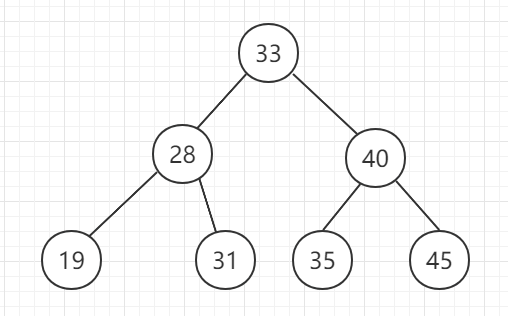
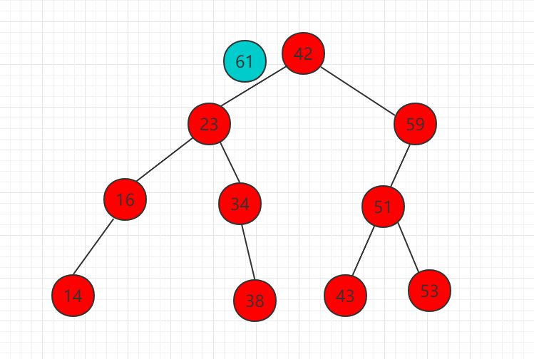
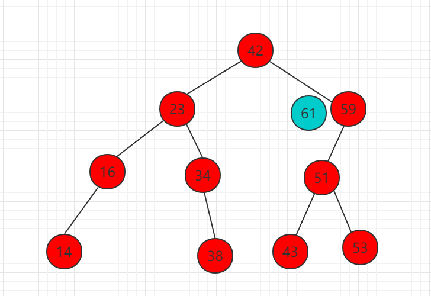
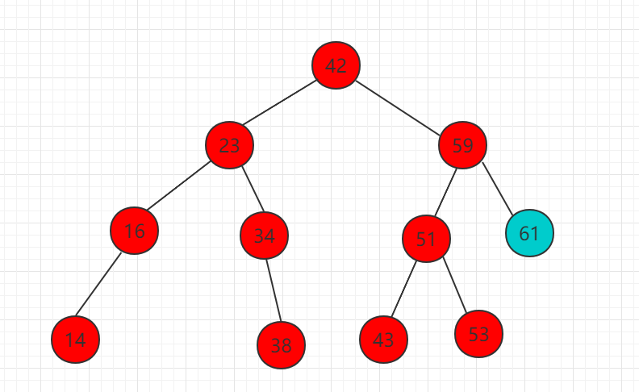

[Python数据结构 | 笔记整理（6）——查找](https://zhuanlan.zhihu.com/p/545816366)

[数据结构：查找(Search)【详解】_index.search返回什么结构-CSDN博客](https://blog.csdn.net/Real_Fool_/article/details/114359564)

# 查找（搜索）

### 定义

1. **查找(Searching)**：就是根据给定的某个值，在**查找表**中确定一个其**关键字**等于给定值的数据元素( 或记录)。

2. **关键字(Key)**：数据元素中唯一标识该元素的某个数据项的值，使用基于关键字的查找，查找结果应该是唯一的。

   例如，在由一个学生元素构成的数据集合中，学生元素中“学号”这一数据项的值唯一地标识一名学生。

> 查找算法可根据实现思路分为以下两类。
>
> - **通过遍历数据结构来定位目标元素**，例如数组、链表、树和图的遍历等。
> - **利用数据组织结构或数据包含的先验信息，实现高效元素查找**，例如二分查找、二叉搜索树查找等。

### key

1. 查找长度 ：在查找运算中，需要对比关键字的次数称为查找长度

2. 平均查找长度$(ASL)$：所有查找过程中进行关键字的比较次数的平均值

    $ASL = \sum\limits_{i = 1}^n P_iC_i$

    - $P_i$:  第 $i$个元素查找概率

    - $C_i$: 找到第 $i$个元素所需进行的比较

    - $n$ ：表长 

> 事实上，`ASL`和概率论与数理统计中的**数学期望**几乎相同

# 线性表查找

## 1. 顺序查找

从表的一端开始，依次将记录的关键字和给定值进行比较，若某个记录的关键字和给定值相等，则查找成功；

反之，若扫描整个表后，仍未找到关键字和给定值相等的记录，则查找失败.

- 查找成功时的平均查找长度为：（假设每个数据元素的概率相等） $ASL = {(n+1) \over 2} $

- 当查找不成功时，需要 $n+1$ 次比较，时间复杂度为 $O(n)$;

平均查找长度 ： $(n+1) \over 2$

**顺序查找的时间复杂度为 $O(n)$**

## 2. 折半查找（二分查找）

**说明：元素必须是有序的，如果是无序的则要先进行排序操作**

### 流程

先初始化指针 $𝑖=0$ 和 $𝑗=𝑛−1$，分别指向数组首元素和尾元素，代表搜索区间 `[0,𝑛−1] `。

请注意，中括号表示闭区间，其包含边界值本身。

接下来，循环执行以下两步。

1. 计算中点索引 $𝑚=⌊(𝑖+𝑗)/2⌋ $，其中 $⌊⌋$ 表示向下取整操作。
2. 判断 $nums[m]$ 和 $target$ 的大小关系，分为以下三种情况。
   1. 当 `nums[m] < target` 时，说明 `target` 在区间 $[𝑚+1,𝑗]$ 中，因此执行 $𝑖=𝑚+1$ 。
   2. 当 `nums[m] > target` 时，说明 `target` 在区间 $[𝑖,𝑚−1]$ 中，因此执行 $𝑗=𝑚−1$ 。
   3. 当 `nums[m] = target` 时，说明找到 `target` ，因此返回索引 $𝑚$ 

若数组不包含目标元素，搜索区间最终会缩小为空。此时返回 $−1$ 。

### 特点

1. 最多查找次数 为 $log_2(n+1)$

2. 平均查找次数 

$$
\text{ASL}=\sum_{i=0}^{k}p_{i}c_{i}=\frac{1}{n}\sum_{i=0}^{k}(i \times 2^{i-1})=\log_{2} (n+1) - 1 + \frac{1}{n} \log_{2} (n+1) \approx \log_{2} (n+1) - 1
$$

假设查找每个数据元素的概率相等，对于一个长度为 $n = 2k -1$ 的有序表，线性表最多被平分 $k = log_2(n+1)$ 次即可完成查找。又因为在 $i$ 次查找中可以找到的元素个数为 $2i-1$ 个，所以其平均查找长度如上

## 3. 分块查找

将顺序查找和折半查找结合

基本思想：将查找表分为若干个子块，**块内元素可以无序，块间元素有序块间有序**

含义： 若a<b，则第 b 块中所有记录的关键字均大于第 a 块中的最大关键字

建立“索引表”，每个结点含有最大关键字域和指向本块第一个结点的指针，且按关键字有序

分块查找的过程分为两步：

1. 索引查找：在索引表中确定待查记录所在的块；（可顺序、可折半）

2. 块内查找：在块内顺序查找

**数据结构｜分块查找**

[www.bilibili.com](https://www.bilibili.com/video/BV1Wd4y167kG/?spm_id_from=333.337.search-card.all.click&vd_source=3310f07bcb7152dc48cc5e65834e98b5)

# 树表查找

## 1. 二叉排序树（二分搜索树）

二叉排序树右称二叉查找树。或者为空树，或者是具有以下性质：

1. 若它的左子树不为空，则左子树所有节点的值小于根结点，

2. 若它的右子树不为空，则根结点的值小于所有右子树结点的值

3. 它的左右子树叶分别为二叉排序树

如图所示 ： 

平均时间的时间复杂度为 $ O(log_2 n)$，最差情况为 $O(n)$。

### 1. 查找

在以 `root` 为根节点的二叉搜索树中搜索一个值为 `value` 的节点。

分类讨论如下：

- 若 `root` 为空，返回 `false`。
- 若 `root` 的权值等于 `value`，返回 `true`。
- 若 `root` 的权值大于 `value`，在 `root` 的左子树中继续搜索。
- 若 `root` 的权值小于 `value`，在 `root` 的右子树中继续搜索。

### 2. 插入

在以 `root` 为根节点的二叉搜索树中插入一个值为 `value` 的节点。

分类讨论如下：

- 若 `root` 为空，直接返回一个值为 `value` 的新节点。
- 若 `root` 的权值等于 `value`，不讨论该情况
- 若 `root` 的权值大于 `value`，在 `root` 的左子树中递归调用插入权值为 `value` 的函数
- 若 `root` 的权值小于 `value`，在 `root` 的右子树中递归调用插入权值为 `value` 的函数

查找到前后位（空位）然后插入

### 3. 创建

依次插入新元素

[【【难点讲解】二叉排序树】](https://www.bilibili.com/video/BV1Tk4y117fs/?share_source=copy_web&vd_source=f6ff1f6b32d145cf17622a2f18e41586) 

### 4. 删除

分为以下三种情况

1. 删除叶子节点 ：直接删除

1. 删除节点有左子树或有右子树 ： 用直接子女补位

1. 左右都不为空 ： 用右子树中的最小值代替

> 搜索、插入、删除的复杂度等于树高，期望$O(log_2n)$最坏退化为偏斜二叉树

## 2. 平衡二叉树

> 平衡二叉树为改进的二叉查找树。一般的二叉查找树的查询复杂度取决于目标结点到树根的距离（即深度），因此当结点的深度普遍较大时，查询的均摊复杂度会上升。为了实现更高效的查询，产生了**平衡树**

平衡二叉树也叫AVL树，具有以下定义：

- 它的右子树和左子树的高度之差(平衡因子)的绝对值不超过`1`，且它的左子树和右子树都是一颗平衡二叉树。
- 平衡二叉树上所有节点的平衡因子只可能为`-1,0,1`

**平衡因子：**左子树高度 - 右子树高度 

平衡二叉树中不存在平衡因子大于 `1` 的节点。在一棵平衡二叉树中，节点的平衡因子只能取 `0 ,1 , -1` ，分别对应着

- 左右子树等高
- 左子树比较高
- 右子树比较高

### 平衡的维护

插入或删除节点后，可能会造成 AVL 树的平衡性质被破坏。

因此，需要沿着从被插入/删除的节点到根的路径对树进行维护：

如果对于某一个节点，平衡性质不再满足，由于我们只插入/删除了一个节点，对树高的影响不超过 `1`，因此该节点的平衡因子的绝对值至多为 `2`

我们考虑如下调整

1. 插入(调整最小不平衡树)
2. 创建（插入同理）
3. 删除  (插入同理)

最小不平衡树：是指离插入结点最近且以平衡因子的绝对值大于`1`的结点作为根的子树

[【平衡二叉树的生成炒鸡简单不用LR、RL（以王道2021数据结构平衡二叉树的生成过程为例）】](https://www.bilibili.com/video/BV1hD4y1278s/?share_source=copy_web&vd_source=f6ff1f6b32d145cf17622a2f18e41586) 

## 3. B-

B树也称B-树,它是一颗多路平衡查找树。我们描述一颗B树时需要指定它的阶数，阶数表示了一个结点最多有多少个孩子结点，一般用字母`m`表示阶数。当m取2时，就是我们常见的二叉搜索树。

### B树的性质

- 树中的每个结点至多有`m`颗子树。

- 若根结点不是叶子结点，则至少有两颗子树

- 除根结点外，所有非终端结点至少有$[ {m\over 2} ]$ ( 向上取整 )颗子树。

### 插入

**B-树的插入（创建）**

[www.bilibili.com](https://www.bilibili.com/video/BV1Jh411q7xP/?spm_id_from=333.337.search-card.all.click&vd_source=3310f07bcb7152dc48cc5e65834e98b5)

1. 根据要插入的$key$的值，找到叶子结点并插入。

2. 判断当前结点key的个数是否小于等于m-1，若满足则结束，否则进行第3步。

3. 以结点中间的key为中心分裂成左右两部分，然后将这个中间的key插入到父结点中，这个key的左子树指向分裂后的左半部分，这个key的右子支指向分裂后的右半部分，然后将当前结点指向父结点，继续进行第3步

如果父结点的关键字个数也超过（m-1），则要再分裂，再往上插。直至这个过程传到根结点为止。

#### 图解

1. 在空树中插入39

    此时根结点就一个key，此时根结点也是叶子结点

1. 继续插入22，97和41

    根结点此时有4个key

1. 继续插入53

插入后超过了最大允许的关键字个数4，所以以key值为41为中心进行分裂，结果如下图所示，分裂后当前结点指针指向父结点，满足B树条件，插入操作结束。当阶数m为偶数时，需要分裂时就不存在排序恰好在中间的key，那么我们选择中间位置的前一个key或中间位置的后一个key为中心进行分裂即可。

1. 依次插入13，21，40，同样会造成分裂，结果如下图所示

### 删除

1. 若该结点为非叶结点，且被删关键字为该结点中第i个关键字key[i]，则可从指针son[i]所指的子树中找出最小关键字Y，代替key[i]的位置，然后在叶结点中删去Y。

2. 如果是叶子结点的话，需要分为下面三种情况进行删除。

    - 如果被删关键字所在结点的原关键字个数n>=[m/2] ( 上取整），说明删去该关键字后该结点仍满足B-树的定义。这种情况最为简单，只需删除对应的关键字k

    - 如果被删关键字所在结点的关键字个数n等于( 上取整）[ m/2 ]-1，说明删去该关键字后该结点将不满足B-树的定义，需要调整。

调整过程为：

如果其左右兄弟结点中有“多余”的关键字,即与该结点相邻的右兄弟(或左兄弟)结点中的关键字数目大于( 上取整）[m/2]-1。则可将右兄弟(或左兄弟)结点中最小关键字(或最大的关键字)上移至双亲结点。而将双亲结点中小（大）于该上移关键字的关键字下移至被删关键字所在结点中。

被删关键字所在结点和其相邻的兄弟结点中的关键字数目均等于（上取整）[m/2]-1。假设该结点有右兄弟，则在删去关键字之后，它所在结点中剩余的关键字，加上双亲结点中的关键字Ki一起，合并到 Ai所指兄弟结点中(若没有右兄弟，则合并至左兄弟结点中)。

#### 图解

1. 原始状态

    

1. 在上面的B树中删除21，删除后结点中的关键字个数仍然大于等2，所以删除结束。、

    

1. 在上述情况下接着删除27。从上图可知27位于非叶子结点中，所以用27的后继替换它。从图中可以看出，27的后继为28，我们用28替换27，然后在28（原27）的右孩子结点中删除28。删除后的结果如下图所示。

    

删除后发现，当前叶子结点的记录的个数小于2，而它的兄弟结点中有3个记录（当前结点还有一个右兄弟，选择右兄弟就会出现合并结点的情况，不论选哪一个都行，只是最后B树的形态会不一样而已），我们可以从兄弟结点中借取一个key。所以父结点中的28下移，兄弟结点中的26上移,删除结束。结果如下图所示。

1. 在上述情况下接着32，结果如下图。

    

当删除后，当前结点中只key，而兄弟结点中也仅有2个key。所以只能让父结点中的30下移和这个两个孩子结点中的key合并，成为一个新的结点，当前结点的指针指向父结点。结果如下图所示。

当前结点key的个数满足条件，故删除结束。

---

1. 上述情况下，我们接着删除key为40的记录，删除后结果如下图所示。

同理，当前结点的记录数小于2，兄弟结点中没有多余key，所以父结点中的key下移，和兄弟（这里我们选择左兄弟，选择右兄弟也可以）结点合并，合并后的指向当前结点的指针就指向了父结点。

同理，对于当前结点而言只能继续合并了，最后结果如下所示。

合并后结点当前结点满足条件，删除结束。

# 哈希表

### 构建

除留余数法
此方法为最常用的构造散列函数方法。对于散列表长为m的散列函数公式为： $H(key) = key\%p$

$\%$是取模（求余数）的意思

### 冲突处理

#### 1. 顺序开放地址

一旦发生冲突，就去寻找下一个空的散列地址，只要散列表足够大，空的散列地址总能找到，并将记录存入。

