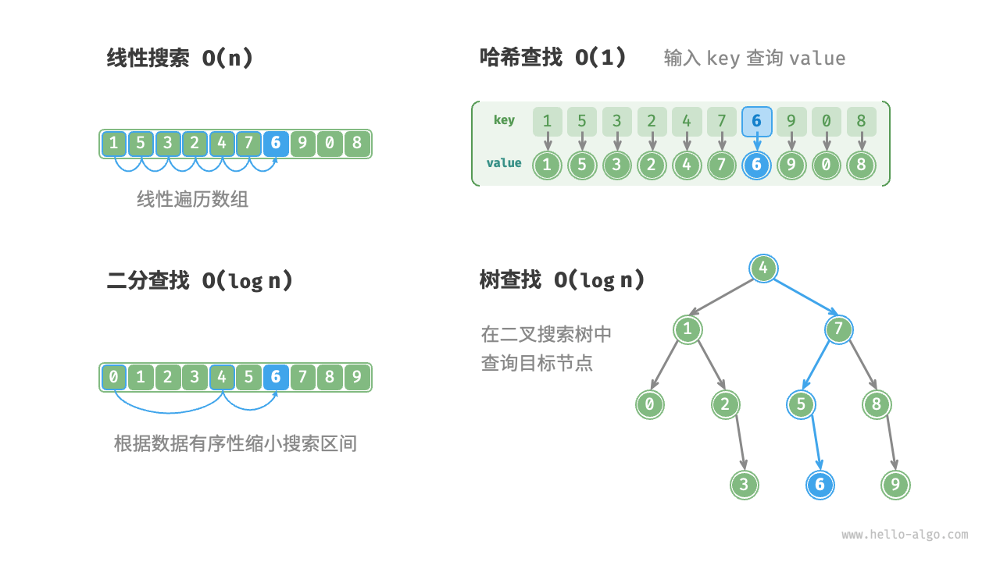
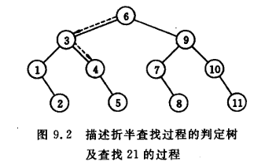
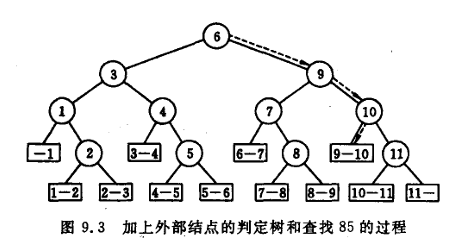
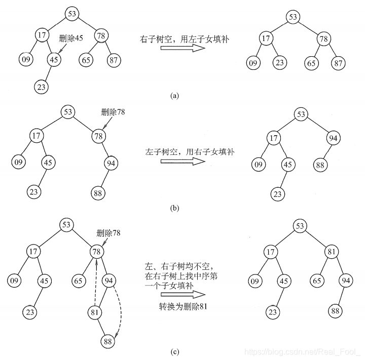
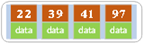
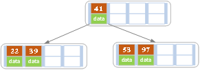
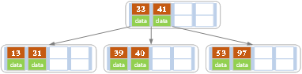
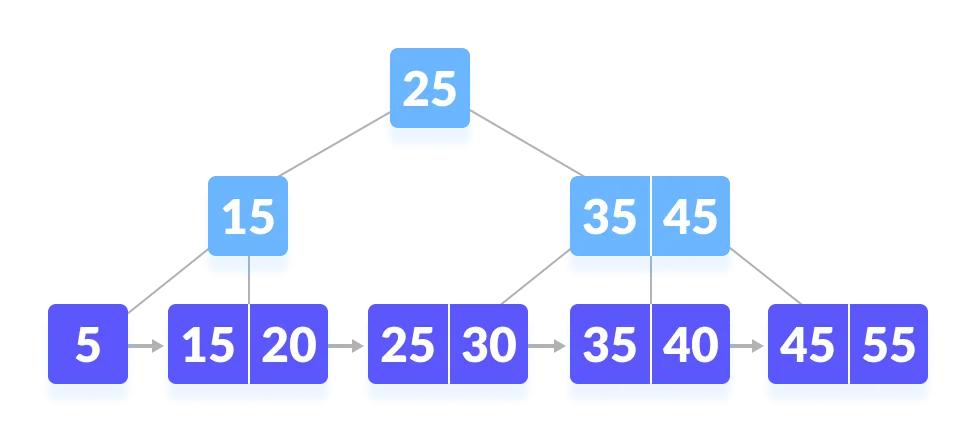
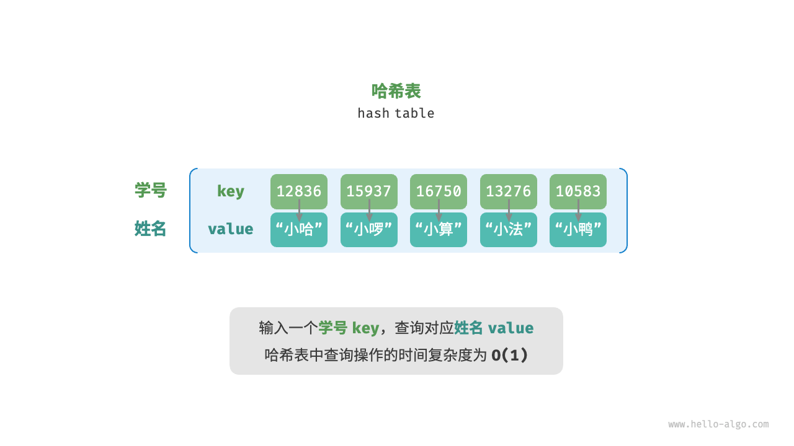
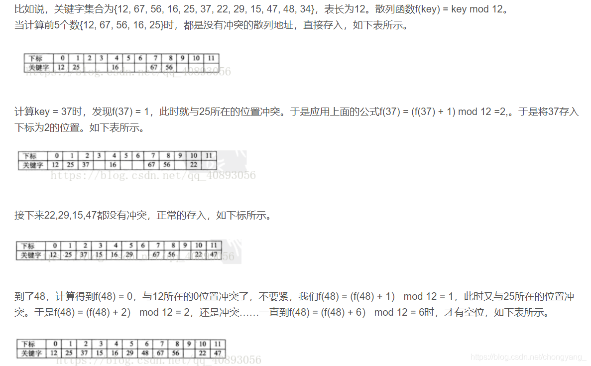

[Python数据结构 | 笔记整理（6）——查找](https://zhuanlan.zhihu.com/p/545816366)


[数据结构：查找(Search)【详解】_index.search返回什么结构-CSDN博客](https://blog.csdn.net/Real_Fool_/article/details/114359564)

# 查找（搜索）



### 定义

1. **查找(Searching)**：就是根据给定的某个值，在**查找表**中确定一个其**关键字**等于给定值的数据元素( 或记录)。

2. **关键字(Key)**：数据元素中唯一标识该元素的某个数据项的值，使用基于关键字的查找，查找结果应该是唯一的。

   例如，在由一个学生元素构成的数据集合中，学生元素中“学号”这一数据项的值唯一地标识一名学生。


> 查找算法可根据实现思路分为以下两类。
>
> - **通过遍历数据结构来定位目标元素**，例如数组、链表、树和图的遍历等。
> - **利用数据组织结构或数据包含的先验信息，实现高效元素查找**，例如二分查找、二叉搜索树查找等。

### key

1. 查找长度 ：在查找运算中，需要对比关键字的次数称为查找长度

2. 平均查找长度$(ASL)$：**在查找成功的前提下**，所有查找过程中进行关键字的比较次数的平均值


$$
ASL = \sum\limits_{i = 1}^n P_iC_i
$$

- $P_i$:  第 $i$个元素查找概率

- $C_i$: 找到第 $i$个元素所需进行的比较次数

- $n$ ：表长 


> 事实上，`ASL`和概率论与数理统计中的**数学期望**几乎相同

**查找算法分类：**

静态查找和动态查找；

注：静态或者动态都是针对查找表而言的。动态表指查找表中有删除和插入操作的表。

# 线性表查找

## 1. 顺序查找

从表的一端开始，依次将记录的关键字和给定值进行比较，若某个记录的关键字和给定值相等，则查找成功；

反之，若扫描整个表后，仍未找到关键字和给定值相等的记录，则查找失败.

- 查找成功时的平均查找长度为：（假设每个数据元素的概率相等） $ASL = {(n+1) \over 2} $

- 当查找不成功时，需要 $n+1$ 次比较，时间复杂度为 $O(n)$;

平均查找长度 ： $(n+1) \over 2$

**顺序查找的时间复杂度为 $O(n)$**

```c
//顺序查找
int sequentialSearch(int arr[], int n, int target) {
    for (int i = 0; i < n; i++) {
        if (arr[i] == target) {
            return i;
        }
    }
    return -1;
}
```

## 2. 折半查找（二分查找）

**说明：元素必须是有序的，如果是无序的则要先进行排序操作**


### 流程

先初始化指针 $𝑖=0$ 和 $𝑗=𝑛−1$，分别指向数组首元素和尾元素，代表搜索区间 `[0,𝑛−1] `。

请注意，中括号表示闭区间，其包含边界值本身。

接下来，循环执行以下两步。

1. 计算中点索引 $𝑚=⌊(𝑖+𝑗)/2⌋ $，其中 $⌊⌋$ 表示向下取整操作。
2. 判断 $nums[m]$ 和 $target$ 的大小关系，分为以下三种情况。
   1. 当 `nums[m] < target` 时，说明 `target` 在区间 $[𝑚+1,𝑗]$ 中，因此执行 $𝑖=𝑚+1$ 。
   2. 当 `nums[m] > target` 时，说明 `target` 在区间 $[𝑖,𝑚−1]$ 中，因此执行 $𝑗=𝑚−1$ 。
   3. 当 `nums[m] = target` 时，说明找到 `target` ，因此返回索引 $𝑚$ 

若数组不包含目标元素，搜索区间最终会缩小为空。此时返回 $−1$ 。

### 特点

1. 最多查找次数 为 $log_2(n+1)$

2. 平均查找次数 （ $n > 50$ ）


$$
\text{ASL}=\sum_{i=0}^{k}p_{i}c_{i}=\frac{1}{n}\sum_{i=0}^{k}(i \times 2^{i-1})=\log_{2} (n+1) - 1 + \frac{1}{n} \log_{2} (n+1) \approx \log_{2} (n+1) - 1
$$

假设查找每个数据元素的概率相等，对于一个长度为 $n = 2k -1$ 的有序表，线性表最多被平分 $k = log_2(n+1)$ 次即可完成查找。又因为在 $i$ 次查找中可以找到的元素个数为 $2i-1$ 个，所以其平均查找长度如上

```c
/* 二分查找（双闭区间） */
int binarySearch(int arr[], int n, int target) {
    int low = 0;
    int high = n - 1;
    while (low <= high) {
        int mid = low + (high - low) / 2;
        if (arr[mid] == target) {
            return mid;
        } else if (arr[mid] < target) {
            low = mid + 1;
        } else {
            high = mid - 1;
        }
    }
    return -1;
}
```

#### * 二叉判定树

折半查找过程可以用二叉树来表示，这个二叉树通常被称为二叉判定树。

构建过程

对于一个有 n 个元素的有序序列，二叉判定树是这样构建的：

1. 如果序列中有一个元素，那么二叉判定树只有一个节点。

2. 如果序列中有多个元素，

   - 首先将序列中间的元素作为根节点。
   - 根节点左子树表示对序列前半部分进行折半查找的过程，
   - 右子树表示对序列后半部分进行折半查找的过程。

   以此类推，递归地构建左右子树。

根据折半判定树可以比较容易的写出`ASL`





## 3. 分块查找

将顺序查找和折半查找结合

基本思想：将查找表分为若干个子块，**块内元素可以无序，块间元素有序块间有序**

含义： 若a<b，则第 b 块中所有记录的关键字均大于第 a 块中的最大关键字

建立“索引表”，每个结点含有最大关键字域和指向本块第一个结点的指针，且按关键字有序

分块查找的过程分为两步：

1. 索引查找：在索引表中确定待查记录所在的块；（可顺序、可折半）

2. 块内查找：在块内顺序查找

**数据结构｜分块查找**

[www.bilibili.com](https://www.bilibili.com/video/BV1Wd4y167kG/?spm_id_from=333.337.search-card.all.click&vd_source=3310f07bcb7152dc48cc5e65834e98b5)

# 树表查找

## 1. 二叉排序树（binary search tree）

二叉排序树（二叉查找树、二叉搜索树）。或者为空树，或者是具有以下性质：

1. 若它的左子树不为空，则左子树所有节点的值小于根结点，

2. 若它的右子树不为空，则根结点的值小于所有右子树结点的值

3. 它的左右子树叶分别为二叉排序树

如图所示 ： 


平均时间的时间复杂度为 $ O(log_2 n)$，最差情况为 $O(n)$。

### 1. 查找

在以 `root` 为根节点的二叉搜索树中搜索一个值为 `value` 的节点。

分类讨论如下：

- 若 `root` 为空，返回 `false`。
- 若 `root` 的权值等于 `value`，返回 `true`。
- 若 `root` 的权值大于 `value`，在 `root` 的左子树中继续搜索。
- 若 `root` 的权值小于 `value`，在 `root` 的右子树中继续搜索。

```c
/* 查找节点 */
TreeNode *search(BinarySearchTree *bst, int num) {
    TreeNode *cur = bst->root;
    // 循环查找，越过叶节点后跳出
    while (cur != NULL) {
        if (cur->val < num) {
            // 目标节点在 cur 的右子树中
            cur = cur->right;
        } else if (cur->val > num) {
            // 目标节点在 cur 的左子树中
            cur = cur->left;
        } else {
            // 找到目标节点，跳出循环
            break;
        }
    }
    // 返回目标节点
    return cur;
}
/*
给定目标节点值 num ，可以根据二叉搜索树的性质来查找。如图所示，我们声明一个节点 cur ，从二叉树的根节点 root 出发，循环比较节点值 cur.val 和 num 之间的大小关系。

若 cur.val < num ，说明目标节点在 cur 的右子树中，因此执行 cur = cur.right 。
若 cur.val > num ，说明目标节点在 cur 的左子树中，因此执行 cur = cur.left 。
若 cur.val = num ，说明找到目标节点，跳出循环并返回该节点。
*/
```

### 2. 插入

在以 `root` 为根节点的二叉搜索树中插入一个值为 `value` 的节点。

分类讨论如下：

- 若 `root` 为空，直接返回一个值为 `value` 的新节点。
- 若 `root` 的权值等于 `value`，不讨论该情况
- 若 `root` 的权值大于 `value`，在 `root` 的左子树中递归调用插入权值为 `value` 的函数
- 若 `root` 的权值小于 `value`，在 `root` 的右子树中递归调用插入权值为 `value` 的函数

查找到前后位（空位）然后插入


### 3. 创建

1. 初始化

   首先创建一个空的二叉树，即根节点为`NULL`。

2. 插入节点

   对于给定的数据集合中的每个元素，执行以下插入操作：

   - 如果二叉树为空，将该元素作为根节点创建二叉树。
   - 如果二叉树不为空，从根节点开始，比较当前节点的值与要插入元素的值：
     - 如果要插入的元素值小于当前节点的值，进入左子树继续查找插入位置。
     - 如果要插入的元素值大于当前节点的值，进入右子树继续查找插入位置。
     - 重复这个过程，直到找到一个合适的空位置，将该元素插入到该位置作为一个新的节点。

[【【难点讲解】二叉排序树】](https://www.bilibili.com/video/BV1Tk4y117fs/?share_source=copy_web&vd_source=f6ff1f6b32d145cf17622a2f18e41586) 

### 4. 删除

分为以下三种情况

1. 删除叶子节点 ：直接删除

1. 删除节点有左子树或有右子树 ： 用直接子女补位

1. 左右都不为空 ： 用**右子树的最小节点或左子树的最大节点**代替





> 搜索、插入、删除的复杂度等于树高，期望$O(log_2n)$最坏退化为偏斜二叉树

### 中序遍历有序


如图所示，二叉树的中序遍历遵循“左 → 根 → 右”的遍历顺序，而二叉搜索树满足“左子节点 < 根节点 < 右子节点”的大小关系。

这意味着在二叉搜索树中进行中序遍历时，总是会优先遍历下一个最小节点，从而得出一个重要性质：**二叉搜索树的中序遍历序列是升序的**。

利用中序遍历升序的性质，我们在二叉搜索树中获取有序数据仅需 $O(n)$ 时间，无须进行额外的排序操作，非常高效。

### 不平衡的二叉树

给定一组数据，我们考虑使用数组或二叉搜索树存储。观察表，二叉搜索树的各项操作的时间复杂度都是对数阶，具有稳定且高效的性能。只有在高频添加、低频查找删除数据的场景下，数组比二叉搜索树的效率更高。

表 数组与搜索树的效率对比

|          | 无序数组 | 二叉搜索树 |
| :------- | :------- | :--------- |
| 查找元素 | O(n)     | O(log⁡n)    |
| 插入元素 | O(1)     | O(log⁡n)    |
| 删除元素 | O(n)     | O(log⁡n)    |

在理想情况下，二叉搜索树是“平衡”的，这样就可以在 $log⁡n$ 轮循环内查找任意节点。

然而，如果我们在二叉搜索树中不断地插入和删除节点，可能导致二叉树退化为图所示的链表，这时各种操作的时间复杂度也会退化为 $O(n)$。


## 2. 平衡二叉树

> 平衡二叉树为改进的二叉查找树。一般的二叉查找树的查询复杂度取决于目标结点到树根的距离（即深度），因此当结点的深度普遍较大时，查询的均摊复杂度会上升。为了实现更高效的查询，产生了**平衡树**

经过两次删除节点操作，这棵二叉搜索树便会退化为链表


平衡二叉树也叫AVL树，具有以下定义：

- 它的右子树和左子树的高度之差(平衡因子)的绝对值不超过`1`，且它的左子树和右子树都是一颗平衡二叉树。
- 平衡二叉树上所有节点的平衡因子只可能为`-1,0,1`

**平衡因子：**左子树高度 - 右子树高度 

平衡二叉树中不存在平衡因子大于 `1` 的节点。在一棵平衡二叉树中，节点的平衡因子只能取 `0 ,1 , -1` ，分别对应着

- 左右子树等高
- 左子树比较高
- 右子树比较高

在图所示的完美二叉树中插入两个节点后，树将严重向左倾斜，查找操作的时间复杂度也随之劣化


由于 AVL 树的相关操作需要获取节点高度，因此我们需要为节点类添加 `height` 变量：

```c
/* AVL 树节点结构体 */
TreeNode struct TreeNode {
    int val;
    int height;					// 添加树高
    struct TreeNode *left;
    struct TreeNode *right;
} TreeNode;

/* 构造函数 */
TreeNode *newTreeNode(int val) {
    TreeNode *node;

    node = (TreeNode *)malloc(sizeof(TreeNode));
    node->val = val;
    node->height = 0;
    node->left = NULL;
    node->right = NULL;
    return node;
}
```

“节点高度”是指从该节点到它的最远叶节点的距离，即所经过的“边”的数量。

需要特别注意的是，叶节点的高度为 `0` ，而空节点的高度为 `−1` 

节点的平衡因子（balance factor）定义为节点左子树的高度减去右子树的高度，同时规定空节点的平衡因子为 `0` 。我们同样将获取节点平衡因子的功能封装成函数，方便后续使用：

```c
/* 获取平衡因子 */
int balanceFactor(TreeNode *node) {
    // 空节点平衡因子为 0
    if (node == NULL) {
        return 0;
    }
    // 节点平衡因子 = 左子树高度 - 右子树高度
    return height(node->left) - height(node->right);
}
```

### 平衡的维护

插入或删除节点后，可能会造成 AVL 树的平衡性质被破坏。

因此，需要沿着从被插入/删除的节点到根的路径对树进行维护：

如果对于某一个节点，平衡性质不再满足，由于我们只插入/删除了一个节点，对树高的影响不超过 `1`，因此该节点的平衡因子的绝对值至多为 `2`

我们考虑如下调整

1. 插入(调整最小不平衡树)
2. 创建（插入同理）
3. 删除  (插入同理)

最小不平衡树：是指离插入结点最近且以平衡因子的绝对值大于`1`的结点作为根的子树

[【平衡二叉树的生成炒鸡简单不用LR、RL（以王道2021数据结构平衡二叉树的生成过程为例）】](https://www.bilibili.com/video/BV1hD4y1278s/?share_source=copy_web&vd_source=f6ff1f6b32d145cf17622a2f18e41586) 

#### * CODE

```c
#include <stdio.h>
#include <stdlib.h>

// 定义 AVL 树节点结构
struct AVLNode {
    int key;
    int height;
    struct AVLNode *left;
    struct AVLNode *right;
};

// 获取节点高度
int height(struct AVLNode *node) {
    if (node == NULL)
        return 0;
    return node->height;
}

// 更新节点高度
void updateHeight(struct AVLNode *node) {
    int leftHeight = height(node->left);
    int rightHeight = height(node->right);
    node->height = (leftHeight > rightHeight? leftHeight : rightHeight) + 1;
}

// 右旋操作
struct AVLNode *rightRotate(struct AVLNode *y) {
    struct AVLNode *x = y->left;
    struct AVLNode *T2 = x->right;

    x->right = y;
    y->left = T2;

    updateHeight(y);
    updateHeight(x);

    return x;
}

// 左旋操作
struct AVLNode *leftRotate(struct AVLNode *x) {
    struct AVLNode *y = x->right;
    struct AVLNode *T2 = y->left;

    y->left = x;
    x->right = T2;

    updateHeight(x);
    updateHeight(y);

    return y;
}

// 获取平衡因子
int getBalance(struct AVLNode *node) {
    if (node == NULL)
        return 0;
    return height(node->left) - height(node->right);
}

// 插入节点
struct AVLNode *insertAVL(struct AVLNode *node, int key) {
    // 普通二叉搜索树插入
    if (node == NULL)
        return (struct AVLNode *)malloc(sizeof(struct AVLNode));
    if (key < node->key)
        node->left = insertAVL(node->left, key);
    else if (key > node->key)
        node->right = insertAVL(node->right, key);
    else
        return node; // 不允许重复值

    // 更新高度
    updateHeight(node);

    // 检查平衡并进行调整
    int balance = getBalance(node);

    // 左子树高且插入在左子树的左子树
    if (balance > 1 && key < node->left->key)
        return rightRotate(node);

    // 右子树高且插入在右子树的右子树
    if (balance < -1 && key > node->right->key)
        return leftRotate(node);

    // 左子树高且插入在左子树的右子树
    if (balance > 1 && key > node->left->key) {
        node->left = leftRotate(node->left);
        return rightRotate(node);
    }

    // 右子树高且插入在右子树的左子树
    if (balance < -1 && key < node->right->key) {
        node->right = rightRotate(node->right);
        return leftRotate(node);
    }

    return node;
}

// 中序遍历 AVL 树
void inorderTraversal(struct AVLNode *root) {
    if (root!= NULL) {
        inorderTraversal(root->left);
        printf("%d ", root->key);
        inorderTraversal(root->right);
    }
}

int main() {
    struct AVLNode *root = NULL;
    root = insertAVL(root, 10);
    root = insertAVL(root, 20);
    root = insertAVL(root, 30);
    root = insertAVL(root, 40);
    root = insertAVL(root, 50);
    root = insertAVL(root, 25);

    printf("中序遍历 AVL 树：");
    inorderTraversal(root);
    printf("\n");

    return 0;
}
```

如何确定左旋或右旋？

```c
// 检查平衡并进行调整
    int balance = getBalance(node);

    // 左子树高且插入在左子树的左子树
    if (balance > 1 && key < node->left->key)
        return rightRotate(node);

    // 右子树高且插入在右子树的右子树
    if (balance < -1 && key > node->right->key)
        return leftRotate(node);

    // 左子树高且插入在左子树的右子树
    if (balance > 1 && key > node->left->key) {
        node->left = leftRotate(node->left);
        return rightRotate(node);
    }

    // 右子树高且插入在右子树的左子树
    if (balance < -1 && key < node->right->key) {
        node->right = rightRotate(node->right);
        return leftRotate(node);
    }
```

`rightRotate`函数（右旋操作）：

- 作用：以给定节点`y`为轴进行右旋操作，调整不平衡的树结构。
- 过程：
  - 首先确定`y`的左子节点`x`和`x`的右子节点`T2`。
  - 然后让`x`的右子节点指向`y`，`y`的左子节点指向`T2`。
  - 最后更新`y`和`x`的高度并返回新的根节点`x`。

## 3. B-

B树，概括来说是一个一般化的二叉搜索树（binary search tree）一个节点可以拥有2个以上的子节点。

B树适用于读写相对大的数据块的存储系统，例如磁盘。B树减少定位记录时所经历的中间过程，从而加快访问速度。这种数据结构能够让查找数据、顺序访问、插入数据及删除的动作，都在对数时间内完成。

### B树的性质

B树也称`B-`树，它是一颗**多路平衡查找树**。

我们描述一颗B树时需要指定它的阶数，阶数表示了一个结点最多有多少个孩子结点，一般用字母`m`表示阶数。当`m`取`2`时，就是我们常见的二叉搜索树。 

- 树中的每个结点至多有`m`颗子树。
- 若根结点不是叶子结点，则至少有两颗子树
- 除根结点外，所有非根节点至少有$\lceil {m\over 2} \rceil $ ( 向上取整 )颗子树
- 所有的叶子节点都在同一层。

### 插入

[可视化](https://www.cs.usfca.edu/~galles/visualization/BTree.html)

**B-树的插入（创建）**

[www.bilibili.com](https://www.bilibili.com/video/BV1Jh411q7xP/?spm_id_from=333.337.search-card.all.click&vd_source=3310f07bcb7152dc48cc5e65834e98b5)


1. 根据要插入的`key`的值，找到叶子结点并插入。

2. 判断当前结点`key`的个数是否小于等于`m-1`，若满足则结束，否则进行分裂。

3. 以结点中间的`key`为中心分裂成左右两部分，然后将这个中间的`key`插入到父结点中，
   - 这个`key`的左子树指向分裂后的左半部分
   - `key`的右子支指向分裂后的右半部分
   - 然后将当前结点指向父结点，继续进行检查父节点

4. 如果父结点的关键字个数也超过`m-1`，则要再分裂，再往上插。直至这个过程传到根结点为止。

#### 图解

1. 在空树中插入`39` 此时根结点就一个 `key`，此时根结点也是叶子结点

    

2. 继续插入`22、97、41`  根结点此时有4个key

    

3. 继续插入`53`插入后超过了最大允许的关键字个数`4`，所以以`key`值为`41`为中心进行分裂，

    结果如下图所示，分裂后当前结点指针指向父结点，满足B树条件，插入操作结束。

>  当阶数`m`为偶数时，需要分裂时就不存在排序恰好在中间的`key`，那么我们选择中间位置的前一个`key`或中间位置的后一个`key`为中心进行分裂即可




依次插入`13，21，40` 同样会造成分裂，结果如下图所示



### 删除

## B+树



B + 树是一种树数据结构，是 B 树的一种变形，常用于数据库和文件系统中实现索引。

1. **结构特点**：
   - B + 树通常是一棵 `m` 阶树，其中 `m` 是树的阶数，表示一个节点最多可以拥有的子节点数量。
   - 非叶子节点存储关键字和指向子节点的指针，**关键字的数量比子节点数量少 1**
   - 叶子节点包含**所有的关键字以及指向对应数据记录的指针，并且叶子节点之间通过链表相连**
2. **与 B 树的区别**：
   - B 树的非叶子节点也存储数据记录，而 B + 树的非叶子节点**只存储关键字和指向子节点的指针**，不存储数据记录。
   - B + 树的叶子节点包含所有的关键字以及指向对应数据记录的指针，并且叶子节点之间通过链表相连，方便进行范围查询。

- **插入操作**：
  - 与 B 树类似，首先通过查找确定插入的位置。如果插入后节点关键字数量小于等于 m-1，则直接插入；如果节点关键字数量等于 m，则需要进行分裂操作。
  - 分裂时，将**中间关键字**上移到父节点，左右两部分分别形成两个新的节点。如果父节点也满了，则继续向上分裂，直到根节点。
  - 如果根节点也满了，则创建一个新的根节点，原根节点分裂为两个子节点。
- **删除操作**：
  - 首先找到要删除的关键字所在的节点。如果该关键字在叶子节点中，且删除后节点关键字数量仍然大于等于⌈m/2⌉-1，则直接删除。
  - 如果删除后节点关键字数量小于⌈m/2⌉-1，则需要进行调整。可以从兄弟节点借一个关键字，或者与兄弟节点合并。
  - 如果要删除的关键字在非叶子节点中，则用该关键字的后继关键字（右子树中的最小关键字）来替换它，然后在叶子节点中删除后继关键字。
- **查找操作**：
  - 对于单个关键字的查找，与 B 树类似，从根节点开始，根据关键字的大小逐步向下查找，直到找到关键字所在的叶子节点。
  - 对于范围查询，可以从最小关键字所在的叶子节点开始，通过链表依次遍历后续的叶子节点，直到找到最大关键字所在的叶子节点。

# 哈希表

哈希表（hash table），又称散列表，它通过建立键 `key` 与值 `value` 之间的映射，实现高效的元素查询。具体而言，我们向哈希表中输入一个键 `key` ，则可以在 $O(1)$ 时间内获取对应的值 `value` 



## 哈希表的工作原理

1. 哈希函数
   - 哈希函数是一个**将给定的数据（关键码）转换为一个整数的函数**，这个整数称为哈希值。哈希值决定了数据在哈希表中的存储位置。
   - 一个好的哈希函数应该尽可能地将不同的关键码映射到不同的哈希值，以减少冲突的发生。
2. 冲突解决
   - 由于哈希函数的输出范围是有限的，而输入的关键码可能是无限的，所以**不同的关键码可能会被映射到同一个哈希值**，这就产生了冲突。
   - 解决冲突的方法有很多种，常见的有开放寻址法和链地址法。
     - 开放寻址法：当发生冲突时，通过一定的探测方法在哈希表中寻找另一个空的位置来存储数据。
     - 链地址法：将哈希值相同的数据存储在一个链表中，哈希表的每个位置存储一个链表的头指针。

## 哈希函数

我们先考虑最简单的情况，**仅用一个数组来实现哈希表**。在哈希表中，我们将数组中的每个空位称为桶（bucket），每个桶可存储一个键值对。因此，查询操作就是找到 `key` 对应的桶，并在桶中获取 `value` 。

那么，如何基于 `key` 定位对应的桶呢？这是通过哈希函数（hash function）实现的。哈希函数的作用是将一个较大的输入空间映射到一个较小的输出空间。在哈希表中，输入空间是所有 `key` ，输出空间是所有桶（数组索引）。换句话说，输入一个 `key` ，**我们可以通过哈希函数得到该 `key` 对应的键值对在数组中的存储位置**。

### 构建

除留余数法

此方法为最常用的构造散列函数方法。对于散列表长为`m`的散列函数公式为：
$$
H(key) = key\%p
$$

- $\%$是取模（求余数）的意思
- 通常，`p` 的选取很关键。一般情况下，`p` 最好取小于等于哈希表长度 m 的一个质数，这样可以减少哈希冲突的概率。

### 冲突处理

从本质上看，哈希函数的作用是将所有 `key` 构成的输入空间映射到数组所有索引构成的输出空间，而输入空间往往远大于输出空间。因此，**理论上一定存在“多个输入对应相同输出”的情况**。

对于上述示例中的哈希函数，当输入的 `key` 后两位相同时，哈希函数的输出结果也相同。例如，查询学号为 12836 和 20336 的两个学生时，我们得到：

```
12836 % 100 = 36
20336 % 100 = 36
```

两个学号指向了同一个姓名，这显然是不对的

### 链地址法

在原始哈希表中，每个桶仅能存储一个键值对。链式地址（separate chaining）将单个元素转换为链表，将键值对作为链表节点，将所有发生冲突的键值对都存储在同一链表中。


### 开放寻址

开放寻址（open addressing）不引入额外的数据结构，而是通过“多次探测”来处理哈希冲突，探测方式主要包括线性探测、平方探测和多次哈希等。

1. **线性探测**：
   - 当发生冲突时，从冲突的位置开始，依次向后探测，直到找到一个空闲的位置来存储数据。
   - 公式为：`hash(key, i) = (hash(key) + i) % tableSize`，其中`hash(key)`是原始哈希值，`i`是探测次数，`tableSize`是哈希表的大小。
   - 优点是实现简单，缺点是容易产生聚集现象，即连续的位置被占用，导致后续的插入和查找效率降低。
2. **二次探测**：
   - 探测的步长是平方的形式增加，即`hash(key, i) = (hash(key) + i * i) % tableSize`。
   - 相比线性探测，二次探测可以减少聚集现象，但仍然可能存在二次聚集问题。
3. **双重哈希**：
   - 使用两个哈希函数，当发生冲突时，通过第二个哈希函数计算出一个步长，然后以该步长进行探测。
   - 公式为：`hash(key, i) = (hash1(key) + i * hash2(key)) % tableSize`。
   - 双重哈希可以更好地避免聚集现象，提高哈希表的性能。但需要选择两个合适的哈希函数，否则可能会导致性能下降。

一旦发生冲突，就去寻找下一个空的散列地址，只要散列表足够大，空的散列地址总能找到，并将记录存入。

### 1.  线性探测

线性探测采用固定步长的线性搜索来进行探测，其操作方法与普通哈希表有所不同。

- **插入元素**：通过哈希函数计算桶索引，若发现数组内已有元素，则从冲突位置向后线性遍历（步长通常为 1 ），直至找到空数组地址，将元素插入其中。
- **查找元素**：若发现哈希冲突，则使用相同步长向后进行线性遍历，直到找到对应元素，返回 `value` 即可；如果遇到空桶，说明目标元素不在哈希表中，返回 `None` 。

展示了开放寻址（线性探测）哈希表的键值对分布。根据此哈希函数，最后两位相同的 `key` 都会被映射到相同的桶。而通过线性探测，它们被依次存储在该桶以及之下的桶中。



>  *值得注意的是，**我们不能在开放寻址哈希表中直接删除元素**。这是因为删除元素会在数组内产生一个空桶 `None` ，而当查询元素时，线性探测到该空桶就会返回，因此在该空桶之下的元素都无法再被访问到，程序可能误判这些元素不存在
>
> 为了解决该问题，我们可以采用懒删除（lazy deletion）机制：它不直接从哈希表中移除元素，**而是利用一个常量 `TOMBSTONE` 来标记这个桶**。在该机制下，`None` 和 `TOMBSTONE` 都代表空桶，都可以放置键值对。但不同的是，线性探测到 `TOMBSTONE` 时应该继续遍历，因为其之下可能还存在键值对。
>
> 然而，**懒删除可能会加速哈希表的性能退化**。这是因为每次删除操作都会产生一个删除标记，随着 `TOMBSTONE` 的增加，搜索时间也会增加，因为线性探测可能需要跳过多个 `TOMBSTONE` 才能找到目标元素。
>
> 为此，考虑在线性探测中记录遇到的首个 `TOMBSTONE` 的索引，并将搜索到的目标元素与该 `TOMBSTONE` 交换位置。这样做的好处是当每次查询或添加元素时，元素会被移动至距离理想位置（探测起始点）更近的桶，从而优化查询效率。

### 2.  平方探测

平方探测与线性探测类似，都是开放寻址的常见策略之一。当发生冲突时，平方探测不是简单地跳过一个固定的步数，而是跳过“探测次数的平方”的步数，即 1,4,9,… 步。

平方探测主要具有以下优势。

- 平方探测通过跳过探测次数平方的距离，试图缓解线性探测的聚集效应。
- 平方探测会跳过更大的距离来寻找空位置，有助于数据分布得更加均匀。

然而，平方探测并不是完美的。

- 仍然存在聚集现象，即某些位置比其他位置更容易被占用。
- 由于平方的增长，平方探测可能不会探测整个哈希表，这意味着即使哈希表中有空桶，平方探测也可能无法访问到它。

### 3.  多次哈希

顾名思义，多次哈希方法使用多个哈希函数 f1(x)、f2(x)、f3(x)、… 进行探测。

- **插入元素**：若哈希函数 f1(x) 出现冲突，则尝试 f2(x) ，以此类推，直到找到空位后插入元素。
- **查找元素**：在相同的哈希函数顺序下进行查找，直到找到目标元素时返回；若遇到空位或已尝试所有哈希函数，说明哈希表中不存在该元素，则返回 `None` 。

与线性探测相比，多次哈希方法不易产生聚集，但多个哈希函数会带来额外的计算量。

##  总结

表查找算法效率对比

|              | 线性搜索 | 二分查找        | 树查找          | 哈希查找        |
| :----------- | :------- | :-------------- | :-------------- | :-------------- |
| 查找元素     | $O(n)$   | $O(log⁡n)$       | $O(log⁡n)$       | $O(1)$          |
| 插入元素     | $O(1)$   | $O(n)$          | $O(log⁡n)$       | $O(1)$          |
| 删除元素     | $O(n)$   | $O(n)$          | $O(log⁡n)$       | $O(1)$          |
| 额外空间     | $O(1)$   | $O(1)$          | $O(n)$          | $O(n)$          |
| 数据预处理   | /        | 排序 $O(nlog⁡n)$ | 建树 $O(nlog⁡n)$ | 建哈希表 $O(n)$ |
| 数据是否有序 | 无序     | 有序            | 有序            | 无序            |

搜索算法的选择还取决于数据体量、搜索性能要求、数据查询与更新频率等。
