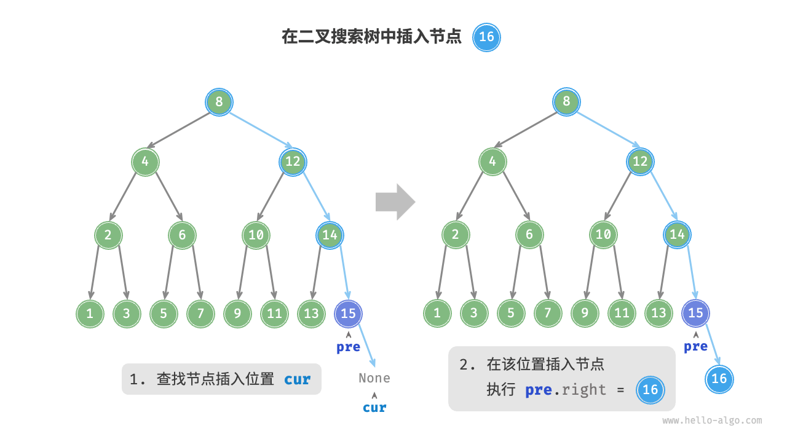

[Python数据结构 | 笔记整理（6）——查找](https://zhuanlan.zhihu.com/p/545816366)


[数据结构：查找(Search)【详解】_index.search返回什么结构-CSDN博客](https://blog.csdn.net/Real_Fool_/article/details/114359564)

# 查找（搜索）


### 定义

1. **查找(Searching)**：就是根据给定的某个值，在**查找表**中确定一个其**关键字**等于给定值的数据元素( 或记录)。

2. **关键字(Key)**：数据元素中唯一标识该元素的某个数据项的值，使用基于关键字的查找，查找结果应该是唯一的。

   例如，在由一个学生元素构成的数据集合中，学生元素中“学号”这一数据项的值唯一地标识一名学生。


> 查找算法可根据实现思路分为以下两类。
>
> - **通过遍历数据结构来定位目标元素**，例如数组、链表、树和图的遍历等。
> - **利用数据组织结构或数据包含的先验信息，实现高效元素查找**，例如二分查找、二叉搜索树查找等。

### key

1. 查找长度 ：在查找运算中，需要对比关键字的次数称为查找长度

2. 平均查找长度$(ASL)$：**在查找成功的前提下**，所有查找过程中进行关键字的比较次数的平均值


$$
ASL = \sum\limits_{i = 1}^n P_iC_i
$$

- $P_i$:  第 $i$个元素查找概率

- $C_i$: 找到第 $i$个元素所需进行的比较次数

- $n$ ：表长 


> 事实上，`ASL`和概率论与数理统计中的**数学期望**几乎相同

**查找算法分类：**

静态查找和动态查找；

注：静态或者动态都是针对查找表而言的。动态表指查找表中有删除和插入操作的表。

# 线性表查找

## 1. 顺序查找

从表的一端开始，依次将记录的关键字和给定值进行比较，若某个记录的关键字和给定值相等，则查找成功；

反之，若扫描整个表后，仍未找到关键字和给定值相等的记录，则查找失败.

- 查找成功时的平均查找长度为：（假设每个数据元素的概率相等） $ASL = {(n+1) \over 2} $

- 当查找不成功时，需要 $n+1$ 次比较，时间复杂度为 $O(n)$;

平均查找长度 ： $(n+1) \over 2$

**顺序查找的时间复杂度为 $O(n)$**

```c
//顺序查找
int SequenceSearch(int a[], int value, int n)
{
    int i;
    for(i=0; i<n; i++)
        if(a[i]==value)
            return i;
    return -1;
}
```

## 2. 折半查找（二分查找）

**说明：元素必须是有序的，如果是无序的则要先进行排序操作**


### 流程

先初始化指针 $𝑖=0$ 和 $𝑗=𝑛−1$，分别指向数组首元素和尾元素，代表搜索区间 `[0,𝑛−1] `。

请注意，中括号表示闭区间，其包含边界值本身。

接下来，循环执行以下两步。

1. 计算中点索引 $𝑚=⌊(𝑖+𝑗)/2⌋ $，其中 $⌊⌋$ 表示向下取整操作。
2. 判断 $nums[m]$ 和 $target$ 的大小关系，分为以下三种情况。
   1. 当 `nums[m] < target` 时，说明 `target` 在区间 $[𝑚+1,𝑗]$ 中，因此执行 $𝑖=𝑚+1$ 。
   2. 当 `nums[m] > target` 时，说明 `target` 在区间 $[𝑖,𝑚−1]$ 中，因此执行 $𝑗=𝑚−1$ 。
   3. 当 `nums[m] = target` 时，说明找到 `target` ，因此返回索引 $𝑚$ 

若数组不包含目标元素，搜索区间最终会缩小为空。此时返回 $−1$ 。

### 特点

1. 最多查找次数 为 $log_2(n+1)$

2. 平均查找次数 （ $n > 50$ ）


$$
\text{ASL}=\sum_{i=0}^{k}p_{i}c_{i}=\frac{1}{n}\sum_{i=0}^{k}(i \times 2^{i-1})=\log_{2} (n+1) - 1 + \frac{1}{n} \log_{2} (n+1) \approx \log_{2} (n+1) - 1
$$

假设查找每个数据元素的概率相等，对于一个长度为 $n = 2k -1$ 的有序表，线性表最多被平分 $k = log_2(n+1)$ 次即可完成查找。又因为在 $i$ 次查找中可以找到的元素个数为 $2i-1$ 个，所以其平均查找长度如上

```c
/* 二分查找（双闭区间） */
int binarySearch(int *nums, int len, int target) {
    // 初始化双闭区间 [0, n-1] ，即 i, j 分别指向数组首元素、尾元素
    int i = 0, j = len - 1;
    // 循环，当搜索区间为空时跳出（当 i > j 时为空）
    while (i <= j) {
        int m = i + (j - i) / 2; // 计算中点索引 m
        if (nums[m] < target)    // 此情况说明 target 在区间 [m+1, j] 中
            i = m + 1;
        else if (nums[m] > target) // 此情况说明 target 在区间 [i, m-1] 中
            j = m - 1;
        else // 找到目标元素，返回其索引
            return m;
    }
    // 未找到目标元素，返回 -1
    return -1;
}
```

## 3. 分块查找

将顺序查找和折半查找结合

基本思想：将查找表分为若干个子块，**块内元素可以无序，块间元素有序块间有序**

含义： 若a<b，则第 b 块中所有记录的关键字均大于第 a 块中的最大关键字

建立“索引表”，每个结点含有最大关键字域和指向本块第一个结点的指针，且按关键字有序

分块查找的过程分为两步：

1. 索引查找：在索引表中确定待查记录所在的块；（可顺序、可折半）

2. 块内查找：在块内顺序查找

**数据结构｜分块查找**

[www.bilibili.com](https://www.bilibili.com/video/BV1Wd4y167kG/?spm_id_from=333.337.search-card.all.click&vd_source=3310f07bcb7152dc48cc5e65834e98b5)

# 树表查找

## 1. 二叉排序树（binary search tree）

二叉排序树（二叉查找树、二叉搜索树）。或者为空树，或者是具有以下性质：

1. 若它的左子树不为空，则左子树所有节点的值小于根结点，

2. 若它的右子树不为空，则根结点的值小于所有右子树结点的值

3. 它的左右子树叶分别为二叉排序树

如图所示 ： 


平均时间的时间复杂度为 $ O(log_2 n)$，最差情况为 $O(n)$。

### 1. 查找

在以 `root` 为根节点的二叉搜索树中搜索一个值为 `value` 的节点。

分类讨论如下：

- 若 `root` 为空，返回 `false`。
- 若 `root` 的权值等于 `value`，返回 `true`。
- 若 `root` 的权值大于 `value`，在 `root` 的左子树中继续搜索。
- 若 `root` 的权值小于 `value`，在 `root` 的右子树中继续搜索。

```c
/* 查找节点 */
TreeNode *search(BinarySearchTree *bst, int num) {
    TreeNode *cur = bst->root;
    // 循环查找，越过叶节点后跳出
    while (cur != NULL) {
        if (cur->val < num) {
            // 目标节点在 cur 的右子树中
            cur = cur->right;
        } else if (cur->val > num) {
            // 目标节点在 cur 的左子树中
            cur = cur->left;
        } else {
            // 找到目标节点，跳出循环
            break;
        }
    }
    // 返回目标节点
    return cur;
}
/*
给定目标节点值 num ，可以根据二叉搜索树的性质来查找。如图所示，我们声明一个节点 cur ，从二叉树的根节点 root 出发，循环比较节点值 cur.val 和 num 之间的大小关系。

若 cur.val < num ，说明目标节点在 cur 的右子树中，因此执行 cur = cur.right 。
若 cur.val > num ，说明目标节点在 cur 的左子树中，因此执行 cur = cur.left 。
若 cur.val = num ，说明找到目标节点，跳出循环并返回该节点。
*/
```

### 2. 插入

在以 `root` 为根节点的二叉搜索树中插入一个值为 `value` 的节点。

分类讨论如下：

- 若 `root` 为空，直接返回一个值为 `value` 的新节点。
- 若 `root` 的权值等于 `value`，不讨论该情况
- 若 `root` 的权值大于 `value`，在 `root` 的左子树中递归调用插入权值为 `value` 的函数
- 若 `root` 的权值小于 `value`，在 `root` 的右子树中递归调用插入权值为 `value` 的函数

查找到前后位（空位）然后插入



### 3. 创建

依次插入新元素

[【【难点讲解】二叉排序树】](https://www.bilibili.com/video/BV1Tk4y117fs/?share_source=copy_web&vd_source=f6ff1f6b32d145cf17622a2f18e41586) 

### 4. 删除

分为以下三种情况

1. 删除叶子节点 ：直接删除

1. 删除节点有左子树或有右子树 ： 用直接子女补位

1. 左右都不为空 ： 用**右子树的最小节点或左子树的最大节点**代替


> 搜索、插入、删除的复杂度等于树高，期望$O(log_2n)$最坏退化为偏斜二叉树

### 中序遍历有序


如图所示，二叉树的中序遍历遵循“左 → 根 → 右”的遍历顺序，而二叉搜索树满足“左子节点 < 根节点 < 右子节点”的大小关系。

这意味着在二叉搜索树中进行中序遍历时，总是会优先遍历下一个最小节点，从而得出一个重要性质：**二叉搜索树的中序遍历序列是升序的**。

利用中序遍历升序的性质，我们在二叉搜索树中获取有序数据仅需 $O(n)$ 时间，无须进行额外的排序操作，非常高效。

### 不平衡的二叉树

给定一组数据，我们考虑使用数组或二叉搜索树存储。观察表，二叉搜索树的各项操作的时间复杂度都是对数阶，具有稳定且高效的性能。只有在高频添加、低频查找删除数据的场景下，数组比二叉搜索树的效率更高。

表 数组与搜索树的效率对比

|          | 无序数组 | 二叉搜索树 |
| :------- | :------- | :--------- |
| 查找元素 | O(n)     | O(log⁡n)    |
| 插入元素 | O(1)     | O(log⁡n)    |
| 删除元素 | O(n)     | O(log⁡n)    |

在理想情况下，二叉搜索树是“平衡”的，这样就可以在 $log⁡n$ 轮循环内查找任意节点。

然而，如果我们在二叉搜索树中不断地插入和删除节点，可能导致二叉树退化为图所示的链表，这时各种操作的时间复杂度也会退化为 $O(n)$。


## 2. 平衡二叉树

> 平衡二叉树为改进的二叉查找树。一般的二叉查找树的查询复杂度取决于目标结点到树根的距离（即深度），因此当结点的深度普遍较大时，查询的均摊复杂度会上升。为了实现更高效的查询，产生了**平衡树**

经过两次删除节点操作，这棵二叉搜索树便会退化为链表


平衡二叉树也叫AVL树，具有以下定义：

- 它的右子树和左子树的高度之差(平衡因子)的绝对值不超过`1`，且它的左子树和右子树都是一颗平衡二叉树。
- 平衡二叉树上所有节点的平衡因子只可能为`-1,0,1`

**平衡因子：**左子树高度 - 右子树高度 

平衡二叉树中不存在平衡因子大于 `1` 的节点。在一棵平衡二叉树中，节点的平衡因子只能取 `0 ,1 , -1` ，分别对应着

- 左右子树等高
- 左子树比较高
- 右子树比较高

在图所示的完美二叉树中插入两个节点后，树将严重向左倾斜，查找操作的时间复杂度也随之劣化


由于 AVL 树的相关操作需要获取节点高度，因此我们需要为节点类添加 `height` 变量：

```c
/* AVL 树节点结构体 */
TreeNode struct TreeNode {
    int val;
    int height;					// 添加树高
    struct TreeNode *left;
    struct TreeNode *right;
} TreeNode;

/* 构造函数 */
TreeNode *newTreeNode(int val) {
    TreeNode *node;

    node = (TreeNode *)malloc(sizeof(TreeNode));
    node->val = val;
    node->height = 0;
    node->left = NULL;
    node->right = NULL;
    return node;
}
```

“节点高度”是指从该节点到它的最远叶节点的距离，即所经过的“边”的数量。

需要特别注意的是，叶节点的高度为 `0` ，而空节点的高度为 `−1` 

节点的平衡因子（balance factor）定义为节点左子树的高度减去右子树的高度，同时规定空节点的平衡因子为 `0` 。我们同样将获取节点平衡因子的功能封装成函数，方便后续使用：

```c
/* 获取平衡因子 */
int balanceFactor(TreeNode *node) {
    // 空节点平衡因子为 0
    if (node == NULL) {
        return 0;
    }
    // 节点平衡因子 = 左子树高度 - 右子树高度
    return height(node->left) - height(node->right);
}
```

### 平衡的维护

插入或删除节点后，可能会造成 AVL 树的平衡性质被破坏。

因此，需要沿着从被插入/删除的节点到根的路径对树进行维护：

如果对于某一个节点，平衡性质不再满足，由于我们只插入/删除了一个节点，对树高的影响不超过 `1`，因此该节点的平衡因子的绝对值至多为 `2`

我们考虑如下调整

1. 插入(调整最小不平衡树)
2. 创建（插入同理）
3. 删除  (插入同理)

最小不平衡树：是指离插入结点最近且以平衡因子的绝对值大于`1`的结点作为根的子树

[【平衡二叉树的生成炒鸡简单不用LR、RL（以王道2021数据结构平衡二叉树的生成过程为例）】](https://www.bilibili.com/video/BV1hD4y1278s/?share_source=copy_web&vd_source=f6ff1f6b32d145cf17622a2f18e41586) 

## 3. B-

这种数据结构能够让查找数据、顺序访问、插入数据及删除的动作，都在对数时间内完成。B树，概括来说是一个一般化的二叉搜索树（binary search tree）一个节点可以拥有2个以上的子节点。

B树适用于读写相对大的数据块的存储系统，例如磁盘。B树减少定位记录时所经历的中间过程，从而加快访问速度。

### B树的性质

B树也称`B-`树，它是一颗多路平衡查找树。

我们描述一颗B树时需要指定它的阶数，阶数表示了一个结点最多有多少个孩子结点，一般用字母`m`表示阶数。当m取2时，就是我们常见的二叉搜索树。 

- 树中的每个结点至多有`m`颗子树。
- 若根结点不是叶子结点，则至少有两颗子树
- 除根结点外，所有非终端结点至少有$\lceil {m\over 2} \rceil $ ( 向上取整 )颗子树
- 所有的叶子节点都在同一层。

### 插入

[可视化](https://www.cs.usfca.edu/~galles/visualization/BTree.html)

**B-树的插入（创建）**

[www.bilibili.com](https://www.bilibili.com/video/BV1Jh411q7xP/?spm_id_from=333.337.search-card.all.click&vd_source=3310f07bcb7152dc48cc5e65834e98b5)


1. 根据要插入的`key`的值，找到叶子结点并插入。

2. 判断当前结点`key`的个数是否小于等于`m-1`，若满足则结束，否则进行第3步。

3. 以结点中间的`key`为中心分裂成左右两部分，然后将这个中间的`key`插入到父结点中，
   - 这个`key`的左子树指向分裂后的左半部分
   - `key`的右子支指向分裂后的右半部分
   - 然后将当前结点指向父结点，继续进行第3步

4. 如果父结点的关键字个数也超过`m-1`，则要再分裂，再往上插。直至这个过程传到根结点为止。

#### 图解

1. 在空树中插入`39` 此时根结点就一个 `key`，此时根结点也是叶子结点

    

2. 继续插入`22、97、41`  根结点此时有4个key

    

3. 继续插入`53`插入后超过了最大允许的关键字个数`4`，所以以`key`值为`41`为中心进行分裂，

    结果如下图所示，分裂后当前结点指针指向父结点，满足B树条件，插入操作结束。

>  当阶数`m`为偶数时，需要分裂时就不存在排序恰好在中间的`key`，那么我们选择中间位置的前一个`key`或中间位置的后一个`key`为中心进行分裂即可


依次插入`13，21，40` 同样会造成分裂，结果如下图所示


### 删除

# 哈希表


### 构建

除留余数法
此方法为最常用的构造散列函数方法。对于散列表长为m的散列函数公式为：
$$
H(key) = key\%p
$$

- $\%$是取模（求余数）的意思

### 冲突处理

#### 1. 顺序开放地址

一旦发生冲突，就去寻找下一个空的散列地址，只要散列表足够大，空的散列地址总能找到，并将记录存入。


表 10-1  查找算法效率对比

|              | 线性搜索 | 二分查找      | 树查找        | 哈希查找      |
| :----------- | :------- | :------------ | :------------ | :------------ |
| 查找元素     | $O(n)$   | $O(log⁡n)$     | $O(log⁡n)$     | $O(1)$        |
| 插入元素     | $O(1)$   | $O(n)$        | $O(log⁡n)$     | $O(1)$        |
| 删除元素     | $O(n)$   | $O(n)$        | $O(log⁡n)$     | $O(1)$        |
| 额外空间     | $O(1)$   | $O(1)$        | $O(n)$        | $O(n)$        |
| 数据预处理   | /        | 排序 O(nlog⁡n) | 建树 O(nlog⁡n) | 建哈希表 O(n) |
| 数据是否有序 | 无序     | 有序          | 有序          | 无序          |

搜索算法的选择还取决于数据体量、搜索性能要求、数据查询与更新频率等。
