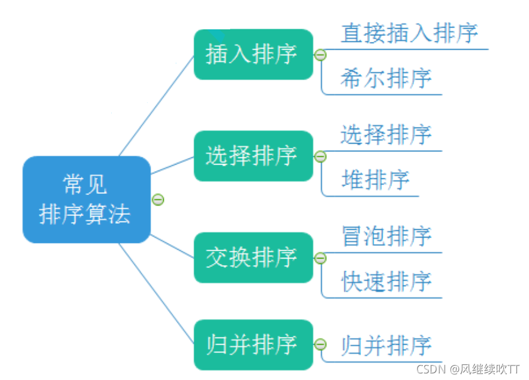
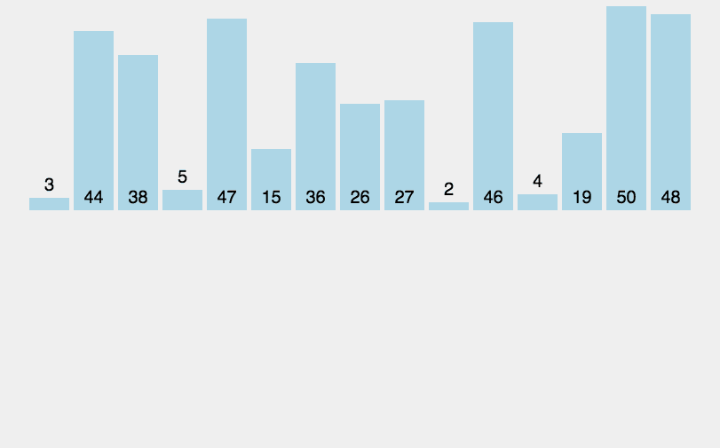
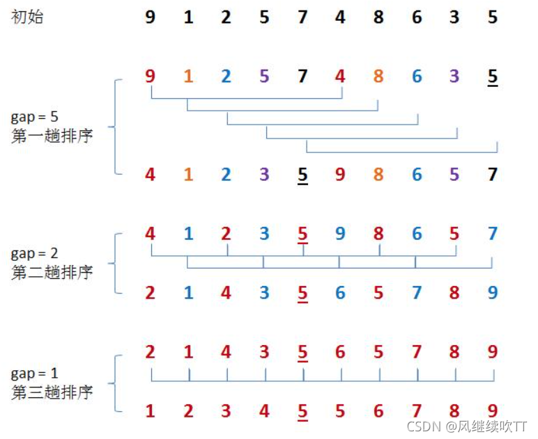
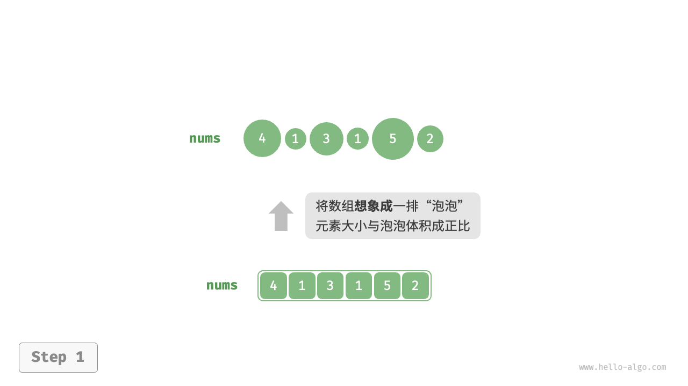
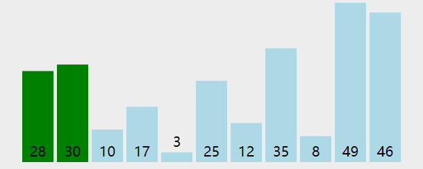

# 排序

排序算法（sorting algorithm）用于对一组数据按照特定顺序进行排列。

## 评价维度

- **运行效率**：我们期望排序算法的时间复杂度尽量低，且总体操作数量较少（时间复杂度中的常数项变小）。对于大数据量的情况，运行效率显得尤为重要。
- **就地性**：顾名思义，原地排序通过在原数组上直接操作实现排序，无须借助额外的辅助数组，从而节省内存。通常情况下，原地排序的数据搬运操作较少，运行速度也更快。
- **稳定性**：稳定排序在完成排序后，**相等元素在数组中的相对顺序不发生改变**



# 插入排序

## 1. 直接插入排序



在**未排序区间**选择一个基准元素，将该元素与其左侧**已排序区间**的元素逐一比较大小，并将该元素插入到正确的位置。

开启一个循环，每轮从未排序区间选择最小的元素，将其放到已排序区间的末尾

### 流程

设基准元素为 `base` ，我们需要将从目标索引到 `base` 之间的所有元素向右移动一位，然后将 `base` 赋值给目标索引


具体流程：

1. 初始状态下，数组的第 `1` 个元素已完成排序。
2. 选取数组的第 `2` 个元素作为 `base` ，将其插入到正确位置后，**数组的前 2 个元素已排序**。
3. 选取第 `3` 个元素作为 `base` ，将其插入到正确位置后，**数组的前 3 个元素已排序**。
4. 以此类推，在最后一轮中，选取最后一个元素作为 `base` ，将其插入到正确位置后，**所有元素均已排序**。

> 简单来说，也就是：直接插入排序和打扑克牌时，**从牌桌上逐一拿起扑克牌，在手上排序的过程相同**
>
> 举例：
>
> 输入： `{5 2 4 6 1 3}`。
>
> 首先拿起第一张牌, 手上有 `{5}`。
>
> 拿起第二张牌 2, 把 2 insert 到手上的牌 `{5}`, 得到 `{2 5}`。
>
> 拿起第三张牌 4, 把 4 insert 到手上的牌 `{2 5}`, 得到 `{2 4 5}`
>
> 以此类推


```c
void insertion_sort(int arr[], int len){
        int i,j,key;
        for (i=1;i!=len;++i){
                key = arr[i];
                j=i-1;
                while((j>=0) && (arr[j]>key)) {
                        arr[j+1] = arr[j];
                        j--;
                }
                arr[j+1] = key;
        }
}
```

> Q : 为什么`i`从`1`开始
>
> A ：因为默认**只有第一个元素的序列**是有序的，也就是说，我们需要从第二个元素开始排序
>
> tips ： 排序是如何进行的？
>
> 1. 从未排序区间取第一个数`x`
> 2. 将该数和已排序区间逐个比较
> 3. （假设已排序区间是从小到大排序）若 `x > 某数`，**已排序区间从后往前依次后移**
> 4. 插入`x`
>
> 希望读者注意，排序算法虽然看起来简单，但是在计算机实现的时候要注意具体的数据结构。
>
> 如 ： 对同一序列的链表形式和数组形式进行排序，复杂度并不相同

#### 特性总结：（插入排序默认为数组形式）

> 因为对插入排序的许多优化都用到了数组随机存取的特性

1. 元素集合越接近有序，直接插入排序算法的时间效率越高

2. **时间复杂度**：$O(N^2)$

   在最好的情况下，时间复杂度为 $O(N)$ ，在最坏的情况下，时间复杂度为 $O(N^2)$ 

3. 空间复杂度：$O(1)$，它是一种稳定的排序算法

4. 稳定性：稳定（在插入操作过程中，我们会将元素插入到相等元素的右侧，不会改变它们的顺序）

### 折半插入排序

略

## 2. 希尔排序（Shellsort）

尔排序是基于插入排序的以下两点性质而提出改进方法的：

- 插入排序在对几乎已经排好序的数据操作时，效率高，即可以达到线性排序的效率
- 但插入排序一般来说是低效的，因为插入排序每次只能将数据移动一位

希尔排序通过**将比较的全部元素分为几个区域**来提升插入排序的性能。这样可以让一个元素可以一次性地朝最终位置前进一大步

然后算法再取**越来越小的步长**进行排序，算法的最后一步就是普通的插入排序，但是到了这步，需排序的数据几乎是已排好的了（此时插入排序较快）

### 流程

**设置一个初始增量`gap`，将数组分成分成`gap`组，组组排序**

1. 先选定一个整数`gap`，把待排序文件中所有记录分成`gap`个组，所有距离为`gap`的记录分在同一组内，并对每一组内的元素进行排序
2. 将`gap`逐渐减小重复上述分组和排序的工作
3. 当到达`gap=1`时，所有元素在统一组内排好序

下图是一个希尔排序示例



#### 希尔排序的特性总结：

1. 希尔排序是对直接插入排序的优化
2. 希尔排序的时间复杂度不好计算，因为`gap`的取值方法很多，导致很难去计算，这里不深究。（约为 $n^{1.3}$）
3. 空间复杂度$O(1)$
6. 稳定性：不稳定（跳跃式移动）

## 3. 冒泡排序

冒泡排序（bubble sort）通过连续地比较与交换相邻元素实现排序。这个过程就像气泡从底部升到顶部一样，因此得名冒泡排序。



### 流程

1. 首先，对 `n` 个元素执行“冒泡”，**将数组的最大元素交换至正确位置**

2. 接下来，对剩余 `n−1` 个元素执行“冒泡”，**将第二大元素交换至正确位置**
3. 以此类推，经过 `n−1` 轮“冒泡”后，**前 `n−1` 大的元素都被交换至正确位置**
4. 仅剩的一个元素必定是最小元素，无须排序，因此数组排序完成。`n-1` 趟是因为最后两个元素时只需要一趟就可以完成





#### 特性总结：

1. 时间复杂度：$O(N^2)$

3. 空间复杂度：$O(1)$

4. 稳定性：稳定（由于在“冒泡”中**遇到相等元素不交换**）

## 4. 快速排序（quick sort）

> 它真的很快

快速排序（quick sort）又称**分区交换排序**，是一种基于**分治策略**的排序算法，运行高效，应用广泛。

快速排序的核心操作是“哨兵划分”，其目标是：

1. **选择数组中的某个元素作为“基准数”，将所有小于基准数的元素移到其左侧，而大于基准数的元素移到其右侧**
2. 递归排序子序列

### 流程

1. 选取数组最左端元素作为基准数，初始化两个指针 `i` 和 `j` 分别指向数组的两端。
2. 设置一个循环，在每轮中使用 `i`（`j`）分别寻找第一个比基准数大（小）的元素，然后交换这两个元素。
3. 循环执行步骤 `2.` ，直到 `i` 和 `j` 相遇时停止，最后将基准数交换至两个子数组的分界线


[【王道计算机考研 数据结构】](https://www.bilibili.com/video/BV1b7411N798/?p=90&share_source=copy_web&vd_source=f6ff1f6b32d145cf17622a2f18e41586) 

[【快速排序（双指针法）动画演示】](https://www.bilibili.com/video/BV1rW4y1x7Kh/?share_source=copy_web&vd_source=f6ff1f6b32d145cf17622a2f18e41586) 

### 算法特性

- **时间复杂度为 $O(nlog⁡_2n)$**
- **空间复杂度为 O(n)、原地排序**：在输入数组完全倒序的情况下，达到最差递归深度 n ，使用 $O(n)$ 栈帧空间。排序操作是在原数组上进行的，未借助额外数组。
- **稳定性**：略

# 选择排序

## 5. 选择排序

### 流程

1. 在要排序的一组数中，选出最小（或者最大）的一个数与第`1`个位置的数交换；
2. 然后在剩下的数中再找最小（或者最大）的与第 `2`个位置的数交换
3. 以此类推，直到 第 `n-1`个元素（倒数第二个数）和第 `n` 个元素（最后一个数）比较为止。

#### 图解

[11.2  选择排序 - Hello 算法 (hello-algo.com)](https://www.hello-algo.com/chapter_sorting/selection_sort/#__tabbed_1_1)

排序排序算法对含有 `n` 个元素的序列实现排序的思路是：每次从待排序序列中找出最大值或最小值，查找过程重复 `n-1` 次

。对于每次找到的最大值或最小值，通过**交换元素位置**的方式将它们放置到适当的位置，最终使整个序列变成有序序列。

举个例子，我们使用选择排序算法对 `{14, 33, 27, 10, 35, 19, 42, 44}` 完成升序排序，需要经历以下几个步骤：

1. 遍历整个待排序序列，从中找到最小值 10 并与第二小元素 14 交换位置：

2. 待排序序列变成 {33, 27, 14, 35, 19, 42, 44}，从中找到最小值 14 并与第三小 33 交换位置：

3. 待排序序列变成 {27, 33, 35, 19, 42, 44}，从中找到最小值 19 并与 27 交换位置：

4. 待排序序列变成 {33, 35, 27, 42, 44}，从中找到最小值 27 并与 33 交换位置：

5. 待排序序列变成 {35, 33, 42, 44}，从中找到最小值 33 并与 35 交换位置：

6. 待排序序列变成 {35, 42, 44}，从中找到最小值 35，它的位置无需变动：

7. 待排序序列变成 {42, 44}，从中找到最小值 42，它的位置无需变动：

对于包含 n 个元素的待排序序列，选择排序算法中只需要找出 n-1 个“最小值”，最后剩下的元素的值必然最大。由此，我们就得到了一个升序序列 $\{10, 14, 19, 27, 33, 35, 42, 44\}$

> 简单来说，就是打扑克算法



> 选择排序算法可以看作是冒泡排序算法的“改良版”。和后者相比，选择排序算法大大**减少了交换数据存储位置的操作**

#### **选择排序的特性总结：**

1. 直接选择排序思考非常好理解，但是效率不是很好(不论数组是否有序都会执行原步骤)。实际中很少使用

2. 时间复杂度：$O(N^2)$

3. 空间复杂度：$O(1)$

4. 稳定性：不稳定

## 6. 堆排序（树形选择排序）

> 重点来咯

堆排序（heap sort）是一种基于**堆数据结构**实现的高效排序算法

堆（heap）是一种满**足特定条件的完全二叉树**，主要可分为两种类型，如图所示。

- 小顶（根）堆（min heap）：任意节点的值 ≤ 其子节点的值。
- 大顶（根）堆（max heap）：任意节点的值 ≥ 其子节点的值。


而堆排序是根据堆的这种数据结构设计的一种排序，下面先来看看什么是大根堆和小根堆

性质：每个结点的值都大于其左孩子和右孩子结点的值，称之为大根堆；每个结点的值都小于其左孩子和右孩子结点的值，称之为小根堆。如下图


#### 基本思想

1.首先将待排序的数组构造成一个大根堆，此时，整个数组的最大值就是堆结构的顶端

2.将根节点与末尾数交换，取出根节点（最大的值）（相当于删去根节点）

3.将剩余的`n-1`个数再构造成大根堆，再将顶端数与`n-1`位置的数交换，如此反复执行，便能得到有序数组

[【数据结构——堆排序】](https://www.bilibili.com/video/BV1aj411M71h/?share_source=copy_web&vd_source=f6ff1f6b32d145cf17622a2f18e41586) 

#### **堆排序的特性总结：**

1. 堆排序使用堆来选数，效率就高了很多。

2. 时间复杂度：$O(N*logN)$

3. 空间复杂度：$O(1)$

4. 稳定性：不稳定


## 7. 归并

一种基于分治策略的排序算法：

1. **划分阶段**：通过递归不断地将数组从中点处分开，将长数组的排序问题转换为短数组的排序问题。
2. **合并阶段**：当子数组长度为 $1$ 时终止划分，开始合并，持续地将左右两个较短的有序数组合并为一个较长的有序数组，直至结束。


1. 计算数组中点 `mid` ，递归划分左子数组（区间 `[left, mid]` ）和右子数组（区间 `[mid + 1, right]` ）。
2. 递归执行步骤 `1.` ，直至子数组区间长度为 1 时终止


#### 特性总结：

1. 归并的缺点在于需要$O(N)$的空间复杂度，归并排序的思考更多的是解决在磁盘中的外排序问题。

2. 时间复杂度：$O(N*logN)$​

   划分产生高度为 $log⁡_𝑛$ 的递归树，每层合并的总操作数量为 $𝑛$ 

3. 空间复杂度：$O(N)$

4. 稳定性：稳定（在合并过程中，相等元素的次序不交换）

> 以下内容略

## 基数排序

## 外部排序

## 

依次用

1. 直接插入排序
2. 希尔排序
3. 冒泡排序
4. 快速排序
5. 归并排序
6. 堆排序

对关键字序列`{7,三,5,8,3,6,1,2}`进行**升序**排序，画出每轮排序后的序列。

- 希尔排序初始步长为`4`，后续步长取半直到`1`；

- 快速排序以第1个元素为基准，先左分区后右分区；

- 归并排序采用2路归并；
- 堆排序采用大根堆，只需画出初始堆和输出一个关键字并调整后的堆即可（2个图）

 注：`三`和`3`大小相同，但画图时应区分，注意稳定的算法要保持其稳定性。（7个图可在一起上传，但请间隔清晰，标注清楚）

# 总结

### 不稳定的排序

- 选择排序（selection sort）
- 希尔排序（shell sort）
- 快速排序（quick sort）
- 堆排序（heap sort）
