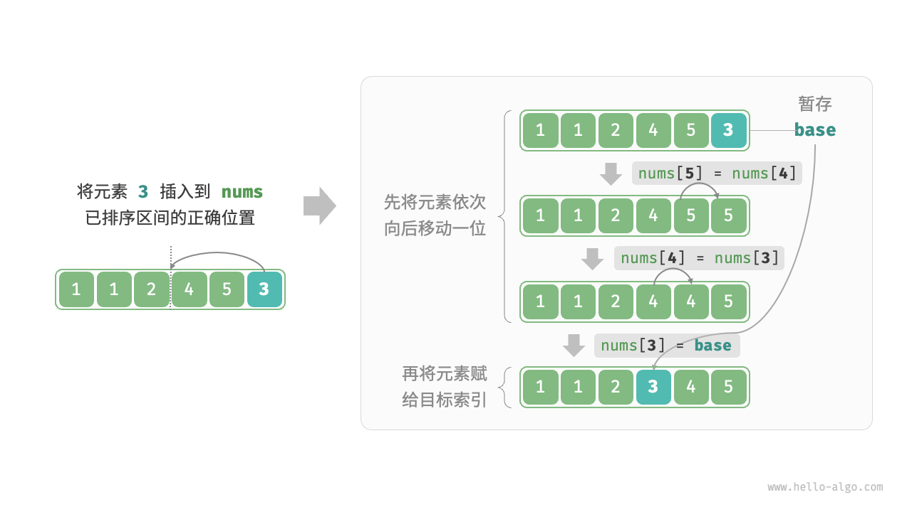
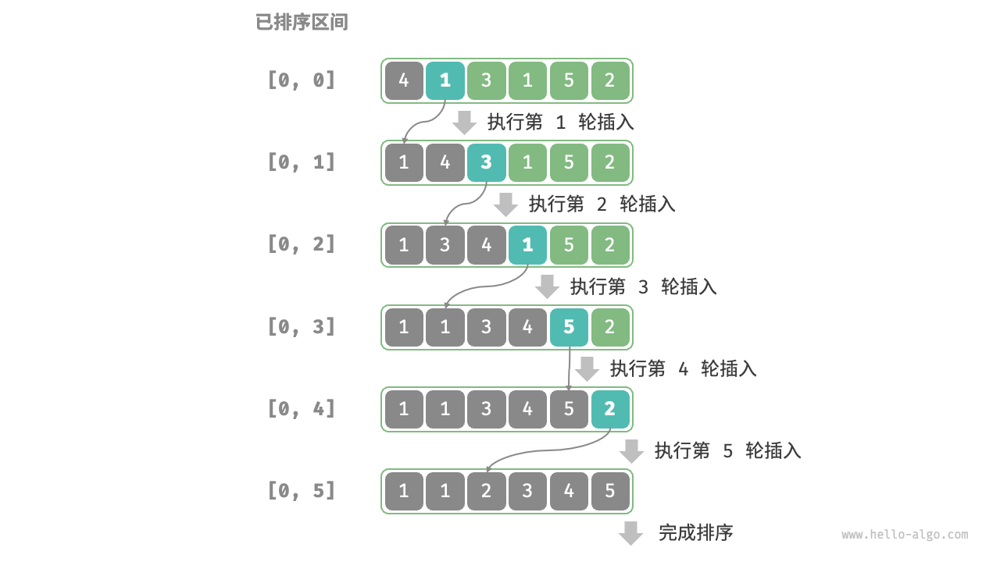
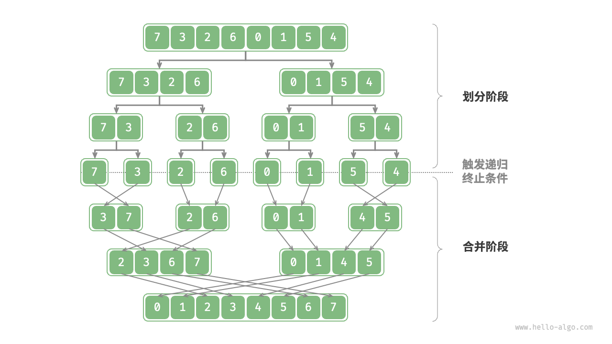
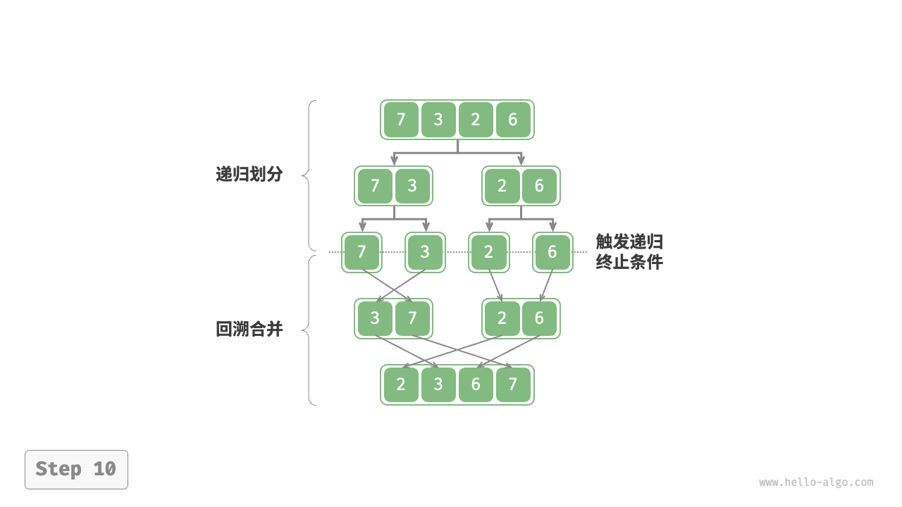

# 排序

> 本章并不要求大家了解算法的代码（期末），只需可以**手动模拟**出各个算法的步骤即可，张贴代码用于深入学习

排序算法（sorting algorithm）用于对一组数据按照特定顺序进行排列。

## 定义

1. **主关键字（Primary Key）**

   定义：主关键字是表中的一个或多个字段，它的值能**唯一地标识表中的每一条记录**。简单来说，就像是每个人都有一个独一无二的身份证号码，在数据库的表中，主关键字就是这个 “身份证号码”，通过它可以准确地找到某一条特定的记录

2. **次关键字（Secondary Key）**

   定义：次关键字也叫辅助关键字，它是能够帮助识别记录，但不能唯一地标识记录的一个或多个字段。它是对主关键字的补充

3. **稳定性** ： 在排序过程中，如果存在两个或多个**具有相同关键字**的记录，排序前后这些相同关键字记录的相对顺序保持不变
4. **内部排序** ： 在排序过程中，待排序的所有数据元素全部存放在计算机内存中的排序算法

> 外部排序 ： 因为待排序的记录（元素）数量很大，以致内存不能一次容纳全部记录，在排序过程中需要读取外存

内部排序方法可大致分为插入排序、交换排序、选择排序、归并排序和计数排序五类

如果按照内部排序过程中所需的工作量来区分，则可分为三类：

1. 简单的排序方法，时间复杂度为 $O (n^2)$
2. 先进的排序方法，时间复杂度为 $O (nlogn)$
3. 基数排序，时间复杂度为 $O (d・n)$

## 评价维度

- **运行效率（时间复杂度）**：我们期望排序算法的时间复杂度尽量低，且总体操作数量较少（时间复杂度中的常数项变小）。对于大数据量的情况，运行效率显得尤为重要。
- **就地性（空间复杂度）**：顾名思义，原地排序通过在原数组上直接操作实现排序，无须借助额外的辅助数组，从而节省内存。通常情况下，原地排序的数据搬运操作较少，运行速度也更快。
- **稳定性**：稳定排序在完成排序后，**相等元素在数组中的相对顺序不发生改变**


# 插入排序

## 1. 直接插入排序


在**未排序区间**选择一个待排序元素，将该元素与其左侧**已排序区间**的元素逐一比较大小，并将该元素插入到正确的位置。

### 流程

设待排序元素为 `base` ，我们需要将从目标索引到 `base` 之间的所有元素向右移动一位，然后将 `base` 赋值给目标索引



具体流程：

1. 初始状态下，数组的第 `1` 个元素已完成排序。
2. 选取数组的第 `2` 个元素作为 `base` ，将其插入到正确位置后，**数组的前 2 个元素已排序**。
3. 选取第 `3` 个元素作为 `base` ，将其插入到正确位置后，**数组的前 3 个元素已排序**。
4. 以此类推，在最后一轮中，选取最后一个元素作为 `base` ，将其插入到正确位置后，**所有元素均已排序**。

> 简单来说，也就是：直接插入排序和打扑克牌时，**从牌桌上逐一拿起扑克牌，在手上排序的过程相同**
>
> 举例：
>
> 输入： `{5 2 4 6 1 3}`。
>
> 首先拿起第一张牌, 手上有 `{5}`。
>
> 拿起第二张牌 2, 把 2 insert 到手上的牌 `{5}`, 得到 `{2 5}`。
>
> 拿起第三张牌 4, 把 4 insert 到手上的牌 `{2 5}`, 得到 `{2 4 5}`
>
> 以此类推



```c
//从大到小排序
void insertion_sort(int arr[], int len){
        int i,j,key;
        for (i=1;i!=len;++i){
                key = arr[i];
                j=i-1;
                while((j>=0) && (arr[j]>key)) {
                        arr[j+1] = arr[j];
                        j--;
                }
                arr[j+1] = key;
        }
}
```

> Q : 为什么`i`从`1`开始
>
> A ：因为默认**只有第一个元素的序列**是有序的，也就是说，我们需要从第二个元素开始排序
>
> tips ： 排序是如何进行的？
>
> 1. 从未排序区间取第一个数`x`
> 2. 将该数和已排序区间逐个比较
> 3. （假设已排序区间是从小到大排序）若 `x > 已排序的key`，**该key后移**
> 4. 插入`x`
>
> 希望读者注意，排序算法虽然看起来简单，但是在计算机实现的时候要注意具体的数据结构。（不考）
>
> 如 ： 对同一序列的链表形式和数组形式进行排序，复杂度并不相同

#### 特性总结：（插入排序默认为数组形式）

> 因为对插入排序的许多优化都用到了数组随机存取的特性

1. 元素集合越接近有序，直接插入排序算法的时间效率越高

2. **时间复杂度**：$O(N^2)$

   在最好的情况下，时间复杂度为 $O(N)$ ，在最坏的情况下，时间复杂度为 $O(N^2)$ 

3. 空间复杂度：$O(1)$，它是一种稳定的排序算法

4. 稳定性：稳定（在插入操作过程中，我们会将元素插入到相等元素的右侧，不会改变它们的顺序）

### * 折半插入排序

折半插入排序（Binary Insertion Sort）是插入排序的一种改进版本。它的基本思想是在插入第个元素时，利用折半查找（二分查找）来寻找插入位置，而不是逐个比较。

### * 2 - 路插入排序

2 - 路插入排序是在折半插入排序的基础上改进而来的，目的是减少排序过程中移动记录的次数

## 2. 希尔排序

希尔排序是基于插入排序的以下两点性质而提出改进方法的：

- 插入排序在对几乎已经排好序的数据操作时，效率高，即可以达到线性排序的效率
- 但插入排序一般来说是低效的，因为插入排序每次只能将数据移动一位

希尔排序通过**将比较的全部元素分为几个区域**来提升插入排序的性能。这样可以让一个元素可以一次性地朝最终位置前进一大步

然后算法再取**越来越小的步长**进行排序，算法的最后一步就是普通的插入排序，但是到了这步，需排序的数据几乎是已排好的了（此时插入排序较快）

### 流程

**设置一个初始增量`gap`，将数组分成分成`gap`组，组组排序**

1. 先选定一个整数`gap`，把待排序文件中所有记录分成`gap`个组，所有距离为`gap`的记录分在同一组内，并对每一组内的元素进行排序
2. 将`gap`逐渐减小重复上述分组和排序的工作
3. 当到达`gap=1`时，所有元素在统一组内排好序

下图是一个希尔排序示例


#### 希尔排序的特性总结：

1. 希尔排序是对直接插入排序的优化
2. 希尔排序的时间复杂度不好计算，因为`gap`的取值方法很多，导致很难去计算，这里不深究。（约为 $n^{1.3}$）
3. 空间复杂度$O(1)$
4. 稳定性：不稳定（跳跃式移动）

```c
void shell_sort(int array[], int length) {
    int h = 1;
    while (h < length / 3) {
        h = 3 * h + 1;
    }
    while (h >= 1) {
        for (int i = h; i < length; i++) {
            for (int j = i; j >= h && array[j] < array[j - h]; j -= h) {
                std::swap(array[j], array[j - h]); // C++
            }
        }
        h = h / 3;
    }
}
```

> Tips ： 
>
> - `gap`的选择视不同数据而不同
>
> - 当`gap = 1`时，也就是对整个数组进行排序
> - 在排序过程中，希尔排序实际上使用**交换（swap）**进行排序

# 交换排序

## 3. 冒泡排序

冒泡排序（bubble sort）通过连续地比较与交换相邻元素实现排序。这个过程就像气泡从底部升到顶部一样，因此得名冒泡排序。


### 流程

1. 首先，对 `n` 个元素执行“冒泡”，**将数组的最大元素交换至正确位置**

2. 接下来，对剩余 `n−1` 个元素执行“冒泡”，**将第二大元素交换至正确位置**
3. 以此类推，经过 `n−1` 轮“冒泡”后，**前 `n−1` 大的元素都被交换至正确位置**
4. 仅剩的一个元素必定是最小元素，无须排序，因此数组排序完成。`n-1` 趟是因为最后两个元素时只需要一趟就可以完成


#### 特性总结：

1. 时间复杂度：$O(N^2)$

3. 空间复杂度：$O(1)$

4. 稳定性：稳定（由于在“冒泡”中**遇到相等元素不交换**）

## 4. 快速排序（quick sort）

> 它真的很快

快速排序（quick sort）又称**分区交换排序**，是一种基于**分治策略**的排序算法，运行高效，应用广泛。

快速排序的核心操作是“枢轴划分”，其目标是：

1. **选择数组中的某个元素作为“基准数”，将所有小于基准数的元素移到其左侧，而大于基准数的元素移到其右侧**
2. 递归排序子序列

### 流程

1. 选取数组最左端元素作为基准数，初始化两个指针 `i` 和 `j` 分别指向数组的两端。
2. 设置一个循环，在每轮中使用 `i`（`j`）分别寻找第一个比基准数大（小）的元素，然后交换这两个元素。
3. 循环执行步骤 `2.` ，直到 `i` 和 `j` 相遇时停止，最后将基准数交换至两个子数组的分界线


[【王道计算机考研 数据结构】](https://www.bilibili.com/video/BV1b7411N798/?p=90&share_source=copy_web&vd_source=f6ff1f6b32d145cf17622a2f18e41586) 

[【快速排序（双指针法）动画演示】](https://www.bilibili.com/video/BV1rW4y1x7Kh/?share_source=copy_web&vd_source=f6ff1f6b32d145cf17622a2f18e41586) 

### 算法特性

- **时间复杂度为 $O(nlog⁡_2n)$**
- **空间复杂度为 O(n)、原地排序**：在输入数组完全倒序的情况下，达到最差递归深度 n ，使用 $O(n)$ 栈帧空间。排序操作是在原数组上进行的，未借助额外数组。
- **稳定性**：略

> *** Tips :** 
>
> 快速排序的平均时间为 $knlogn$，其中`n`为待排序序列中记录的个数，`k`为某个常数。在同量级的排序方法中，快速排序的常数因子`k`最小，因此平均而言，快速排序是较好的内部排序方法
>
> 通常采用 “三者取中” 的法则来选取枢轴记录，即比较 ``L.r [low].key、L.r [high].key、L.r [(low + high) / 2].key`，取三者中关键字取中值的记录为枢轴，然后将该记录和 `L.r [low]` 互换
>
> 快速排序需要一个栈空间来实现递归
>
> - 在理想情况下，如果每趟排序都将记录序列均匀地分割成长度相近的两个子序列，栈的最大深度为$(\lfloor\log_{2}n\rfloor + 1)$
> - 在最坏情况下，如果每趟排序之后，枢轴位置均偏向子序列的一端，则栈的最大深度为 $n$。 

# 选择排序

## 5. 简单选择排序

### 流程

1. 在要排序的一组数中，选出最小（或者最大）的一个数与第`1`个位置的数交换；
2. 然后在剩下的数中再找最小（或者最大）的与第 `2`个位置的数交换
3. 以此类推，直到 第 `n-1`个元素（倒数第二个数）和第 `n` 个元素（最后一个数）比较为止。

#### 图解

[11.2  选择排序 - Hello 算法 (hello-algo.com)](https://www.hello-algo.com/chapter_sorting/selection_sort/#__tabbed_1_1)

排序排序算法对含有 `n` 个元素的序列实现排序的思路是：

每次从待排序序列中找出最大值或最小值，查找过程重复 `n-1` 次

对于每次找到的最大值或最小值，通过**交换元素位置**的方式将它们放置到适当的位置，最终使整个序列变成有序序列

举个例子，我们使用选择排序算法对 `{14, 33, 27, 10, 35, 19, 42, 44}` 完成升序排序，需要经历以下几个步骤：

1. 遍历整个待排序序列，从中找到最小值 10 并与第二小元素 14 交换位置：

2. 待排序序列变成 {33, 27, 14, 35, 19, 42, 44}，从中找到最小值 14 并与第三小 33 交换位置：

3. 待排序序列变成 {27, 33, 35, 19, 42, 44}，从中找到最小值 19 并与 27 交换位置：

4. 待排序序列变成 {33, 35, 27, 42, 44}，从中找到最小值 27 并与 33 交换位置：

5. 待排序序列变成 {35, 33, 42, 44}，从中找到最小值 33 并与 35 交换位置：

6. 待排序序列变成 {35, 42, 44}，从中找到最小值 35，它的位置无需变动：

7. 待排序序列变成 {42, 44}，从中找到最小值 42，它的位置无需变动：

对于包含 n 个元素的待排序序列，选择排序算法中只需要找出 n-1 个“最小值”，最后剩下的元素的值必然最大。由此，我们就得到了一个升序序列 $\{10, 14, 19, 27, 33, 35, 42, 44\}$

> 简单来说，就是打扑克算法（需注意在代码中是交换操作）


> 原地操作几乎是选择排序的唯一优点，当空间复杂度要求较高时，可以考虑选择排序；实际适用的场合非常罕见。

```c
/* 选择排序 */
void selectionSort(int nums[], int n) {
    // 外循环：未排序区间为 [i, n-1]
    for (int i = 0; i < n - 1; i++) {
        // 内循环：找到未排序区间内的最小元素
        int k = i;
        for (int j = i + 1; j < n; j++) {
            if (nums[j] < nums[k])
                k = j; // 记录最小元素的索引
        }
        // 将该最小元素与未排序区间的首个元素交换
        int temp = nums[i];
        nums[i] = nums[k];
        nums[k] = temp;
    }
}
```

#### **选择排序的特性总结：**

1. 直接选择排序思考非常好理解，但是效率不是很好(不论数组是否有序都会执行原步骤)。实际中很少使用

2. **时间复杂度为 $O(n^2)$**：外循环共 `n−1` 轮，第一轮的未排序区间长度为 `n` ，最后一轮的未排序区间长度为 `2` ，即各轮外循环分别包含 `n、n−1、…、3、2` 轮内循环，求和为 $(n−1)(n+2)\over2 $ 

3. **空间复杂度为 O(1)、原地排序**：指针 `i` 和 `j `使用常数大小的额外空间。

4. 稳定性：不稳定,如图所示，元素 `nums[i]` 有可能被交换至与其相等的元素的右边，导致两者的相对顺序发生改变。


## 6. 堆排序（树形选择排序）

> 重点来咯

堆排序（heap sort）是一种基于**堆数据结构**实现的高效排序算法

堆（heap）是一种满**足特定条件的完全二叉树**，主要可分为两种类型，如图所示。

- 小顶（根）堆（min heap）：任意节点的值 ≤ 其子节点的值。
- 大顶（根）堆（max heap）：任意节点的值 ≥ 其子节点的值。


## 堆的数据结构

堆也是一种数据结构，其定义了如下操作：

| 方法名      | 描述                                             | 时间复杂度 |
| :---------- | :----------------------------------------------- | :--------- |
| `push()`    | 元素入堆                                         | $O(log⁡n)$  |
| `pop()`     | 堆顶元素出堆                                     | $O(log⁡n)$  |
| `peek()`    | 访问堆顶元素（对于大 / 小顶堆分别为最大 / 小值） | $O(1)$     |
| `size()`    | 获取堆的元素数量                                 | $O(1)$     |
| `isEmpty()` | 判断堆是否为空                                   | $O(1)$     |

### 堆的存储与表示

“二叉树”章节讲过，完全二叉树非常适合用数组来表示。由于堆正是一种完全二叉树，**因此我们将采用数组来存储堆**。

当使用数组表示二叉树时，元素代表节点值，索引代表节点在二叉树中的位置。**节点指针通过索引映射公式来实现**。

如图所示，给定索引 `i` ，其左子节点的索引为 `2i+1` ，右子节点的索引为 `2i+2` ，父节点的索引为 `(i−1)/2`（向下整除）。当索引越界时，表示空节点或节点不存在。


### 元素入堆

给定元素 `val` ，我们首先将其添加到堆底。添加之后，由于 `val` 可能大于堆中其他元素，堆的成立条件可能已被破坏，**因此需要修复从插入节点到根节点的路径上的各个节点**，这个操作被称为堆化（heapify）。

考虑从入堆节点开始，**从底至顶执行堆化**。

### 堆顶元素出堆

堆顶元素是二叉树的根节点，即列表首元素。如果我们直接从列表中删除首元素，那么二叉树中所有节点的索引都会发生变化，这将使得后续使用堆化进行修复变得困难。为了尽量减少元素索引的变动，我们采用以下操作步骤。

1. 交换堆顶元素与堆底元素（交换根节点与最右叶节点）。
2. 交换完成后，将堆底从列表中删除（注意，由于已经交换，因此实际上删除的是原来的堆顶元素）。
3. 从根节点开始，**从顶至底执行堆化**。

### 堆排序

#### 基本思想

1.首先将待排序的数组构造成一个大根堆，此时，整个数组的最大值就是堆结构的顶端

2.将根节点与末尾数交换，取出根节点（最大的值）（相当于删去根节点）

3.将剩余的`n-1`个数再构造成大根堆，再将顶端数与`n-1`位置的数交换，如此反复执行，便能得到有序数组

[【数据结构——堆排序】](https://www.bilibili.com/video/BV1aj411M71h/?share_source=copy_web&vd_source=f6ff1f6b32d145cf17622a2f18e41586) 

```c
/* 堆的长度为 n ，从节点 i 开始，从顶至底堆化 */
void siftDown(int nums[], int n, int i) {
    while (1) {
        // 判断节点 i, l, r 中值最大的节点，记为 ma
        int l = 2 * i + 1;
        int r = 2 * i + 2;
        int ma = i;
        if (l < n && nums[l] > nums[ma])
            ma = l;
        if (r < n && nums[r] > nums[ma])
            ma = r;
        // 若节点 i 最大或索引 l, r 越界，则无须继续堆化，跳出
        if (ma == i) {
            break;
        }
        // 交换两节点
        int temp = nums[i];
        nums[i] = nums[ma];
        nums[ma] = temp;
        // 循环向下堆化
        i = ma;
    }
}

/* 堆排序 */
void heapSort(int nums[], int n) {
    // 建堆操作：堆化除叶节点以外的其他所有节点
    for (int i = n / 2 - 1; i >= 0; --i) {
        siftDown(nums, n, i);
    }
    // 从堆中提取最大元素，循环 n-1 轮
    for (int i = n - 1; i > 0; --i) {
        // 交换根节点与最右叶节点（交换首元素与尾元素）
        int tmp = nums[0];
        nums[0] = nums[i];
        nums[i] = tmp;
        // 以根节点为起点，从顶至底进行堆化
        siftDown(nums, i, 0);
    }
}
```

**堆排序的特性总结：**

1. 堆排序使用堆来选数，效率就高了很多。

2. 时间复杂度：$O(N*logN)$  ： 建堆操作使用 $O(n)$ 时间。从堆中提取最大元素的时间复杂度为 $O(log⁡n)$ ，共循环 `n−1` 轮。

3. 空间复杂度：$O(1)$ : 几个指针变量使用 $O(1)$ 空间。元素交换和堆化操作都是在原数组上进行的。

4. 稳定性：不稳定，在交换堆顶元素和堆底元素时，相等元素的相对位置可能发生变化。


## 7. 归并

一种基于分治策略的排序算法：

1. **划分阶段**：通过递归不断地将数组从中点处分开，将长数组的排序问题转换为短数组的排序问题。
2. **合并阶段**：当子数组长度为 $1$ 时终止划分，开始合并，持续地将左右两个较短的有序数组合并为一个较长的有序数组，直至结束。



1. 计算数组中点 `mid` ，递归划分左子数组（区间 `[left, mid]` ）和右子数组（区间 `[mid + 1, right]` ）。
2. 递归执行步骤 `1.` ，直至子数组区间长度为 1 时终止



```c
/* 合并左子数组和右子数组 */
void merge(int *nums, int left, int mid, int right) {
    // 左子数组区间为 [left, mid], 右子数组区间为 [mid+1, right]
    // 创建一个临时数组 tmp ，用于存放合并后的结果
    int tmpSize = right - left + 1;
    int *tmp = (int *)malloc(tmpSize * sizeof(int));
    // 初始化左子数组和右子数组的起始索引
    int i = left, j = mid + 1, k = 0;
    // 当左右子数组都还有元素时，进行比较并将较小的元素复制到临时数组中
    while (i <= mid && j <= right) {
        if (nums[i] <= nums[j]) {
            tmp[k++] = nums[i++];
        } else {
            tmp[k++] = nums[j++];
        }
    }
    // 将左子数组和右子数组的剩余元素复制到临时数组中
    while (i <= mid) {
        tmp[k++] = nums[i++];
    }
    while (j <= right) {
        tmp[k++] = nums[j++];
    }
    // 将临时数组 tmp 中的元素复制回原数组 nums 的对应区间
    for (k = 0; k < tmpSize; ++k) {
        nums[left + k] = tmp[k];
    }
    // 释放内存
    free(tmp);
}

/* 归并排序 */
void mergeSort(int *nums, int left, int right) {
    // 终止条件
    if (left >= right)
        return; // 当子数组长度为 1 时终止递归
    // 划分阶段
    int mid = left + (right - left) / 2;    // 计算中点
    mergeSort(nums, left, mid);      // 递归左子数组
    mergeSort(nums, mid + 1, right); // 递归右子数组
    // 合并阶段
    merge(nums, left, mid, right);
}
```

> 归并排序基本操作
>
> 1. 假设有左右两个有序数组
> 2. 创建数组`Tmp`（大小 = 左右大小相加），通过两个指针`i、j`，比较左右中的元素，将较小的数放入新数组
> 3. 逐步遍历两个数组

#### 特性总结：

1. 归并的缺点在于需要$O(N)$的空间复杂度，归并排序的思考更多的是解决在磁盘中的外排序问题。

2. 时间复杂度：$O(N*logN)$​

   划分产生高度为 $log⁡_𝑛$ 的递归树，每层合并的总操作数量为 $𝑛$ 

3. 空间复杂度：$O(N)$

4. 稳定性：稳定（在合并过程中，相等元素的次序不交换）

# 总结

### 不稳定的排序

- 选择排序（selection sort）
- 希尔排序（shell sort）
- 快速排序（quick sort）
- 堆排序（heap sort）

## 

依次用

1. 直接插入排序
2. 希尔排序
3. 冒泡排序
4. 快速排序
5. 归并排序
6. 堆排序

对关键字序列`{7,三,5,8,3,6,1,2}`进行**升序**排序，画出每轮排序后的序列。

- 希尔排序初始步长为`4`，后续步长取半直到`1`；

- 快速排序以第1个元素为基准，先左分区后右分区；

- 归并排序采用2路归并；
- 堆排序采用大根堆，只需画出初始堆和输出一个关键字并调整后的堆即可（2个图）

 注：`三`和`3`大小相同，但画图时应区分，注意稳定的算法要保持其稳定性。（7个图可在一起上传，但请间隔清晰，标注清楚）

> 以下内容略

## * 基数排序

**基数排序**（英语：Radix sort）是一种非比较型[整数](https://zh.wikipedia.org/wiki/整数)[排序算法](https://zh.wikipedia.org/wiki/排序算法)，其原理是将整数按位数切割成不同的数字，然后按每个位数分别比较。


为什么从最低位开始排序？

在连续的排序轮次中，后一轮排序会覆盖前一轮排序的结果。举例来说，如果第一轮排序结果 a<b ，而第二轮排序结果 a>b ，那么第二轮的结果将取代第一轮的结果。由于数字的高位优先级高于低位，因此应该先排序低位再排序高位。

### 算法特性

相较于计数排序，基数排序适用于数值范围较大的情况，**但前提是数据必须可以表示为固定位数的格式，且位数不能过大**。例如，浮点数不适合使用基数排序，因为其位数 k 过大，可能导致时间复杂度 $O(nk)≫O(n^2)$ 。

- **时间复杂度为 $O(nk)$**：设数据量为 `n`、数据为 `d` 进制、最大位数为 `k` ，则对某一位执行计数排序使用 `O(n+d)` 时间，排序所有 `k` 位使用 `O((n+d)k)` 时间。通常情况下，d 和 k 都相对较小，时间复杂度趋向 O(n) 。
- **空间复杂度为 $O(n+d)$、非原地排序**：与计数排序相同，基数排序需要**借助长度为 n 和 d 的数组 `res` 和 `counter`** 。
- **稳定排序**：当计数排序稳定时，基数排序也稳定；当计数排序不稳定时，基数排序无法保证得到正确的排序结果。

## * 外部排序

**外排序**（External sorting）是指能够处理极大量[数据](https://zh.wikipedia.org/wiki/数据)的[排序算法](https://zh.wikipedia.org/wiki/排序算法)。通常来说，外排序处理的数据不能一次装入[内存](https://zh.wikipedia.org/wiki/内存)，只能放在读写较慢的[外存储器](https://zh.wikipedia.org/wiki/外存储器)（通常是[硬盘](https://zh.wikipedia.org/wiki/硬盘)）上。外排序通常采用的是一种“排序-[归并](https://zh.wikipedia.org/w/index.php?title=归并&action=edit&redlink=1)”的策略。在排序阶段，先读入能放在内存中的数据量，将其排序输出到一个临时文件，依此进行，将待排序数据组织为多个有序的临时文件。而后在归并阶段将这些临时文件组合为一个大的有序文件，也即排序结果。

比如，要对900 [MB](https://zh.wikipedia.org/wiki/兆字节)的数据进行排序，但机器上只有100 MB的可用内存时，外归并排序按如下方法操作：

1. 读入100 MB的数据至内存中，用某种常规方式（如[快速排序](https://zh.wikipedia.org/wiki/快速排序)、[堆排序](https://zh.wikipedia.org/wiki/堆排序)、[归并排序](https://zh.wikipedia.org/wiki/归并排序)等方法）在内存中完成排序。
2. 将排序完成的数据写入磁盘。
3. 读入每个临时文件（顺串）的前10 MB（ = 100 MB / (9块 + 1)）的数据放入内存中的输入[缓冲区](https://zh.wikipedia.org/wiki/缓冲区)，最后的10 MB作为输出缓冲区。（实践中，将输入缓冲适当调小，而适当增大输出缓冲区能获得更好的效果。）
4. 执行九路[归并](https://zh.wikipedia.org/w/index.php?title=归并&action=edit&redlink=1)算法，将结果输出到输出缓冲区。一旦输出缓冲区满，将缓冲区中的数据写出至目标文件，清空缓冲区。一旦9个输入缓冲区中的一个变空，就从这个缓冲区关联的文件，读入下一个10M数据，除非这个文件已读完。这是“外归并排序”能在主存外完成排序的关键步骤 -- 因为“归并算法”(merge algorithm)对每一个大块只是顺序地做一轮访问(进行归并)，**每个大块不用完全载入主存**。

### 最佳归并树

最佳归并树是在外部排序中的一个重要概念。在外部排序中，通常需要将多个顺串（已经内部排序好的子序列）进行归并。最佳归并树是一种能够使归并过程中的读写磁盘次数达到最少的归并方案所对应的树结构。

- 它是一棵 k - 叉树（k 为归并路数），其中叶节点代表初始的顺串，非叶节点代表归并后的新顺串，且每个非叶节点有 k 个子节点。

**构建原理**

考虑初始顺串个数不同的情况

- 当初始顺串的个数恰好是 k（归并路数）的整数倍时，构建 k - 叉树是比较简单的。例如，有 9 个顺串，归并路数 k = 3，那么可以构建一棵比较规整的 3 - 叉树。

- 但如果初始顺串个数不是 k 的整数倍，就需要**添加长度为 0 的 “虚段” 来构建平衡的 k - 叉树**。

  例如，有 8 个顺串，归并路数 k = 3。此时，为了构建最佳归并树，需要补充 1 个虚段，使总的节点数为 9（能构成一棵完整的 3 - 叉树）。
